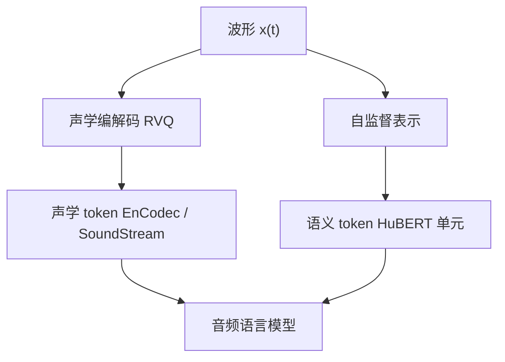

# 语音 tokenizer

先把波形变成离散符号，语言模型才能在语音上做它已经会的那件事：预测下一个 token。

<footer>—— 归纳自神经网络音频编解码与语音单元文献</footer>

文本 LLM 的输入是词表上的整数。语音是连续波形 $x(t)$。要让同一套 Transformer 吃音频，必须先把 $x(t)$ 变成有限集合里的符号序列 $z_{1:T}$，这个映射叫语音 tokenizer。它不是「把 ASR 文本再 tokenize」：文本 token 丢掉了音色、韵律和信道；语音 token 要在压缩率、可重建性和语义对齐之间取点。当代路线大致分成两类：面向重建的神经编解码器离散码（SoundStream、EnCodec），和面向内容的自监督单元（HuBERT 一类语义 token）。Audio LM、零样本 TTS 和部分语音理解模型都建立在这种离散化之上。本篇对照这几条线，不把某一家 RVQ 的码本超参写成唯一标准。

## 问题

波形采样率 16 kHz 时，每秒 16000 个实数，远超文本的每秒 token 数。直接对采样点做语言模型，序列太长，注意力平方不可接受，且相邻采样点高度相关，信息密度极低。传统做法用帧级连续特征（Fbank、MFCC）交给 CTC 或 AED，那是识别器，不是 tokenizer：输出仍是实值向量，不能进入离散词表的交叉熵。

Tokenizer 要同时回答三个互相打架的问题。第一，码率：每秒多少个离散符号。第二，保真：从符号能否还原可懂、可听的波形。第三，语义：符号是否主要随词内容变，而不是随说话人变。重建型编解码器优先前两项，语义单元优先第三项。没有一种离散化在三项上同时最优，所以系统里常常两套码并行：语义码管「说了什么」，声学码管「听起来像谁」。

### 连续特征为什么还不够

AuT、Whisper 编码器输出的是连续隐向量，给 LLM 前要经 projector 对齐维度。那是另一条路：不离散化，把音频当软 token。离散化的动机是复用文本侧的采样、缓存和词表工程，以及把生成变成分类。TTS 神经编解码语言模型（VALL-E 一类）必须离散，因为要自回归预测码本下标。理解任务可以不离散。把「语音 tokenizer」和「音频编码器」当成同义词，会把 RVQ 码与 Fbank 隐状态混在一张图里。

离散不等于可懂。码本崩塌时，很多帧挤进少数码字，重建有嗡声，识别也差。RVQ 用残差多级码本缓解单级量化的容量不足，但不自动保证语义解耦。

## 方法

SoundStream 把波形编码为多层残差向量量化（RVQ）码流，并用对抗与重建损失训练神经网络编解码器，目标是低码率高保真。EnCodec 沿同一思路给出更强的流式压缩：编码器下采样、RVQ 量化、解码器上采样，码本可在约 1.5–24 kbps 量级工作（具体档位见原论文）。形式上一帧的量化是

$$
\mathbf{e} = E(x),\qquad
z^{(1)}=\mathrm{Q}_1(\mathbf{e}),\quad
z^{(q)}=\mathrm{Q}_q\Bigl(\mathbf{e}-\sum_{i<q}\mathrm{Decode}_i(z^{(i)})\Bigr).
$$

每层 $z^{(q)}$ 是码本下标，全部层拼起来描述该帧的声学。语言模型可以只预测第一层（粗结构）再并行或自回归补残差层。

HuBERT 走自监督聚类。它在连续 Transformer 表示上做 k-means，得到帧级单元 ID，训练目标是预测被掩码位置的单元。这些单元更贴近音素和词内容，对说话人与信道不那么敏感，但单独拿它们做高保真重建通常不够。于是有「语义 token + 声学 token」的双码流：前者来自 HuBERT 或类似单元，后者来自 EnCodec/SoundStream。

### 帧率与文本对齐

Fbank 常用 10 ms 一帧，即 100 Hz。编解码器按跳步把帧率降到 50 Hz、75 Hz 或更低；Qwen 音频侧常见 12.5 Hz 量级的编码器输出（约 80 ms 一帧），那是连续音频 token 率，不一定是 RVQ 码率。语义单元若仍停在 50 Hz，和 12.5 Hz 的 LLM 音频口不对齐，需要下采样或 CTC 压缩。Tokenizer 的「词表大小」是码本条目数，不是汉语字表；一层 1024 项的码本已经是相当粗的量化，多层相乘才恢复声学细节。

## 机制

RVQ 的每一层量化的是上一层的残差，因此浅层码更像全局包络与音位轮廓，深层码更像纹理与噪声。语言模型若只在浅层做长程依赖、深层用局部预测，符合残差的信息分层。SoundStream/EnCodec 的训练有对抗项，为的是听感，不是音素分类；其 token 对 ASR 不一定最优。HuBERT 单元的训练目标是掩码预测聚类 ID，梯度来自内容一致性，所以更适合作理解侧的离散输入，不适合作唯一的 TTS 码。

把离散码送进 LLM 时，通常要扩展词表：为每个码本下标增加 embedding 行，或用一层嵌入把码 ID 映到 LLM 维。多码本时还要决定是沿时间拼接（帧率×层数）还是沿通道加和。拼接拉长时间，加和保留帧率但混叠层间信息。VALL-E 对 EnCodec 码的层次化建模，就是在这个设计空间里选点。

语义 token 的「语义」是经验说法：聚类在音素可辨的层上，并不保证词义。噪声、叠音、语码转换会让单元序列失去与文本的单调对齐。把它当成无损音素转录会高估离散化。

### 与连续音频编码器的分工

Qwen3-Omni / Qwen3-ASR 的理解路径主要用 AuT 把 Fbank 编成连续表示再投影进 LLM，而不是先 RVQ 再当文本词。Tokenizer 路线在生成侧更关键：Talker 预测离散语音 codec。同一系统里，理解用连续软 token、生成用离散 codec，并不矛盾——约束不同。讨论「语音 tokenizer」时要先问任务是重建、合成还是识别。

## 边界与工程取舍

低码率编解码器在音乐和混响上仍有伪影；语音 tokenizer 在歌声 ASR、重叠说话人上的单元会碎。码本与说话人 ID 纠缠时，TTS 能克隆音色，但隐私与安全风险上升。语义单元跨语种不可直接移植：在英语 HuBERT 上聚的类，对汉语声调用处有限，需要分语种或联合聚类。

流式场景还要求 tokenizer 本身因果：编码器不能看未来波形。SoundStream/EnCodec 有流式配置；非因果 HuBERT 要加块状或蒸馏。LLM 的 KV 缓存按音频 token 帧增长，12.5 Hz 时一分钟约 750 个音频位置，比 50 Hz 的单元序列轻松得多。选 tokenizer 往往先选帧率，再选码本。

不要把「用了 EnCodec」写成「理解了语音」。编解码器保证的是可听重建，理解还要靠后续模型是否在这些码上见过对齐文本。反过来，HuBERT 单元对齐文本很好，却听不出原说话人。

## 小结

- 语音 tokenizer 把波形映到离散符号，使语言模型能对音频做下一 token 预测；它与连续 Fbank 编码器是两条接口。
- SoundStream / EnCodec 用 RVQ 服务重建与低码率传输；HuBERT 式 k-means 单元服务内容向的语义 token。
- 声学码保真、语义码对齐文本，常需双码流；单码本很难同时最优。
- 帧率决定 LLM 序列长度；残差层决定信息分层与建模顺序。
- 理解模型可以不离散化（AuT 连续表示）；生成 codec LM 必须离散化。
- 出处：Zeghidour 等，SoundStream；Défossez 等，EnCodec（*High Fidelity Neural Audio Compression*）；Hsu 等，HuBERT。与 Qwen 生成侧 codec 的关系见 Qwen2.5-Omni / Qwen3-Omni 技术报告。
