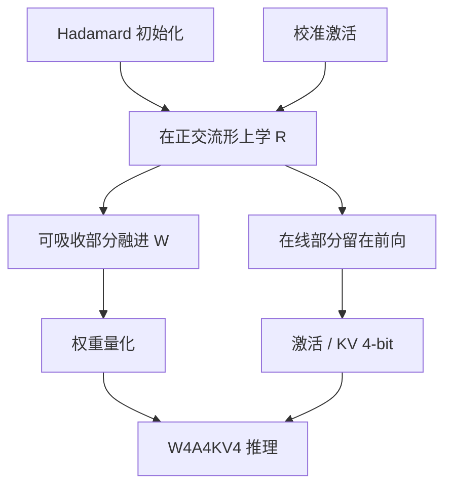

# SpinQuant

    
随机旋转已经能把异常值打散，但它不是为量化误差最优的那一组基；在正交约束下把旋转学出来，4-bit 激活与 KV 的格子才能少浪费在无关方向上。

    <footer>—— Liu 等，SpinQuant: LLM Quantization with Learned Rotations，ICLR 2025</footer>

Zechun Liu、Changsheng Zhao、Igor Fedorov、Bilge Soran、Dhruv Choudhary、Raghuraman Krishnamoorthi、Vikas Chandra、Yuandong Tian 与 Tijmen Blankevoort 的 ICLR 2025 论文（arXiv:2405.16406）接在 [QuaRot](/llm/quarot) 之后：承认计算不变性与 Hadamard 打散是对的，但随机正交只是可行点，不是量化意义下的最优点。他们在 Stiefel 流形上学习少量旋转矩阵，用校准激活的量化重建误差当目标，再把学到的旋转按与 QuaRot 相同的方式融进权重或留在在线路径。主形状仍是 **W4A4KV4**。Meta 的实验合同落在 LLaMA-2 / LLaMA-3，引用时不要写成已经覆盖所有 RMSNorm 模型。

## 问题

随机 Hadamard 把尖峰摊开，却不区分「哪些方向摊开对 4-bit 网格更有利」。量化误差不是各向同性的：某些子空间里权重与激活的动态范围搭配更苛刻，随机转到那里会变糟。QuaRot 用随机性换去优化，校准只服务后续 GPTQ。若愿意付一小段校准优化，旋转本身可以成为可学习参数。约束是必须保持正交，否则计算不变性作废，浮点网络已经不是原来的函数，后面的「量化几乎无损」无从谈起。

另一条压力是旋转的落点。有的 $R$ 能完全吸进相邻线性层，推理零开销；有的必须停在残差分叉、值投影或 down-proj 之前，decode 每步都要乘。可学习旋转若变成许多稠密 $d\times d$ 矩阵，部署会比随机 Hadamard 更重。SpinQuant 要学的是**少数**旋转，位置与 QuaRot 的可吸收 / 在线划分对齐，而不是给每一层都配一个满秩 $R$。

### 随机旋转不是最优旋转

在正交群上，量化后的层输出 MSE 对 $R$ 可导（经直通或对尺度的平滑），因此可以下降。随机 Hadamard 是一个好的初始化：已经打散尖峰，优化是在「可量化」区域里微调基，而不是从标准基硬拉。原文用校准集上的重建误差，不是下一 token 交叉熵全网训练——它仍是 PTQ 校准，不是第二轮预训练。把 SpinQuant 写成 QAT，会高估计算量，也会误导「必须有指令数据才能学旋转」。

学习旋转需要校准前向与对 $R$ 的梯度，比 QuaRot 的「生成一个随机 Hadamard 再 GPTQ」贵，但仍远小于全网 QAT。迭代量级是百次而非训一个 epoch。引用墙钟时把「学旋转」和「推理」分开。

## 方法

论文在网络里放置四类旋转（实现命名常作 $R_1$–$R_4$），职责不同：

- 可全程吸收的全局基变化，融进嵌入与各层投影，推理消失。
- 注意力输出侧、必须与残差对齐的旋转，处理残差汇合处的坐标。
- 值 / 输出投影附近、影响 KV 量化的旋转。
- down-proj 前的在线旋转，对应 MLP 中间激活的 4-bit。

$R$ 参数化在正交约束上。原文采用 Cayley 一类更新（反对称生成元经 Cayley 变换保持正交），避免先 SGD 再 QR 正交化造成的目标不一致。损失是块或层输出在假量化下的重建误差；权重侧可接 GPTQ 或 RTN，激活与 KV 假量化成 4-bit。学完后冻结 $R$，按不变性吸收能吸收的部分，再做最终权重量化。

LLaMA-2-7B / 70B 与 LLaMA-3-8B 上，论文报告 W4A4KV4 的困惑度与零样本相对随机旋转再降一截，向 FP16 靠近。降幅随模型与是否已经 GPTQ 变：随机旋转已经很好时，学习的边际变小；随机旋转碰巧转到差基时，学习的收益大。因此主表应读成「可学习旋转的上界更好」，而不是「每一个随机种子都差一截」。

### Cayley 更新保持正交

若把 $R$ 当成普通矩阵用 SGD，正交性立刻坏掉，RMSNorm 不变性不再成立，量化误差与「网络已经变了」缠在一起。Cayley 把更新限制在正交群的切空间，每步 $R$ 仍满足 $R^\top R=I$。这与 LoRA 式低秩增量不同：这里改的是坐标系，不是再加一个残差适配器。学到的 $R$ 不能单独拿到未经旋转设计的检查点上用；它和吸收后的权重是一套。

## 机制

量化网格在标准基下被通道尖峰绑架。正交变换混合通道，使逐维动态范围接近。随机混合已经降低 $\max |x_j|$；学习则继续压低「量化后输出 MSE」这一标量。梯度会把对重建最有害的方向转到更易被 4-bit 表示的轴上，这不一定等于把语义上的「异常特征」对齐到某几个坐标——解释通道的人会更难受，量化核会更舒服。

四块旋转对应四处不变性缺口。残差要求加减两端同基；RoPE 要求查询键的相对旋转在正确的坐标发生；KV 量化要求缓存与查询同基；MLP 中间激活没有前后线性可以完全吸收时，必须在线转。少放一块，对应位置的 4-bit 会重新出现尖峰。这是结构约束，不是超参口味。

SpinQuant 学的是旋转，不是逐通道 $s$。对角缩放不混合通道；旋转混合通道。二者可叠：先旋转再平滑，或反过来。原文主路径是旋转 + 权重量化 + 激活取整，不要把 OmniQuant 的可学习 $s$ 写进这篇的 $R$。

### 校准目标仍是量化误差

损失在假量化后的层输出上，直通梯度穿过 round。它不保证生成多样性、指令遵循或长上下文针测。WikiText 下降时，聊天模型仍应在 MT-Bench 一类任务上复测——这是 AWQ 已经提出的合同纪律，SpinQuant 的主表以语言建模与零样本为主，指令模型要外推时自担风险。校准域极偏（仅代码、仅数学）会学到对该域友好的基，换域后旋转可能不再优，但正交性仍保证浮点函数在未量化时不变；坏的是量化误差分布。

## 边界与工程取舍

### 推理图仍可能留下稠密旋转

不能吸收的 $R$ 若被学成稠密正交而不是 Hadamard，在线乘是 $O(d^2)$ 而不是 $O(d\log d)$。论文需要在「更准」与「仍能快速变换」之间取舍：有的实现把学到的 $R$ 再近似回 Hadamard 一类结构，会吐回部分精度。部署前要看最终图里还剩几次 `gemm(R)`。把 SpinQuant 的困惑度表配上 QuaRot 的「Hadamard 几乎免费」墙钟，是拼错两篇论文。

没有 4-bit 激活核时，W4A4 的产品意义只剩 KV 显存。学旋转的代码路径（Cayley、块重建、与 GPTQ 的衔接顺序）比随机 Hadamard 更容易实现错。LLaMA-3 与 LLaMA-2 的异常值形态不同，论文分列是有原因的；合并成「8B 都怎样」不合法。GQA、头维、是否把 `lm_head` 留在高精度，都会移动数字。SpinQuant 不解决训练期量化，也不替代剪枝。

出处：Liu et al.，*SpinQuant: LLM Quantization with Learned Rotations*，ICLR 2025（arXiv:2405.16406）。作者单位以 Meta 为主。随机旋转基线应引用 QuaRot，不要写成 SpinQuant 自己消融里的弱实现。

## 小结

- SpinQuant 在正交约束下学习少量旋转，替代 QuaRot 的随机 Hadamard，目标仍是 W4A4KV4。
- Cayley 一类更新保证 $R^\top R=I$，计算不变性在学习过程中成立。
- 校准优化的是量化重建误差，不是全网预训练。
- 可吸收旋转推理免费；在线稠密 $R$ 可能比快速 Hadamard 更贵。
- 出处：Liu et al.，ICLR 2025。
