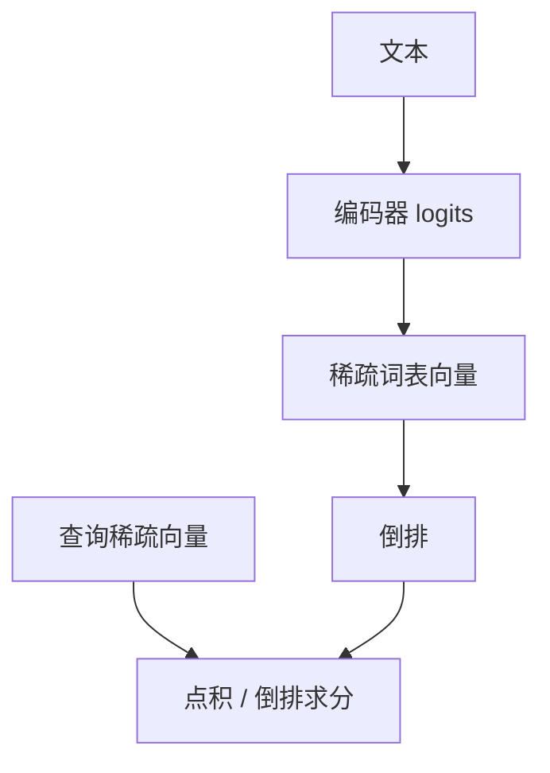

# SPLADE

让编码器对词表维预测稀疏权重，倒排里就会出现「没写在文里但该被检索到」的扩展词。词法通道由此可学习，而不只靠 BM25 计数。

<footer>—— Formal 等 SPLADE</footer>

[上一课](/llm/bm25-sparse)的词袋不能扩同义。查询扩展与同义词表是手工的。Formal 等人的 SPLADE 用预训练语言模型对每个文档（和查询）预测一个词表那么长的稀疏向量，非零维相当于加权后的词，可写入倒排。缺口是把「可学习稀疏」从稠密双塔里拆出来。后课 MTEB 会同时考稀疏、稠密与指令嵌入，不要混成一种模型。

## 问题

BM25 只激活文档里出现过的词。用户写「心肌梗死」，文档写「heart attack」，字面零命中。稠密能对上，但标识符又弱。SPLADE 希望：稀疏向量在「心肌梗死」维上有权重，即使原文是英文医学同义。它仍走倒排，延迟与可解释性接近词法，而不是 ANN。

训练要用对比或蒸馏（向交叉编码器看齐），并对向量加稀疏正则，否则退化为稠密的低效版本：几乎每维都非零，倒排爆炸。

稀疏维是词表下标，人可以读出「模型用哪些词扩展了文档」。这是调试召回的接口，不是保证扩展正确。

## 方法

对输入做 MLM 式 logits，经激活（如 log-saturation）与池化得到词表维权重，再 L1 / FLOPS 正则压非零数。查询与文档可非对称：查询更短更稀疏。索引：把非零维当 term、权重当冲击值，用学习到的分数代替 BM25 公式。推理延迟取决于平均非零数，必须当指标报。

## 机制

正则迫使模型只点亮少量扩展词。对比损失要求这些词能把正例从难负例里分开，于是点亮的是有判别力的同义与相关词，而不只是高频词。若正则过强，退回近乎字面 BM25；过弱，变成昂贵稠密。与难负例课同样：假相关扩展会伤害精度。

## 边界

词表是分词器词表，对未登录标识符仍弱——keyword 字段与 BM25 通道仍值得保留，混合检索并不过时。下一课 MTEB：在统一任务套件上比较这些嵌入家族。

## 小结

- SPLADE 学习稀疏词表权重，倒排可含扩展词。
- 稀疏正则是可用性条件；非零数要当延迟指标。
- 不替代 BM25 标识符字段，常作混合一路。
- 出处：Formal 等 SPLADE。
