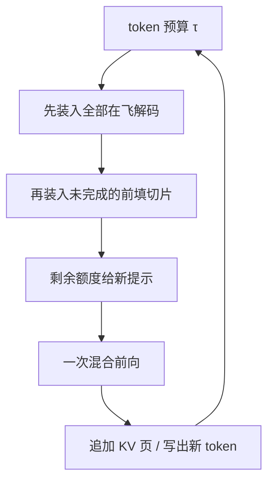

# splitfuse / 混合批次

    
把尚未做完的提示切片，与正在生成的 token 放进同一次前向，前向尺寸变得可规划，解码也不再为整段前填停机。

<footer>—— Holmes et al., DeepSpeed-FastGen 中的 Dynamic SplitFuse；对照 Agrawal 等 Sarathi-Serve</footer>

[Chunked prefill](/llm/chunked-prefill) 解决「前填能不能分期」。接下来的问题是：每一拍的前向里放谁。纯解码批吃不满算力；纯前填批又会让已在生成的请求停住。混合批次（hybrid / mixed batch）把两类 token 放进同一次前向：若干条请求的一个解码 token，加上一块或多块尚未完成的前填。DeepSpeed-FastGen 把动态地拆提示、再与生成拼到目标 token 预算的策略叫做 Dynamic SplitFuse；Sarathi-Serve 用 stall-free 调度与 decode-maximal 的装填顺序描述同一类思想。本篇写融合规则与它和分离式服务的边界，不把两个系统的实验数字互相套用。

## 问题

连续批处理按迭代插入请求，但若每一拍仍然是「整段前填」或「纯解码」二选一，粒度还是太粗。前填优先：吞吐高、[ITL](/llm/tpot-itl) 出现 stall。[解码](/llm/tpot-itl) 优先：正在打字的用户流畅，新请求的 [TTFT](/llm/ttft) 在队长里堆积。GPU 的尴尬是：纯解码算术强度低，纯长前填强度高但时间无界。需要一种装填，使每一拍的 token 数落在窄带里——既喂饱张量核，又不超过 TBT 允许的墙钟。

SplitFuse 的「拆」是提示可以跨拍；「融」是同一拍里前填切片与生成 token 共存。没有拆，融只能把整段前填塞进去，预算立刻被一条长提示打爆。没有融，拆只是把前填自己分期，解码批仍然吃不饱，权重每拍白扫一遍。两者合在一起，才是混合批次。

### 预算约束而不是请求数约束

Orca 一类迭代级批处理常以请求条数为上限。条数相同，token 数可以差两个数量级：32 条解码是 32 个 token，32 条长前填可以是数十万 token。混合批次改用 token 预算 $\tau$：

$$
B_{\mathrm{decode}} + B_{\mathrm{prefill}} \le \tau.
$$

$B_{\mathrm{decode}}$ 通常等于本拍仍在生成的请求数（每条一个新 token，推测解码除外）。$B_{\mathrm{prefill}}$ 是本拍允许的前填 token 数，来自一条或多条尚未完成的提示切片。$\tau$ 由「这一拍必须在 TBT SLO 内结束」反推，再按硬件饱和点取下限，避免 $\tau$ 小到掉出算力区。

预算是调度单位，不是注意力窗口。同一拍里不同请求的 KV 长度可以完全不同；核函数按变长序列或页表计算，softmax 不会跨请求。融合的是计算作业，不是上下文。

## 方法

Dynamic SplitFuse 有两条装填行为。长提示被拆成远小于全长的块，跨多个前向执行，**只有前填全部完成后**该请求才进入生成。短提示会被拼起来填满目标前向尺寸；必要时连短提示也切一刀，以免超支预算，使各拍的 token 数对齐。Sarathi-Serve 的 stall-free 顺序更强调优先级：先装入所有正在进行的解码（它们必须每拍都走，否则 ITL 直接违约），再装入已部分完成的前填切片，最后才接纳新请求的前填。新前填永远不能把正在生成的请求挤出这一拍。

这样定义之后，正在解码的请求不会遇到「下一拍被一条 20k 原子前填独占」的停机。它们仍要等待这一拍的混合计算，但等待时间由 $\tau$ 封顶。新请求的 TTFT 变成「还要多少块才能凑齐自己的提示」，而不是「队头那条提示的全长二次项」。

### 均匀迭代与流水线

混合批次的副作用是各拍工作量接近，这对流水线并行很重要：气泡来自相邻 microbatch 耗时差。FastGen 与 Sarathi 都指出，切块加融合之后前向尺寸稳定，分布式推理的空转下降。这不是混合批次的产品卖点（用户看不见气泡），而是多卡部署时相对「前填/解码时长差两个数量级」的系统收益。

## 机制

同一前向里，解码 token 与前填 token 共享一次权重读出。设权重体积为 $W$，纯解码 $B_d$ 个 token 的算术强度大致随 $B_d$ 线性升；再拼上 $B_p$ 个前填 token，分母变成 $B_d+B_p$，扫权重的成本被摊薄。这是混合批次常常**提高吞吐**的原因：解码搭了前填的算力便车。注意力则按各请求自己的 KV 长度分别计算，前填切片还要读本请求已有前缀，解码要读更长的生成中缓存。总线账是「权重更划算、KV 更忙」。

对用户可见延迟：解码的 ITL 从「一次轻量带宽步」变成「一次带 $B_p$ 算力的步」，基线上升，尾部因不再出现无界前填而下降——均值和 P99 可能反向变化。TTFT 因提示分期而变长，但排队等待原子长作业的极端值下降。SLA 必须分开写，不能用「平均延迟降低」掩盖「首字变慢、打字节奏略钝、但不再卡死」。

FastGen 报告相对当时 vLLM 的吞吐与尾延迟改善，Sarathi-Serve 报告在 TBT 约束下的服务容量提升。数字绑定各自模型、硬件与负载（如 ShareGPT、长文档摘要），不能当成另一条模型的容量公式。本篇只取机制：拆、融、预算、解码优先。

### 与分离式服务如何分工

前填/解码分离把两段放到不同副本，从根上取消同卡干扰，代价是 KV 传输与双池容量规划。混合批次留在单池，用预算模拟「轻度干扰、高度占用」。当 KV 很大、互连足够、TTFT 与 ITL 都要严守时，分离更干净；当单机或小集群、负载以中长提示为主、更能忍受 ITL 基线换吞吐时，SplitFuse 一类更省。两者也可以分层：池内仍用切块平滑作业，池间再分离。不要把 SplitFuse 说成分离的替代证明，也不要把分离说成混合批次已经过时——取决于 SLO 组合。

## 边界与工程取舍

混合前向要求内核支持变长、分页 KV、以及「一批里既有 seqlen_q=1 又有 seqlen_q=C」。图捕获更难：形状每拍变。推测解码使 $B_d$ 不再等于请求数，预算要按草稿长度重算。MoE 上前填切片与解码的路由集合不同，同拍可能加载更多专家，内存流量上升。这些是实现税，论文里的理想混合批在生产中会被核与路由打折。

优先级若实现错（新前填抢在解码前把预算吃光），stall 会以新面目回来。预算若按请求数估算而不按 token，长短提示一混就失效。短提示被强制切开时，TTFT 增加一次额外迭代，对本来就能一拍做完的闲聊是净伤害，需要「短于阈值则不分」的例外。

名称不要绑死产品。vLLM、SGLang、TensorRT-LLM 后来都有各自的 chunked prefill / mixed batch 实现，语义接近但预算、优先级和默认值不同。写运维文档应写本引擎的调度器行为，而不是写「我们用了论文里的 SplitFuse」就结束。

## 小结

- SplitFuse / 混合批次 = 提示可拆 + 与解码 token 同拍融合，用 token 预算而不是请求条数限制前向尺寸。
- Stall-free 装填先保证在飞解码每拍都在，再填前填切片，最后接纳新提示。
- 权重读出被更多 token 摊薄，吞吐常升；解码 ITL 基线上升，无界 stall 的尾部下降。
- TTFT 因分期通常变长，但不再取决于队头提示的全长二次项。
- 与流水线并行相容处在于迭代均匀；与分离式服务是不同层级的干扰管理。
- 内核变长、图捕获、MoE 路由、推测解码都会使理想预算走样，需要按引擎实测。
- 出处：Holmes 等，DeepSpeed-FastGen（Dynamic SplitFuse）；Agrawal 等，Sarathi 与 Sarathi-Serve（OSDI 2024）。
