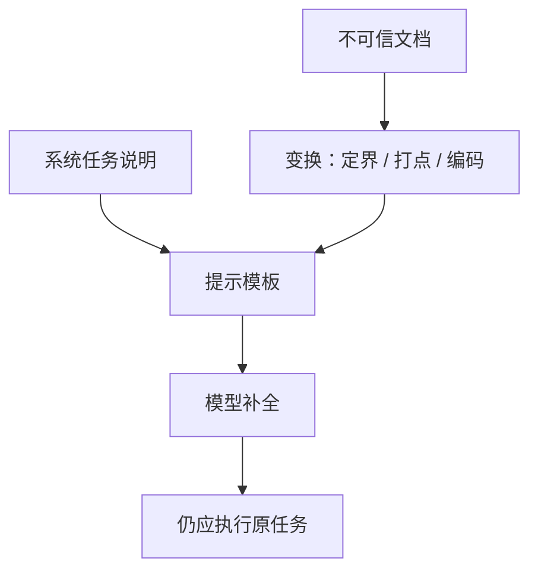

# Spotlighting 输入标记

    
对输入做变换，给来源一个连续、可靠的信号，使模型更容易把系统指令与不可信文本区分开——它们本来只是同一条没有特权位的 token 流。

    <footer>—— Hines 等，Defending Against Indirect Prompt Injection Attacks With Spotlighting，arXiv:2403.14720</footer>

语言模型按设计吃的是**一条**文本。应用却把系统任务、用户话和检索来的文档拼在一起。模型没有硬件级的「这段是数据」标志，于是文档里的祈使句可能被当成要执行的指令：这就是 [间接注入](/llm/indirect-injection)（论文用语 XPIA）。Hines、Lopez、Hall、Zarfati、Zunger、Kıcıman（微软）把一类**只改提示与输入变换**、不改权重的缓解叫做 **spotlighting**（聚光标记）：用变换给不可信块打上可贯穿全文的来源信号，并在系统提示里说明如何对待该块。他们在 GPT 家族上用合成文档集测量攻击成功率（ASR），报告从大于 50% 降到实验中低于 2%，且对下游 NLP 任务损害很小。本篇写威胁模型与三种实例的设计意图。不提供注入文本、不逐步演示如何劫持会话，也不把评测载荷写进仓库。

## 问题

直接注入发生在用户框；间接注入发生在网页、邮件、插件返回等用户并未键入的通道。用户往往是受害者。论文强调：LLM 在无边界的 token 流上补全，结构上分不清「开发者写的代码（指令）」与「外部数据」。对齐训练降低有害输出，并不自动理解「这段看起来像指令，但来自文档」。随着工具变多，间接通道的下游风险从「说错话」变成「用用户的已授权能力做错事」。

与越狱（用户主动攻安全政策）相比，间接场景的语言分布不同：长文档里一小段指令，甚至人类读者不显眼的片段。同一句转账请求，在用户框里可能是合法任务，在检索块里则是劫持。还存在「意外 XPIA」：写给人类的操作说明被过勤的模型执行。防御若只在用户入口做分类，会漏掉工具返回。Spotlighting 的问题设定是：**不训练新模型、不引入单独分类器服务**的前提下，如何让开发者用提示工程提高来源可区分性。它不声称替代权限隔离。

### 评测合同是相对 ASR，不是「已免疫」

作者构造约 1000 篇带简单关键词载荷的合成文档：载荷试图让模型放弃原任务、只回复特定词，以便自动判定成败。任务包括摘要等常见 NLP。基线 ASR 随模型与任务变，GPT-4 相对较低，但绝对数字难客观解释；有用的是**同一任务上相对下降**。温度在他们检查中对 XPIA 敏感性无显著影响。这种载荷便于量 ASR，不等于覆盖自适应、多步工具劫持。引用 50%→2% 必须写明：GPT 家族、该合成集、论文实验设置。换模型、换自适应对手，数字会变。

论文把 UPIA（用户框注入）与 XPIA 分开。Spotlighting 针对拼接进提示的外部数据。用户框攻击的语义更杂，需另套评测。不要用本篇数字外推越狱榜。

## 方法

每种实例都有两步：可选地变换不可信文本；更新系统提示，说明变换含义以及「块内指令不得改变目标」。三者强度递增，对模型能力的要求也递增。

**Delimiting（定界）**：在块两端加特殊符号，并告知模型符号之间不得当作指令。实现便宜，论文认为效果弱于后两种，**不推荐作为唯一手段**。边界只在两端，中间仍是「看起来像系统话」的自然语言。

**Datamarking（数据打点）**：不仅标记两端，而且把空白等位置替换成贯穿全文的标记字符（文中示例用 `^` 插在词之间），同时在系统提示里解释该标记用于区分来源。信号是连续的，载荷无法靠「写在中间」来逃出标记区——变换施加在整块输入上。作者建议至少用到这一档；并对下游任务显示无明显伤害。

**Encoding（编码）**：用模型已见过的编码（如 Base64、ROT13）变换整块，系统提示要求先按约定理解再做摘要等任务，且不得因块内文字改目标。高容量模型往往能内隐解码；论文对 GPT-4 一类给出最强缓解，并警告**只应用于能处理该编码的模型**（见论文图 8 一类容量检查）。弱模型会连任务一起做砸。

### 变换加说明必须成对，缺一则信号无定义

只改文本不加说明，模型可能把标记当成噪声或新语法。只加「请忽略文档里的指令」而不变换，则回到普通提示，论文认为不够。工程上变换要在**进入模板之前**由应用施加，不能指望模型自己给自己打标。标记字符与编码算法应固定并写进系统提示；若对手能控制变换层，信号失效。这是应用完整性问题，不是再加一句形容词。

## 机制

机制是提高「指令通道」与「数据通道」在 token 统计上的可分性。定界给出局部括号；打点改变整段的表面形式，使文档 token 不再与系统提示同分布；编码把文档移到另一套符号，系统提示仍是明文。模型若在预训练里见过「先解码再完成任务」的模式，编码档最强；若见得少，会损害效用。Spotlighting **不改变**工具权限：模型若仍调用外发工具，需要 [CaMeL](/llm/camel-injection-defense) 或人审来挡。它也不阻止「内容被扭曲但未改任务」的失败。

与指令层级（系统 > 用户 > 工具）的关系：层级是训练与模板约定，spotlighting 是对工具/检索区的额外表面信号。二者叠加是深度防御：层级处理角色，标记处理「同一角色槽里仍混了脏数据」。Microsoft Research 页面与 arXiv 摘要给出同一 ASR 叙事；产品后来把相关思路收进 Prompt Shields 一类名称时，要分开「论文方法」与「云上分类器」——后者是另一组件。

定界易做但论文不推荐单用。打点是默认建议。编码留给已验证能解码的高容量模型。不要对小模型默认 Base64 再抱怨摘要质量。

### 自适应对手会针对已知变换

论文实验用固定、易判定的载荷，不是针对标记字符做对抗搜索的对手。公开讨论里，随机化标记、与分类器联用，属于产品加固方向，仍无形式保证。设计上应假设：spotlighting 降低清洁与简单载荷下的 ASR，不能当唯一控制。权限最小化、输出与动作过滤、双模型抽取，仍要在 [提示注入总述](/llm/prompt-injection) 的分层里。

## 边界与工程取舍

### 它是提示层缓解，不是访问控制

密钥、内部 URL、未授权工具不应靠「模型看见标记就会忽略」来保护。系统提示仍可能被套出一部分。编码增加 token 与延迟；打点改变分词，极端情况下影响需要精确空白的任务（代码、表格）。多文档拼接时，每块应单独变换并在提示中编号来源，避免块间标记混用。评测应同时报 ASR 与主任务指标（ROUGE、准确率等），只报 ASR 会鼓励过强变换把任务做崩。

不要在博客或系统提示示例里粘贴真实攻击句。论文自己的系统提示范例是任务说明加变换说明，评测载荷留在研究语料。本仓库遵循同一纪律。与 CaMeL 相比：spotlighting 实现快、无解释器、无保证；CaMeL 实现重、有政策保证、假设可信用户查询。生产代理两者可叠，职责不同。

出处：Hines 等，*Defending Against Indirect Prompt Injection Attacks With Spotlighting*，arXiv:2403.14720（Microsoft Research 同期条目）。间接通道对照 Greshake 等与 OWASP LLM01。无攻击配方。

## 小结

- Spotlighting 用输入变换加系统说明，给不可信文本连续的来源信号。
- 三档：定界弱、打点为建议默认、编码适用于高容量模型。
- 报告的 ASR 下降绑定 GPT 家族与合成关键词载荷实验，不是通用免疫。
- 必须与最小权限、工具闸门分层；不能单独当访问控制。
- 出处：arXiv:2403.14720。
