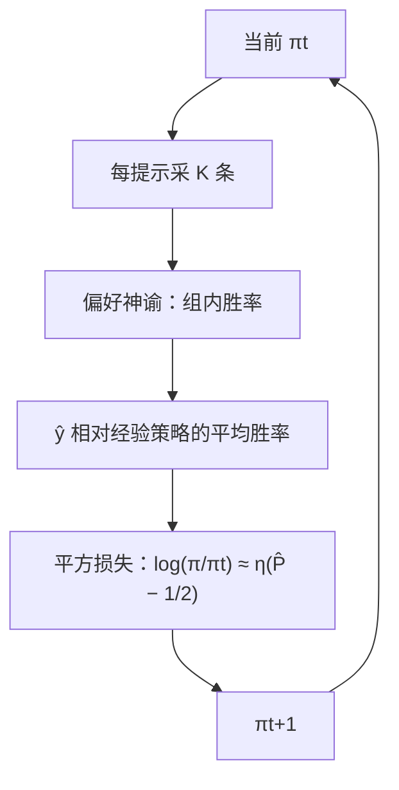

# SPPO

    
偏好不必能写成一个可传递的标量奖励；把它当成两人常和博弈，用自我对弈去逼近纳什均衡，策略就按对当前自己的胜率做乘性更新。

    <footer>—— Wu 等，Self-Play Preference Optimization for Language Model Alignment，2024</footer>

Bradley–Terry 给每条回答一个分数，胜率由分数差的 logistic 决定。人的比较可以循环、可以不传递，一个标量无法表示。Munos、Swamy、Wang 等人把 RLHF 改写成两人常和博弈：策略 $\pi$ 的收益是它对对手策略的期望胜率，目标是纳什均衡（von Neumann winner）。Wu 等人给出一个能接到大模型微调上的实现：Self-Play Preference Optimization（SPPO）。每轮用当前策略采样、用偏好神谕给组内胜率，再把「相对上一轮的对数比」平方回归到「对经验策略的超额胜率」。它与 [DPO](/llm/dpo) 的成对 logistic 不同：监督是一条回答相对一整组对手的平均胜率，不是一对 $(y_w,y_l)$ 的符号。

## 问题

标准 RLHF 先拟合 BT 奖励再 [PPO](/llm/ppo-llm)，或把奖励回代成 DPO。两条路都假定偏好由潜在分数生成。一旦 $A\succ B$、$B\succ C$、$C\succ A$，不存在与数据一致的 $r$。IPO 改的是 $\Psi$ 映射，仍在成对概率上工作；它最大化的是相对某个参考策略的期望胜率，不是博弈均衡。参考一过时，目标就不再是「对任何对手都不差」。

博弈表述的目标明确：找 $\pi^*$ 使得 $\mathbb{P}(\pi^*\succ\pi)\ge 1/2$ 对一切 $\pi$ 成立（对称纳什）。Freund 与 Schapire 的乘性权重给出平均策略以 $O(1/\sqrt{T})$ 收敛到均衡的对偶间隙。困难是把指数更新

$$
\pi_{t+1}(y\mid x)\propto \pi_t(y\mid x)\exp\bigl(\eta\,\mathbb{P}(y\succ\pi_t\mid x)\bigr)
$$

写成可对神经网络求梯度的损失，并且用有限次偏好查询估计 $\mathbb{P}(y\succ\pi_t)$。Swamy 等人的 SPO 在理论上落到 Hedge，实践上建议再用 PPO 或 SAC 去近似指数更新；SPPO 要的是直接可微、可大规模微调的平方损失，而不是再套一层策略梯度。

### 成对对称损失推的是间隔，不是密度

DPO / [IPO](/llm/ipo) 在一对回答上做对称对比，配分函数相减消掉。梯度保证相对对数比变大，不保证受欢迎回答的绝对似然上升——Pal 等人指出过这一现象。纳什更新需要的是：一条 $y$ 若对当前策略的平均胜率高于 $1/2$，其概率质量应上升，平局则不动。这是相对「对手策略」的绝对校准，不是相对另一条样本的差。

论文中的 SPPO 与 Swamy 等的 SPO 不是同一算法。SPO 是一般约化框架；SPPO 专指接在 LLM 上、用平方损失近似指数更新的那一套。后起的「Sequence-Level PPO」也有人叫 SPPO，与本篇无关。

## 方法

对固定提示，指数更新等价于

$$
\log\frac{\pi_{t+1}(y\mid x)}{\pi_t(y\mid x)}=\eta\,\mathbb{P}(y\succ\pi_t\mid x)-\log Z_{\pi_t}(x).
$$

SPPO 不靠成对相减消 $Z$，而直接对这一等式做 $L_2$ 拟合。有限样本时，对每个 $x$ 从 $\pi_t$ 采 $K$ 条，用经验策略 $\widehat{\pi}_t^K$ 估计胜率。实践中把 $\log Z$ 换成常数 $\eta/2$（在胜负近似均匀、 $K\to\infty$ 时 $Z\to e^{\eta/2}$），得到论文里实际最小化的目标：

$$
\mathbb{E}_{y\sim\pi_t}\Bigl(\log\frac{\pi(y\mid x)}{\pi_t(y\mid x)}-\eta\bigl(\mathbb{P}(y\succ\widehat{\pi}_t^K\mid x)-\tfrac12\bigr)\Bigr)^2.
$$

平局（胜率 $1/2$）时对数比目标为零；高于 $1/2$ 则提高密度。算法每轮：采样 $K$ 条、查询偏好神谕得到组内两两胜率、构造 $(x,y,\hat P)$、按上式更新到 $\pi_{t+1}$。作者实验用 UltraFeedback 的约 60k 条提示（不要原回答），偏好神谕是 0.4B 的 PairRM，不引入 GPT-4 写的回答或偏好。从 Mistral-7B-Instruct-v0.2 出发，AlpacaEval 2.0 对 GPT-4-Turbo 的长度控制胜率报到 28.53%；从 Llama-3-8B-Instruct 出发报到 38.77%。这些是该设置下的数字，不是泛化保证。

### 与 DPO、IPO、DNO 的接口

DPO 吃离线 $(y_w,y_l)$，一次更新，参考冻结。SPPO 是迭代自我对弈：参考是上一轮 $\pi_t$，标签是对当前自己的胜率，不必预先存在人类成对。IPO 的平方损失打在成对对数比差上，目标间隔常数；SPPO 的平方损失打在单条对数比上，目标是超额胜率。并发的 Direct Nash Optimization 用交叉熵拟合胜率差，实践实现仍常退回迭代 DPO；SPPO 实验里坚持自己的平方目标，并且不用更强模型的外部监督。REBEL 在偏好设定下与 SPPO 相近，差别主要在是否对绝对胜率回归还是对相对奖励回归。

## 机制

### 乘性权重为何收敛到均衡

两人常和博弈里，乘性权重是无悔算法：平均策略的对偶间隙以 $O(1/\sqrt{T})$ 下降（Freund & Schapire 1999；论文 Theorem 4.1 在可实现假设下复述）。每步把质量乘上 $\exp(\eta\times\text{对当前对手的收益})$，对手若是上一轮的自己，就是自我对弈。平方损失是对「理想对数比」的投影：若函数类够大且优化够准，一步接近指数更新；函数类不够时，只是在对数概率空间里做有偏近似。理论保证的是平均策略 $\bar\pi_T$，实践部署的是最后一轮 $\pi_T$，两者不必相同。论文没有声称最后一轮就是精确纳什。

胜率估计来自 $K$ 条样本的两两比较，查询次数 $O(K^2)$。$K$ 太小，经验对手覆盖不足，超额胜率噪声大，平方回归会把噪声写进策略。PairRM 是近似神谕，不是人类 $\mathbb{P}$；均衡是相对这个神谕的均衡。神谕有长度偏置，纳什策略也会学长度偏置——作者因此在 AlpacaEval 上报告长度控制胜率。

SPPO 的「无外部监督」指实验不拿 GPT-4 写回答、不当裁判；不是没有偏好信号。PairRM 仍是外部模型。换成自己训的成对 RM，均衡就相对那个 RM，与 InstructGPT 的数据面相同。

### 平方损失与策略梯度的近亲关系

把 $\log(\pi/\pi_t)$ 回归到优势形状的目标，梯度含 $\nabla\log\pi$ 乘残差，形式上接近带基线的策略梯度，只是样本来自本轮开始时冻结的 $\pi_t$，而不是每一步都在线采样。作者称之为半在线：一轮内多步 SGD 复用同一批合成数据，轮与轮之间才重新生成。这解释了为何它能提高赢家似然、压低输家似然，而不只拉开相对间隔。代价是每轮都要生成 $K$ 条并打两两比较，比纯离线 DPO 贵，比 PPO 四模型栈仍简单——没有价值网络，偏好神谕可以远小于策略。

## 边界与工程取舍

SPPO 依赖可查询的成对偏好神谕和可负担的组采样。神谕若只是 BT 奖励模型，博弈表述的「能表示非传递」在实现上会退化为近似传递。提示集质量决定自我对弈能探索的区域：只用 60k UltraFeedback 提示，均衡是这些提示上的均衡，换域不会自动好。迭代轮数与 $\eta$ 决定走多近；$\eta$ 过大，平方目标要求的对数比一步跳太远，语言模型拟合不良。

不要把 SPPO 写成「迭代 DPO」。数据构造可以看起来像组内排序，损失却不是 logistic 差。也与后来同名的序列级 PPO 无关。并发的 Nash 学习工作（NLHF、DNO）共享博弈目标，实现与监督来源不同；比较时应看是否用更强模型当金标，而不是看名字里有没有 Nash。

组内两两比较的计算是 $K^2$ 次神谕前向。$K=4$ 还好，$K=16$ 就已经和生成成本一个量级。论文可以选子集进 $\mathcal{D}_t$；只留极端胜负会回到成对方法，理论与「对经验策略的平均胜率」不再一致。

### 何时不必上 SPPO

已有干净成对人类数据、且 BT 近似够用时，离线 DPO / IPO 更便宜。奖励可验证、同一题可打标量分时，组相对策略梯度（[GRPO](/llm/grpo)、[RLOO](/llm/rloo)）更直接，不必构造胜率矩阵。没有可靠偏好神谕、又不能在线采样时，SPPO 无法启动。非传递性若从未在数据里出现，为它付组采样预算没有收益。

## 小结

- SPPO 把对齐写成两人常和博弈，用自我对弈近似纳什均衡，而不是拟合可传递的标量奖励。
- 每轮对当前策略采样，用偏好神谕估计相对经验策略的胜率，平方回归对数比到 $\eta(\hat P-1/2)$。
- 相对 DPO/IPO，监督是单条回答的绝对超额胜率，配分函数不靠成对相减消去。
- 理论保证的是平均策略的对偶间隙；实践部署最后一轮，神谕误差会进入均衡。
- 实验用 PairRM 与 UltraFeedback 提示，不依赖 GPT-4 写样本；数字绑定该设置。
- 同名的 SPO 或序列级 PPO 不是这篇算法。
- 出处：Wu, Sun, Yuan, Ji, Yang, Gu，*Self-Play Preference Optimization for Language Model Alignment*，arXiv:2405.00675，2024。
