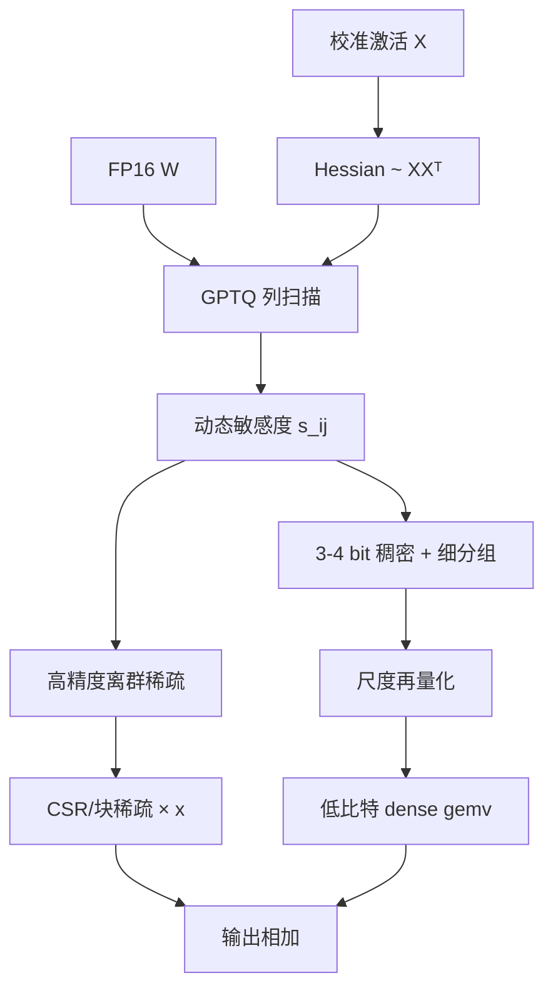

# SpQR

    
量化误差不是撒在矩阵上的白噪声：行、列、甚至某个注意力头会成片变「敏感」。把这些权重隔离成高精度稀疏项，其余走 3–4 bit，再把极细分组的尺度也量化掉，近无损压缩才第一次在端侧尺寸上站得住。

    <footer>—— Dettmers、Svirschevski、Egiazarian、Frantar、Alistarh 等，SpQR，ICLR 2024</footer>

Tim Dettmers、Ruslan Svirschevski、Vage Egiazarian、Denis Kuznedelev、Elias Frantar、Saleh Ashkboos、Alexander Borzunov、Torsten Hoefler 与 Dan Alistarh 的 ICLR 2024 论文（arXiv:2306.03078）提出 **Sparse-Quantized Representation（SpQR）**：在 GPTQ 式逐层求解里动态标出对层输出伤害过大的权重，它们留在较高精度，其余 3–4 bit，分组可以细到 16 个元素，尺度再压到 3-bit。合同是 **近无损**——高质量 LLaMA / Falcon 上困惑度相对 16-bit 的相对误差小于约 1%——从而把 33B 装进 24GB 消费卡并带一点生成加速。激活特征离群见 [LLM.int8()](/llm/llm-int8)；权重离群的并发非均匀路线见 [SqueezeLLM](/llm/squeezellm)。本篇写 SpQR 的敏感度定义、双轴离群结构、以及双层量化格式。

## 问题

3–4 bit 权重量化已经能把模型缩小约 4×，但 7–13B 这类真正适合端侧的尺寸，相对误差仍然会在自回归里累积成生成崩坏。RTN 与即便是 GPTQ，在小模型上的 PPL 增量往往不可忽视。需要一种格式：压缩比仍在 3–4 bit 量级，端到端语言建模损失几乎对齐稠密基线。

先前工作看到了**输入特征维**上的激活离群。作者要问权重矩阵里有没有对称结构：某些输出隐维、某些列、某些注意力头，是否系统性地更难量化。若敏感权重成片出现，就应该用混合稀疏格式，而不是把分组大小当作唯一旋钮。

### 敏感度必须允许邻居补偿

把 $|w-\mathrm{quant}(w)|$ 或 $|w|\,|x|$ 当敏感度，会忽略列之间的相关性：GPTQ 本来就会把一个权重的取整误差 squirt 到未量化列。SpQR 把 $w_{ij}$ 的敏感度定义成：强制该元取量化值之后，允许其余权重连续调整，层输出 MSE 的最小增量。闭式解落在 OBS 框架里，与 Hessian 逆 $(XX^{\top})^{-1}$ 的对角有关。实现上不必另算一遍：GPTQ 每量化一列都已持有剩余子矩阵的逆，可以**动态**用当前 $w_{ij}$（含已被补偿过的值）更新 $s_{ij}$。

幻觉式 API 与「编造不存在的量化格式」是两类不同的错误。SpQR 是一种存储布局加编码算法，不是 bitsandbytes 里 LLM.int8() 的默认路径。论文计划接入 bitsandbytes，引用实现时应对齐 Vahe1994/SpQR 仓库与论文伪代码。

## 方法

编码分两步。第一步在 GPTQ 扫描中计算 $s_{ij}$，超过阈值的位置记为离群，暂不按低比特提交。第二步对非离群权重做分组量化：组可以非常小（如 16），以拟合局部统计；组尺度与零点再量化到低比特（双层），避免细分组把平均比特抬回 5–6 bit。离群权重以稀疏结构（论文讨论基于块 / CSR 的 GPU 友好布局）存较高精度。解码：稠密 3–4 bit gemv 与稀疏高精度 gemv 相加。

分析章节用 LLaMA-65B 末层注意力输出投影的 log-sensitive 图（含 32×32 max-pool）展示三类结构：**列离群**对应下一层输入特征离群；**行离群**是某输出单元上一段或整行高敏感，注意力里可与头对齐；**头条带**宽约 128，Q/K 水平、输出投影垂直，MLP 中没有同样条带。这些模式随深度变密。格式必须能表达「非整列、非整头」的局部片段，因此细分组加元素级稀疏，而不是只拆异常列。

主结果：LLaMA 与 Falcon 家族，WikiText 等 PPL 相对基线 $\lt$1% 量级；零样本任务保持；33B 在 24GB 上可运行，相对 FP16 约 15% 生成加速、约 3.4× 内存压缩（随离群比例与分组变）。与 Round-to-Nearest、GPTQ 同比特对比时，近无损是这条格式的差异化句，不是「任何 3-bit 都无损」。

### 双层量化为什么出现

组大小 16 时，每组一个 FP16 尺度的元数据税很重。把尺度再量化到 3-bit，平均比特回到与粗分组 GPTQ 可比较的区间，同时保留局部适应。这是格式设计，不是又训一层网络。离群比例典型在百分之一量级：太低，漏掉行/头结构；太高，稀疏核打回 FP16 延迟。

## 机制

$s_{ij}\propto (w_{ij}-\mathrm{quant}(w_{ij}))^2 / (H^{-1})_{ii}$：取整残差大、或该方向上 Hessian 逆小（难以被邻居补偿）的权重，敏感度高。列离群与 LLM.int8() 的激活离群同源：大激活乘上的那一列权重，量化误差被放大。行离群是新观察：某些输出通道自身的权重片段对 $WX$ 更脆，可能与残差里的特权维、注意力头功能分化有关。SpQR 不把它们平滑到邻居（那是 SmoothQuant 对激活的策略），而是**付少量高精度存储把误差源挖走**，让剩余稠密部分满足 GPTQ 的二次型假设。

### 近无损绑定生成，而不是选择题

生成质量对 PPL 的近无损敏感，是因为自回归把每步的 logits 误差喂给下一步。选择题准确率可以在 PPL 已坏时仍看似平稳：argmax 对轻微 logit 扰动不敏感，但采样与长尾实体会先坏。原文因此把语言建模损失当作近无损的主指标，并在 LLaMA / Falcon 这种已经较强的稠密模型上签字；不要把「相对误差 $\lt$1%」抄到任意 1B 随机初始化或未对齐的指令模型上。零样本表是辅证，防止只刷 WikiText。

与 SqueezeLLM 的分工：SpQR 停在 OBS / 层输出，网格仍偏均匀加分组；SqueezeLLM 用 OBD / 终局 Fisher 做非均匀质心，稀疏更稀。同场比必须对齐平均比特与是否含元数据。

## 边界与工程取舍

SpQR 是权重量化，不解决 W8A8 prefill。细分组 + 稀疏让 CUDA 核变两支，实现质量决定「15% 加速」能否复现；没有专用核就只剩省显存。校准域仍是 C4 一类文本，代码或指令模型应重标离群。与 SparseGPT 不同：SparseGPT 在中等稀疏率下联合剪枝加量化；SpQR 的稀疏是**高精度例外**，不是把大部分权重置零。Falcon / LLaMA 上的 $\lt$1% 相对 PPL 不要外推到任意 1B 级或 MoE。

何时用 SpQR：需要 3–4 bit、接近 FP16 的生成、并接受自定义核。何时用 GPTQ/AWQ：生态核成熟、可容忍一点 PPL。何时用 SqueezeLLM：想要更低稀疏的非均匀 LUT，并自己维护查找表核。

出处：Dettmers, Svirschevski, Egiazarian, Kuznedelev, Frantar, Ashkboos, Borzunov, Hoefler, Alistarh，*SpQR: A Sparse-Quantized Representation for Near-Lossless LLM Weight Compression*，ICLR 2024，arXiv:2306.03078。前作 GPTQ；激活离群见 LLM.int8()。

## 小结

- SpQR 在 GPTQ 扫描里按 OBS 敏感度隔离权重离群，稠密 3–4 bit，尺度可再量化。
- 权重离群有行、列、注意力头片段三类结构，细分组加元素稀疏才能覆盖。
- 近无损以 PPL 相对误差衡量，并绑定 LLaMA/Falcon 与论文核。
- 出处：Dettmers et al.，ICLR 2024。
