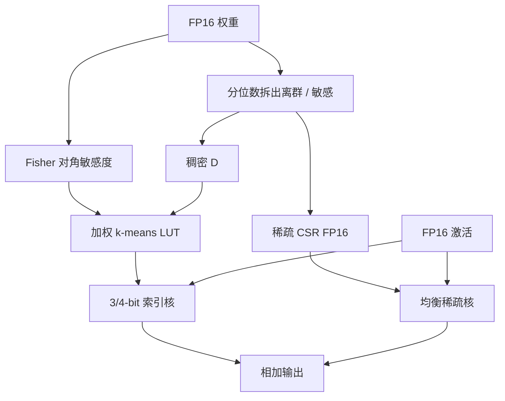

# SqueezeLLM

    
生成式 decode 卡在带宽而不是算力；与其把格子划均匀，不如按二阶敏感度把质心拉到要命的权重旁边，再把离群点抠成稀疏 FP16，3-bit 的困惑度缺口才能从均匀量化里收回来。

    <footer>—— Kim、Hooper、Gholami、Keutzer 等，SqueezeLLM: Dense-and-Sparse Quantization，ICML 2024</footer>

Sehoon Kim、Coleman Hooper、Amir Gholami、Zhen Dong、Xiuyu Li、Sheng Shen、Michael Mahoney 与 Kurt Keutzer（UC Berkeley / ICSI / LBNL）的 ICML 2024 论文（arXiv:2306.07629）把 LLM 权重量化写成两件事：**敏感度加权的非均匀量化**，以及 **稠密加稀疏分解**。它是训练后量化，激活保持 FP16，对象是单 batch 生成时的 Memory Wall。与 [GPTQ](/llm/gptq) 的均匀网格加 Hessian 补偿、[AWQ](/llm/awq) 的通道放大不同，SqueezeLLM 认为：反正 decode 的算术也在 FP16 里做，均匀 INT 格子没有硬件红利，不如用查找表把代表值放到 Fisher 意义下更重要的位置。并发的 [SpQR](/llm/spqr) 也抠离群权重，但分组更碎、稀疏度更高；本篇按 SqueezeLLM 的 OBD / 非均匀 LUT 写。

## 问题

LLaMA-65B 的 FP16 大约 130GB，装不进当时单卡。生成式一步是矩阵–向量乘，算术强度极低，屋顶线落在带宽上：只降权重比特、激活仍 FP16，延迟几乎线性下降。于是 3–4 bit 权重量化成为主战场。均匀 RTN 在 3-bit 上会把 LLaMA-7B 的 C4 困惑度从约 7 打到 28；GPTQ 能救一截，但格子仍均匀，而权重直方图明显不是均匀的。

第二点是离群值。约 99.9% 的权重挤在全距的约 10% 里，少数尖峰绑架 min-max。分组量化用更多尺度去间接对付它们，元数据涨、核变复杂。需要一种直接手段：把尖峰拿走，让稠密部分的动态范围塌缩，再在塌缩后的分布上分配 8 或 16 个代表值。

### 均匀格子服务的是整数算力，不是 decode

W4A16 的卖点是少搬权重。反量化之后的乘加仍在 FP16。坚持均匀量化，是为了将来可能的 INT 计算，不是为了当前的生成延迟。SqueezeLLM 把这个观察写成方法选择：非均匀 LUT + 逐通道码本，反量化核按块把 3/4-bit 索引解成 FP16 再乘向量。

「无损 3-bit」在摘要里相对的是当时同内存预算下的均匀方法缺口，不是与 FP16 bitwise 一致。引用应带 C4 / WikiText 与平均比特（含稀疏与 LUT）。

## 方法

敏感度来自损失对权重的二阶展开。收敛后梯度近似为零，量化扰动 $\Delta W$ 的损失增量由 Hessian 二次型给出。完整 $H$ 不可算，用 Fisher 信息 $\mathcal{F}=\frac{1}{|D|}\sum g_d g_d^{\top}$ 近似，再取对角，得到加权 k-means：

$$
\min_{Q}\sum_i \mathcal{F}_{ii}\bigl(w_i-Q(w_i)\bigr)^2.
$$

质心被拉向 Fisher 大的权重。这是 Optimal Brain Damage 的精神：保护终局损失，而不是只保护每一层的 $WX$。校准用约 100 条 C4（Vicuna 则用其训练集）上的梯度。每个输出通道一本 LUT，3-bit 即 8 个 FP16 代表值。

稠密–稀疏：$W=D+S$。按分位数阈值把幅度离群点放进 $S$，再用 Fisher 额外抠约 0.05% 的敏感元，合计常见 **0.45%** 稀疏（0.4% 离群 + 0.05% 敏感），CSR 存 FP16。$D$ 动态范围大约可收一个数量级，再跑加权 k-means。前向 $Wx=Dx+Sx$，稠密 LUT 核与均衡 CSR 核一次 launch，避免两次同步。作者认为分组不如这点稀疏来得划算。

主表：LLaMA 7B–65B、LLaMA-2、OPT、Vicuna；C4 与 WikiText 困惑度，另有 MMLU 与 Vicuna 指令跟随。3-bit 相对 GPTQ/AWQ 在同内存分组下把 PPL 缺口再压一截（文中对 LLaMA-7B 称相对 SOTA 最高约 2.1× 收窄缺口）；A6000 上生成相对 FP16 最高约 2.3× 加速。对比时把「无稀疏 SqueezeLLM」对「无分组 GPTQ」，「0.45% 稀疏」对「g128 GPTQ/AWQ」，避免用平均比特不同的点互打。

### 非均匀不是 NF4

[QLoRA](/llm/qlora) 的 NF 数据类型是假设权重近似正态的静态码本。SqueezeLLM 的码本按层、按通道、按 Fisher 现场聚出来，分布与敏感度都进目标。k-means 本身不是新发明；加权与 LLM 权重量化的组合是这篇的贡献点。同一套 LUT 不能在层之间共用：注意力输出投影与 FFN down 的直方图、敏感团位置都不同，通道级码本是在用元数据换拟合，而不是再学一套全局 NF。

## 机制

Fisher 大的权重对终局损失曲率高，同样的 $|w-\hat{w}|$ 伤害更大。均匀格子把 bin 浪费在直方图两侧的空旷区；加权质心挤在敏感团附近，3-bit 的 8 个电平不再均分全距。离群点若不抠走，某一个电平会被尖峰吸走，其余团块变粗——稀疏提取是在给 k-means 松绑，不是为了「再做一次 LLM.int8()」。LLM.int8() 抠的是**激活特征维**；这里抠的是**权重元素**，激活全程 FP16。

相对 GPTQ：GPTQ 在均匀网格上按列补偿层输出 MSE（OBS 谱系）；SqueezeLLM 不改邻居来补偿取整，而是改网格本身并允许极少数权重逃出网格。相对 SpQR：SpQR 用 GPTQ 过程中的敏感度 $s_{ij}$ 动态标出离群，配合极细分组与尺度再量化；SqueezeLLM 用更低稀疏、不用分组作为主杠杆。原文称在附录里 OBD 终局损失优于只保层输出。

稀疏度升高，CSR 不规则访存会吃掉 3-bit 的带宽红利。0.45% 是精度与核之间的操作点，不是越高越好。行间非零极不均匀时，论文用每线程固定非零数的 hybrid CSR，而不是一行一线程。

## 边界与工程取舍

### LUT 核、稀疏度与分组不要叠成三份税

LUT 核要自己写；生态里 GPTQ/AWQ 的 INT4 核更现成。非均匀代表值无法直接走整数 Tensor Core，这是方法选择而不是实现疏漏。校准 Fisher 需要反向，比 AWQ 的激活统计贵一截，仍远小于 QAT。敏感度估在 C4 上，换指令或代码分布，Fisher 指向可能偏，应在目标域抽几十条重算对角。分组与稀疏可以叠，作者认为次优：细分组已经在付尺度税，再叠 0.45% CSR，平均比特与核复杂度一起涨，而加权 k-means 在塌缩后的 $D$ 上往往已经够用。KV、激活不在合同内。报加速必须写 GPU、batch=1、生成长度；大 batch prefill 会离开 Memory Wall 假设，此时非均匀 LUT 相对均匀 INT4 的墙钟优势会收窄，甚至反转。

出处：Kim, Hooper, Gholami, Dong, Li, Shen, Mahoney, Keutzer，*SqueezeLLM: Dense-and-Sparse Quantization*，ICML 2024，PMLR 235:23901–23923，arXiv:2306.07629。并发离群权重格式见 SpQR。代码：SqueezeAILab/SqueezeLLM。

## 小结

- SqueezeLLM 是 W3/W4A16 的 PTQ：Fisher 加权 k-means 非均匀 LUT + 约 0.45% 稠密–稀疏分解。
- 设计假设是单 batch 生成带宽墙，均匀 INT 算力不是目标。
- 与 GPTQ/AWQ 比的是同内存下的 PPL；与 SpQR 比对稀疏度与是否依赖细分组。
- 出处：Kim et al.，ICML 2024。
