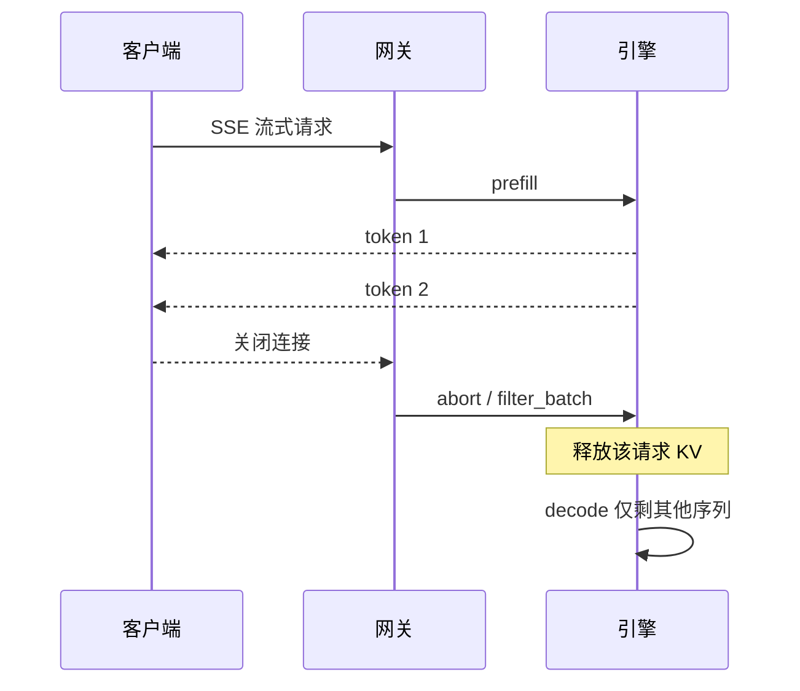

# 流式输出与取消

客户端一关连接，正在 decode 的那条序列就应该从 batch 里消失，KV 槽还给别人。流式若只出字、不回收，取消就是假的。

<footer>—— 对照 TGI 架构文档中的 filter_batch 时序，以及 OpenAI 兼容层把断开当 abort 的实践</footer>

大模型服务把生成拆成许多步。非流式接口等到 EOS 或 `max_tokens` 才返回一整块 JSON，首字延迟等于整段延迟。流式用 Server-Sent Events（SSE）把每个 token（或每个 chat chunk）推给客户端，TTFT 才有意义。取消是流式的对偶：用户点停止、页面关闭、网关超时，HTTP 连接断开之后，引擎若继续把这条请求算完，GPU 在为无人阅读的 token 付费，KV 池被幽灵序列占满。TGI 的架构时序里，Client 离开对应 `filter_batch`；vLLM 一类 OpenAI server 把断开传播为内部 abort。本篇写流、取消、代理缓冲这三件事如何咬合，不编造一条「SSE 取消」的 arXiv。

## 问题

Decode 步在 GPU 上便宜到「每步一两个毫秒」时，浪费一百步也不显眼；上下文变长、并发变高之后，每条已取消请求仍占一份 KV，并且仍参与连续批的同步点，尾延迟会先于平均吞吐恶化。更麻烦的是：断开发生在 prefill 尚未返回之时——用户已经离开，引擎还在为长提示做注意力。若取消只挂在「已经开始往 SSE 写」的生成器上，排队中的请求会漏掉 abort。

协议层也不统一。OpenAI 兼容流是 `data: {json}\n\n` 帧，结束常用 `data: [DONE]`。TGI 自有 `/generate_stream` 是另一套事件字段。MindIE EndPoint 对 TGI / OpenAI / 原生 `/infer` 各有流式路径。网关若按「等上游 JSON 完整」去缓冲，流式在用户眼里退化成非流式，超时却按流式连接的长超时计算——两边最坏情况叠在一起。

### 取消必须穿过三层

第一层是 HTTP：TCP 复位或半关闭。第二层是应用服务器：ASGI 取消、Rust 侧发现写 socket 失败。第三层是引擎：从 running batch 删除 `request_id`，释放 KV，必要时 `clear_cache`。只做第一层，日志里仍会把请求标为 Finished；只做第三层而客户端不知情，用户会看到截断却没有错误帧。三层都要测。

代理超时是取消的第一大误报来源。Nginx、负载均衡、云 API 网关的默认空闲超时把长生成杀掉，引擎日志写 abort，客户端写「随机失败」。流式路径必须单独放大超时，并关闭对 SSE 的 response buffering。

## 方法

流式响应头应是 `Content-Type: text/event-stream`（及禁止中间层缓冲的相关头）。每一帧携带增量文本：chat 兼容里是 `delta.content`，而不是反复发送已生成全文。结束条件包括 EOS、命中 `stop`、到达 `max_tokens`、或被取消。正常结束与取消在客户端的可观测性不同：前者有结束 chunk 与完整 `usage`，后者可能只有连接关闭。不要用一条伪造的「空 content 加 finish_reason=stop」去粉饰 abort，否则计费与评估会把取消当完成。

TGI 文档中的调用流给出可执行的引擎契约：`prefill` 产出首 token 与 `cached_batch`；随后反复 `decode`；当 Client 1 离开，router 对 model server 发 `filter_batch`，`request_ids_to_keep` 只含仍在线的请求。若请求在 prefill 期间被取消，时序图里出现 `clear_cache`，避免为已空的 batch 继续 decode。任何自研引擎只要声称连续批，都应能指出与这两类 RPC 对应的内部接口，否则取消只存在于 HTTP 框架的 try/finally 里。

### 检测断开的时机

理想情况：在排队阶段就轮询断开（TGI router 在发 gRPC 前就能丢弃；vLLM 社区修复过「未出首 token 就不 abort」的漏洞）。实现上常见做法是：流式生成器在每次 `yield` 前后检查 `request.is_disconnected()`，并对引擎 `abort(request_id)`。检查间隔若等于一步 decode，最坏浪费一步；若只在 Python 队列外层等完整生成，可能浪费整段 `max_tokens`。压测取消必须包含「发完请求立刻断开」与「生成到一半断开」两条。

Stop sequence 与取消不同。Stop 是采样成功结束，KV 仍按策略保留或释放；取消是失败路径，默认应立即释放，除非产品明确做「暂停后续写」。把 Ctrl+C 做成 stop，会让模型以为自己说完了，下一轮前缀里留下半截句子。

## 机制

SSE 是单向、基于 HTTP/1.1 长连接的文本帧。它不保证每 token 一个 TCP 包，也不保证跨代理的实时性。真正的实时性来自：上游 `flush`、代理 `X-Accel-Buffering: no` 一类开关、以及客户端按帧解析而不是等 `Content-Length`。HTTP/2 下的流取消有 RST_STREAM，网关必须把它翻译成对上游 HTTP/1.1 连接的关闭，否则会出现「浏览器停了、引擎还在跑」。

连续批里取消的代价不是一次 `free()`。TGI 写明：插入 prefill 或 filter 会停掉当前 decode batch 再重启。高频取消会把重启税打到还活着的请求上。产品上应节流「停止」按钮的连点，并把取消计入独立指标（aborted requests），不要混进失败率当模型质量问题。KV 释放之后，[KV 感知路由](/llm/kv-aware-routing) 的缓存键也应失效，避免后续请求打到「以为还有前缀」的副本。

Tokenizer 流式 detokenize 会遇到不完整 UTF-8 与未闭合的多字节子词。取消时缓冲区要丢弃，不能把半个汉字冲进已关闭的 socket 再记一次编码错误。见 [tokenizer 开销](/llm/serving-tokenizer-cost)。

### 与 OpenAI 信封的衔接

兼容层在 `stream: true` 时通常不在中间帧填完整 `usage`，最后一帧或 `[DONE]` 之前补。取消则可能没有任何 usage。网关计费若只认 usage 字段，取消流量会变成零成本攻击面：恶意客户端占满 decode 再断开。应对是在引擎侧按已生成 token 记账，而不是按是否收到 `[DONE]`。`finish_reason` 在正常路径取值 `stop` / `length`；取消不一定有机会写出该字段。

## 边界与工程取舍

不要为取消单独发明一个必须鉴权的 `POST /cancel/{id}` 才认为功能完备。对浏览器与 SDK 而言，关连接是最便宜的信号；TGI / vLLM 的主流实践也是这条。内部管理面可以另做 abort by id，用于管理员杀请求，但它不是客户端协议的一部分。[OpenAI 兼容协议](/llm/openai-compat-api) 没有标准化这条管理 API。

MindIE 的 Triton 风格路径提供 `stopInfer` 一类显式停止，说明有的服务化框架选择「命名 RPC」而不是「靠断开」。接这类后端时，网关必须在客户端断开时主动调停止，不能假设 NPU 引擎会盯着 TCP。多副本前面的重试更危险：断开后若幂等重试同一 `request_id`，可能在另一副本上再跑一遍。取消应与幂等键一起设计。

出处：Hugging Face TGI Architecture 时序（filter_batch / clear_cache）；OpenAI 流式响应的公开格式；各引擎关于 client disconnect abort 的说明。没有单独的会议论文编号。

## 小结

- 流式用 SSE 把 TTFT 从整段生成里拆出来；取消必须释放 KV，否则连续批被幽灵请求污染。
- TGI 用 `filter_batch` 与 `clear_cache` 表达「人走了」；自研引擎需要同等契约。
- 断开检测要覆盖排队中与生成中；代理缓冲与超时是第一故障源。
- 正常结束、stop sequence、取消是三条语义，计费与前缀缓存不能混用。
- 显式 stop RPC 只在特定服务化框架存在，不能从 OpenAI 信封推导。
- 出处：TGI 架构文档；OpenAI 流式 API 说明；开源引擎的 abort / disconnect 实践。
