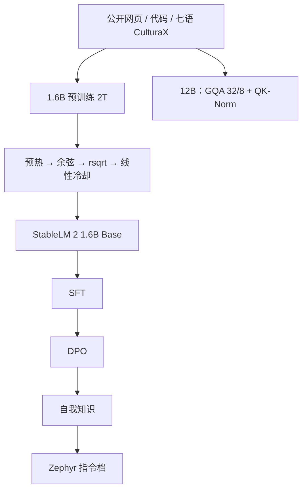

# StableLM 2

    
把数据表、学习率日程和 1.6B 的训练小时数摊开，是为了让「小于 2B 的开源点」可以被复现，而不是只下载一份排行榜权重。

    <footer>—— Bellagente 等，Stable LM 2 1.6B Technical Report，arXiv:2402.17834</footer>

Stability AI 的 StableLM 2 是 2024 年的小模型一代：**1.6B** 有完整技术报告，随后放出 **12B**（约 12.1B 参数）共用同一条「Stable LM 2」产品线。1.6B 训在约 **2T** 公开可商用语料上，七种欧洲语言，报告发布时自称 2B 以下开源明显领先；12B 模型卡写明在多样多语与代码数据上训 **2T token、两轮**。本篇以 2402.17834 为 1.6B 的出处，12B 只引用 Hugging Face 模型卡与同一份报告的引用栏，**不为 12B 伪造独立 arXiv**。

## 问题

小模型若只给权重、不给混合比例与日程，社区只能用更大模型蒸馏或猜数据。Stability 要把 1.6B 写成可审计实验：全部数据源公开、采样权重列表化、约 **9.2 万 GPU 小时**（报告按每卡时 3.5 美元估云成本）。问题因此是两层：在 24 层、$d=2048$、上下文 4096 的解码器上，如何用公开网页、代码与多语把「小于 2B」的英语与多语基准打满；以及后训练（SFT、DPO、自我知识）能否在不引入多语对齐数据的前提下把对话抬上去。

12B 要回答的产品问题不同：单机可部署的 12B 稠密模型，用 [GQA](/llm/gqa) 和逐头 QK 归一化把服务 KV 与训练稳定钉住。它的数据叙事与 1.6B 同源（RefinedWeb、RedPajama、The Pile 去 Books3、StarCoder、CulturaX 等），但架构表、许可条款以 12B 模型卡为准。

### 1.6B 不是把 Llama 缩到 24 层那么简单

结构接近 Llama 式解码器，但报告列明差异：RoPE 只加在每个头的前 **25%** 维（GPT-NeoX 式，为吞吐）；归一化用带学习偏置的 LayerNorm，而不是 RMSNorm；FFN 与注意力里去掉大部分 bias，**保留 Q/K/V 投影的 bias**。词表是 Arcade100k——从 `tiktoken` 的 `cl100k_base` 扩出代码特殊符号与数字切分，训练时 pad 到 100352 以对齐 Tensor Core。1.6B 形状：参数约 16.4 亿，隐藏 2048，24 层，32 头，序列 4096。12B 模型卡：隐藏 5120，40 层，32 查询头 / **8** KV 头，序列 4096。

1.6B 报告表没有 GQA；12B 才是 32/8。不要把两档写成同一套注意力。许可是 Stability AI Community License，商用要看当时条款，不是 Apache 2.0。12B 模型卡语言栏写 English，但预训练混合含 CulturaX 多语——产品「官方语言」与数据里出现过的语言不是一回事。

## 方法

1.6B 预训练在 512 张 A100 40GB 上，ZeRO-1，关掉激活检查点以换微批，全局约 $2^{23}$ token/步，报告约 170 TFLOPs/s、54.5% MFU。AdamW：$\beta_1=0.9$，$\beta_2=0.95$，weight decay 0.1。混合精度 BF16，All-Reduce 走 FP32。他们消融过 softmax 上的 z-loss，觉得对稳定帮助有限，**最终主实验没用**。

数据表（报告 Table 1）按采样权重列出 ArXiv、PubMed、S2ORC、书籍、CulturaX 英/西/德/法/意/荷/葡、C4、OpenWebText2、RefinedWeb、StackExchange、法律、数学、Wiki、StarCoder、以及 Yuan & Liu 风格的 Restruct-v1 指令化语料。CulturaX 的 mC4 因 HTML boilerplate 被丢掉，只留 OSCAR 子集。总有效 token 约 **2.01T**。消融在附录，用来选多语与代码比例。

### 可续训的学习率：余弦接 rsqrt，再线性降到零

预热约 9720 步升到 $10^{-3}$。主段先按余弦降到 $N/4$ 步，再切到

$$
\eta(i)=\frac{\alpha}{\sqrt{i+\beta}},
$$

$\alpha,\beta$ 选成在衔接点函数值与导数连续。最后约 8 万步（约 670B token）线性降到 0。动机是：余弦把终点写死，想多训只能重来；rsqrt 段允许「还没决定总步数」时继续，最后一段冷却收盆地。这与后来小模型常用的 [WSD](/llm/minicpm) 平台+衰减是同一类灵活性，形状不同。

后训练三步且**不用多语数据**：SFT → DPO → 自我知识。指令档以 `stablelm-2-zephyr-1_6b` 等名字发布。12B 预训练两轮、384 张 H100 量级（模型卡叙述），实现库 GPT-NeoX；逐头 QK-Norm 引用 ViT 与 Wortsman 等稳定化工作。

## 机制

小模型的知识密度更吃数据混合而不是深度。1.6B 把 RefinedWeb 与 CulturaX 英语放到最大权重，代码与数学各占几个百分点，Restruct 把下游格式提前写进预训练，减少「只会续写网页」到「会答题」的落差。RoPE 只转 25% 维是吞吐权衡：旋转更少的通道，GEMM 更整；外推能力不能按「全头 RoPE」的经验外推。Arcade100k 对代码与非英语压缩更好，英语下游在报告的对照里与 NeoX 词表无显著差——选它是为多语和代码账单，不是为刷英语 MMLU。

rsqrt 段的机制是让学习率随步数缓慢下降而不预设终点，优化器仍有足够噪声去吃新数据；线性冷却才把权重推进低损失区。因此「最后 670B 很重要」是日程相位，不是那一段语料突然变神。后训练关掉多语，是为了把有限的 1.6B 容量花在英语对话；多语能力主要来自预训练，指令档的多语对话不要期望与英语 MT-Bench 同一水平。

报告 Table 4 把 Phi 标成 aligned，理由是教材式数据与问答意图，即使它们声称只预训练。和 [Phi](/llm/phi) 比，StableLM 2 走的是公开网页混合 + 透明日程，不是合成教材。两者都「小打大」，数据哲学不同。

### 1.6B 与 12B、与 SmolLM / MobileLLM

端侧吞吐与量化，报告给了 1.6B 的设备剖面；要本地助手先看 1.6B 指令档。12B 是单卡或双卡服务档，KV 靠 GQA 8 头，不要用 1.6B 的 32 头满 KV 去估 12B 显存。与 [SmolLM](/llm/smollm) 比，StableLM 2 更早摊开完整源表；SmolLM 更强调教育过滤与合成教材。与 [MobileLLM](/llm/mobilellm) 比，1.6B 不是为手机 SRAM 深度优先而设计，而是云侧可复现的 2B 以下点。

## 边界与工程取舍

12B 没有与 1.6B 等长的独立技术报告，架构与 token 量以模型卡为准，不要把 1.6B 的 24 层日程线性乘到 40 层。Community License 含使用与归因约束。Books3 被明确排除。z-loss 未进主实验，不能把别家的 logits 压制当成 StableLM 2 的默认实现。从 StableLM 3B 4e1t 等前代接 LoRA，层数与词表都不兼容。

指令档的 MT-Bench 与 Open LLM 平均分会随对照集变。量化检查点的表在报告里有，和 BF16 主表不是同一列。自我知识步骤的数据与提示以报告第三节为准，不要写成通用 DPO 的第四损失项。

真实编号只有 Bellagente 等 *Stable LM 2 1.6B Technical Report*，arXiv:2402.17834。12B 模型卡的 bibtex 仍指向这一号。不要编造 12B 专有 arXiv。

## 小结

- StableLM 2 含 1.6B（完整报告、约 2T、七语、可续训学习率）与 12B（模型卡：GQA、QK-Norm、2T×两轮）。
- 架构近 Llama，但 RoPE 25% 维、LayerNorm、部分 QKV bias、Arcade100k。
- 后训练为英语 SFT+DPO+自我知识；许可为 Stability 社区条款。
- 出处：Bellagente 等，arXiv:2402.17834，2024；12B 以 Stability 模型卡为准。
