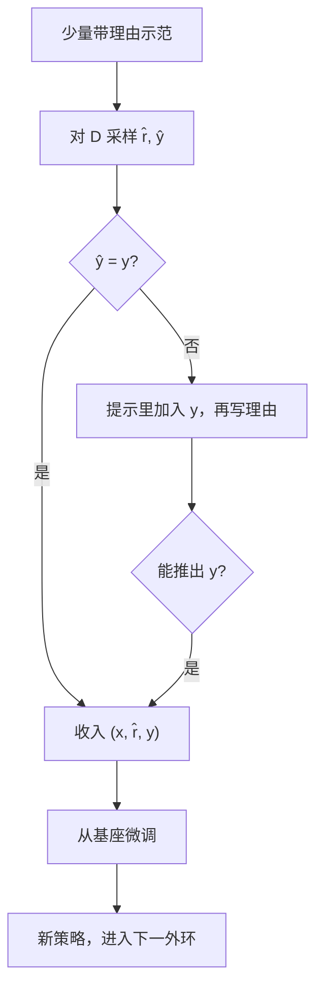

# STaR Self-Taught Reasoner

    
用少量带理由的例子去生成许多理由，只保留能推出正确答案的那些，再微调；错的题目则把答案当作提示，让模型反过来写一条能通向该答案的理由。

    <footer>—— Zelikman, Wu, Mu, Goodman，STaR: Bootstrapping Reasoning With Reasoning，NeurIPS 2022</footer>

思维链能提高算术、常识与应用题成绩，但完整理由标注贵，纯 few-shot 又不改权重。Zelikman 等人提出 Self-Taught Reasoner（STaR）：外环在「生成 → 按答案过滤 → 微调」之间打转，把一小撮示范扩成越来越大的自生成理由集。做不对的题不是丢掉，而是**合理化**（rationalization）——把正确答案塞进提示，让模型倒着写理由，微调时再把答案提示拿掉。本篇按 arXiv:2203.14465 写循环、合理化与 GPT-J 上的数字；token 级默想见 [Quiet-STaR](/llm/quiet-star)。

## 问题

当时诱导理由有两条路。一条是人工写成千上万条逐步解答再监督微调，贵，且理由风格被标注者锁死。另一条是 Wei 等人的 few-shot chain-of-thought：推理时在提示里放几条示范，权重大不变，难题上 6B 级模型几乎帮不上。需要一种中间物：示范很少，无理由的题很多，模型用自己的生成当训练数据，并且难度能随外环上升。

只保留「答对了的理由」会停在模型已经会的题上——外环饱和。错题若直接拿来训，又会强化坏推理。STaR 要解决的是：如何从失败里得到**仍能导向正确答案**的理由，而不把「高温度蒙对」当成正例。后者在算术上尤其致命：温度一升高，草稿纸与答案脱节，模型会学到无意义中间步骤。

### 自举的前提是 few-shot 高于随机

外环第一步必须能采样到一些对的理由。作者发现 GPT-2 在算术上无法从 few-shot 起步；GPT-J 6B 可以。二分类、正确率接近随机的任务会混进大量「理由胡写、选项碰巧对」的样本，过滤器失效。这是方法边界，不是调参能消掉的。

合理化不是把标准答案泄漏进部署。训练时提示含 $y$，写入数据集时只留 $(x,r,y)$，推理与下一轮生成都不给 $y$。若实现忘了删提示，模型学会的是抄答案而不是推理。

## 方法

记少量带理由示范为 $P$，无理由但有标签的题集为 $D$。每一外环：

1. 用 $P$ 作 few-shot，对 $D$ 中的 $x$ 采样理由 $\hat r$ 与答案 $\hat y$。
2. 若 $\hat y=y$，把 $(x,\hat r,y)$ 加入本轮训练集。
3. 对失败题，把 $y$ 作为提示再采样理由（合理化）；若新理由能重新推出 $y$，同样收入。
4. 从**原始预训练检查点**（或固定起点）微调，而不是在上一外环权重上接着训——避免一次过拟合锁死。步数随外环增加（原文：首轮 40 step，之后每轮约 +20%）。
5. 用新模型重复。算术上他们在第 30 轮后截断训练集规模以免过长。

微调阶段把少量 few-shot 示范混进批次，作者消融认为这对 CQA 有帮助（无合理化从 60.9% 到 68.8%，有合理化从 69.9% 到 72.5%）。

主实验基座 GPT-J。算术：5 万随机加减题，外环每轮抽 1 万；16 轮后总体准确率 89.5%，对照「1 万无理由样本训 5000 step」为 76.3%，few-shot 即使带草稿纸在 2 位数上已 $<1\%$。CommonsenseQA：STaR+合理化 72.5%，GPT-J 直接微调 60.0%，few-shot CoT 36.6%；文中写与约 30 倍大的 GPT-3 直接微调（73%）接近。GSM8K：STaR+合理化 10.7%，直接微调 5.8%，few-shot CoT 约 3%；合理化在 GSM8K 上增益不大。最终 CQA 模型用到训练集约 78.2% 的生成理由，另加约 8.5% 来自合理化。

### 合理化为何不是高温度

高温度增加「答案对、理由错」的比例，算术草稿纸会崩成乱码，外环停滞。合理化条件在 $y$ 上，模型做的是逆向：已知目标，填一条前向看起来合法的链。过滤仍然要「这条链推出的答案等于 $y$」，不是有了 $y$ 就无条件收录。作者把高温度对照写成系统更差，且生成是序列瓶颈，多采样比再跑一次带答案的前向更贵。

## 机制

### 过滤把推理当隐变量

真正的目标是 $p(y\mid x)$，理由 $r$ 是帮助计算它的隐轨迹。STaR 用指示函数 $\mathbf{1}[\hat y=y]$ 选择 $r$，近似「成功轨迹上的最大似然」。这与后来的拒绝采样 SFT、RFT 是同一家族，差别是外环迭代与合理化补失败。没有负例梯度：做错的理由若不经合理化，不会被显式压低，只是不出现。这与 RL 里对错样本都更新不同。

外环从基座重微调，是为了对抗「本轮数据被上一策略的错误模式污染后还在同一权重上接着学」。代价是算力随轮数重置。持续训练单一检查点是另一种实现，原文不采用。

### 机会水平会污染理由

CQA 五选一，随机 20%，浅启发式约 30%。答对不等于理由对。作者承认常识题上理由质量只能个案看，不像算术能对齐标准草稿纸。这是 STaR 在分类任务上的结构性噪声，也解释了为何后来数学 RL 更爱可解析的最终数字，而不是五选一。

## 边界与工程取舍

STaR 需要可自动核对的 $y$。开放写作没有这个过滤器。基座太弱则外环起不来。二分类任务正例污染重，原文列为未解决问题。合理化可能写入「从答案反推的事后诸葛」，表面连贯、并非模型在无 $y$ 时会走的搜索；下一轮 few-shot 生成若仍依赖这种风格，会与真实解题分布错位。GPT-J 的 GSM8K 10.7% 只说明 2022 年 6B 上的自举存在性，不能与 2025 年的长链 RL 比绝对分。

与 RL 的关系：STaR 是迭代过滤 SFT，没有优势、没有 KL 惩罚、没有在线奖励模型。Quiet-STaR 去掉 $y$，改用未来词似然；R1 用规则奖励在线更新。三条都「从自己的生成里学」，监督密度与是否改策略梯度不同。

「可比 30 倍大的 GPT-3」仅针对 CQA 直接微调的 73% 这一格，不是跨任务、跨协议的普遍结论。GSM8K 上 GPT-J 的 STaR 远未接近后来的专用数学模型。

### 何时不必上 STaR

已有大规模正确长链（蒸馏轨迹），一次 SFT 就够，不必多外环。有可验证奖励与采样预算，GRPO 一类能用负例。没有标准答案，换 Quiet-STaR 或偏好学习。基座 few-shot 已在随机水平，先做预训练或更大模型，不要空转外环。

## 小结

- STaR 用少量理由示范，在带标签题上自生成理由，按最终答案过滤后微调，外环迭代。
- 合理化：失败题看到 $y$ 再写理由，入库时去掉 $y$，用于打破「只会已经会的题」。
- GPT-J 上 CQA 72.5%、算术 89.5%、GSM8K 10.7%，对照为直接微调与 few-shot CoT。
- 高温度不能替代合理化；机会水平任务会混进坏理由。
- 它是过滤式自举 SFT，不是策略梯度；后续 Quiet-STaR 与长链 RL 是不同监督。
- 出处：Zelikman, Wu, Mu, Goodman，*STaR: Bootstrapping Reasoning With Reasoning*，NeurIPS 2022，arXiv:2203.14465。
