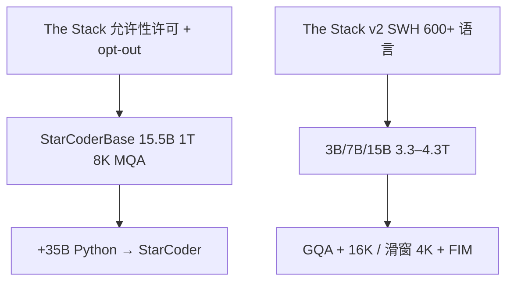

# StarCoder / StarCoder2

BigCode 把可许可的源代码档案做成可检查、可退出的预训练集：15.5B 在 The Stack 上吃 1T token，下一代改用 Software Heritage 上的 The Stack v2，把 3B 训到超过上一代 15.5B Base。

<footer>—— Li 等，StarCoder，arXiv:2305.06161；Lozhkov 等，StarCoder2，arXiv:2402.19173</footer>

BigCode（Hugging Face、ServiceNow 等）的 **StarCoder** 线是开源代码模型里数据治理与架构配方写得最完整的一组。第一代：**StarCoderBase 15.5B** 在 The Stack（允许性许可证、opt-out）上训 **1T** token，再在 **35B** Python token 上得到 **StarCoder**；8K 上下文，**MQA**，**FIM**，TMLR 2023，arXiv:2305.06161。第二代 **StarCoder2**：**3B / 7B / 15B**，The Stack v2（Software Heritage，600+ 语言，体积约 4×），上下文 **16384**、滑动窗 **4096**，**GQA**，3B/7B 约 **3.3T**、15B 约 **4.3T** token，arXiv:2402.19173。本篇写两代差分；不把 SantaCoder 1.1B 或后来的指令版当成 Base 主表。

## 问题

闭源 Codex 把 HumanEval 抬起来，开源缺的是：可合法再分发的大规模代码；训练时就见过 IDE 式中间填空；推理时大 batch 补全要省 KV。The Stack 用许可证过滤与退出流程，而不是「能爬就训」。文件级随机取样仍看不到跨文件依赖——后代 [DeepSeek-Coder](/llm/deepseek-coder) 才把仓库组包写进预训练；StarCoder 要先把**多语言 Base + Python 特化 + FIM + 8K**做成可复现基线。

StarCoder2 面对的是：v1 语言覆盖与体积不够；15.5B 对端侧仍大；绝对位置 8K 外推弱。问题变成：用 SWH 档案扩语言，把小模型训过上一代大 Base，并把窗口做到 16K 而不把注意力做成满 16K 二次。

### Base 与 Python 特化不要混名

StarCoderBase：80+ 语言、GitHub issues、commit、Jupyter，1T token。StarCoder：同一 15.5B 再吃 35B Python。评测上 Python 特化仍保其它语言，是论文主张；引用必须写是 Base 还是 Python 版。架构：GPT-2 式解码器，**MQA**，学得的绝对位置，FlashAttention，FIM 训练（Bavarian 等，见 [FIM 解码](/llm/fim-decode)）。词表约 49K。PII 红线与归属追踪工具是发布的一部分，不是博客装饰。

StarCoder2-15B 没有再做一代那种单独 35B Python 续训；多语言 v2 与更长训练替代了「先通吃再特化 Python」的两段式。不要把 StarCoder 的 35B Python 故事抄到 2 的模型卡上。

## 方法

The Stack v1.2：允许性许可证仓库，opt-out 排除。过滤规则（平均行长、最大行长、字母比例等）被后来许多代码模型沿用。FIM 把文件切成前缀 / 中段 / 后缀，训练时按哨兵拼接，使补全条件于两侧。MQA：多查询共享 KV，补全服务里大 batch 省缓存。

The Stack v2：与 Software Heritage 合作，619 种语言的档案标识（SWHID）公开，另加 PR、Kaggle、文档等。3B/7B/15B 用 NeMo 在 Eos Supercomputer（DGX H100）上训。注意力改为 **GQA**，位置改为 RoPE 一类相对编码（相对一代绝对位置），16K 上下文配 **4K 滑动窗**——长程是局部窗的堆叠，不是每层满 16K 稠密。FIM 保留。许可 OpenRAIL，数据可追溯到 SWHID。

### 小模型打过上一代大 Base

2 的主张：StarCoder2-3B 在多数代码基准上超过同尺寸对照，并且超过 **StarCoderBase-15B**；15B 可打到或超过更大的 CodeLlama-34B 一档，在高资源补全上仍可能落后当时的 DeepSeekCoder-33B，但在数学、代码推理与部分低资源语言上更好。这是数据与训练长度的故事：3B×3T+ 对 15.5B×1T 的陈旧混合。指令版与评测提示不在 Base 主文展开。

## 机制

FIM 改的是排列：中段出现在后缀之后，梯度让模型在看见调用方时填实现，见 Bavarian；StarCoder 把它做成预训练默认比例，而不是只在微调补。MQA/GQA 改的是 KV 头数：补全时 batch 里许多请求共享同一套深网络，KV 带宽往往先爆。8K 让「文件上方的类」与「下方的测试」同时进窗口，仍远小于仓库；2 的 16K 加滑窗把更长文件放进训练，但滑窗意味着超过 4K 的依赖要靠层间传递，不是单层全局。

v2 的治理机制是可引用的 SWHID：权重与数据清单分开，opt-out 与许可证可审计。这与「爬到什么训什么」的闭源叙述相反，也解释了为何许多后续配方（含 DeepSeek-Coder 的过滤规则）要引用 The Stack。

### 和 Codestral、和仓库级组包

[Codestral](/llm/codestral) 是 22B 产品级代码模型，FIM 与 80+ 语言是同一产品意图，数据与许可（MNPL）不同。[DeepSeek-Coder](/llm/deepseek-coder) 把依赖解析组包写进预训练，明确对照「StarCoder 式文件过滤仍可能留 fork」。StarCoder2 仍以文件 / 档案语料为主，16K 不是仓库图。评测上不要用 HumanEval Python 一列宣布低资源语言胜利。

2 的 16K 是训练窗口；滑窗 4096 是注意力模式。实现若关掉滑窗做满 16K，算力与论文配方不一致，外推数字不能当论文结果。

## 边界与工程取舍

OpenRAIL 不是 Apache：使用与再分发有行为约束，商用读许可证。opt-out 之后的快照与你下载的权重可能有时间差。PII 红线降低但不消灭密钥泄漏，输出仍要扫描。FIM 推理必须用训练哨兵，聊天模板冒充中间填空会和后缀打架。15.5B 一代用绝对位置，强行超 8K 要另做外推，不要假设与 2 的 RoPE 相同。

不要把 StarCoderPlus / StarChat 的指令数字写进 Base。不要把 15B-2 写成 15.5B 的继续训——数据与结构都换了。HumanEval 污染随时间变差，应用自有仓库回归。低资源语言「600+」是档案覆盖，不是每种语言都有 15B 级 token。

IDE 集成要把前缀缓存键包含 FIM 后缀。滑窗实现与 FlashAttention 版本绑在一起，升级内核要回归补全一致性。归属工具可查疑似抄训练集，不能当许可证合规的充分条件。过滤规则把平均行长与字母比例当质量代理，会误伤压缩过的生成代码，也会放过「看起来像源码的数据文件」；上线前应用自己的语言与仓库再滤一层，不要假设 The Stack 的阈值等于你们的生产阈值。Issues 与 Jupyter 进预训练，是为了自然语言里的报错和笔记本工作流，不等于聊天指令模型；要把 StarChat 一类对话数字从 Base 表里拿掉。2 代 15B 在高资源补全上输给更大的稠密代码模型时，应看语言与基准分列，不要用一张平均分宣布「开源已经结束」。FIM 比例与 PSM/SPM 排列若与论文不同，中间补全回归会先坏，HumanEval 从左到右分数却仍能看——这是最容易漏测的差分。

出处：Li 等，*StarCoder: may the source be with you!*，arXiv:2305.06161；Lozhkov 等，*StarCoder 2 and The Stack v2: The Next Generation*，arXiv:2402.19173。SantaCoder 是 1.1B 前身。The Stack 数据集论文见 Kocetkov 等 2022。

## 小结

- StarCoderBase 15.5B：The Stack、1T token、8K、MQA、FIM；StarCoder 再加 35B Python。
- StarCoder2：3/7/15B，The Stack v2，3.3–4.3T，GQA，16K 配 4K 滑窗，FIM 保留。
- 数据可退出、可追溯是 BigCode 的一等贡献；3B-2 可超过 15.5B Base 是训练配方主张。
- 与仓库组包派、与 MNPL 的 Codestral 不是同一张卡。
- 出处：arXiv:2305.06161 与 arXiv:2402.19173。
