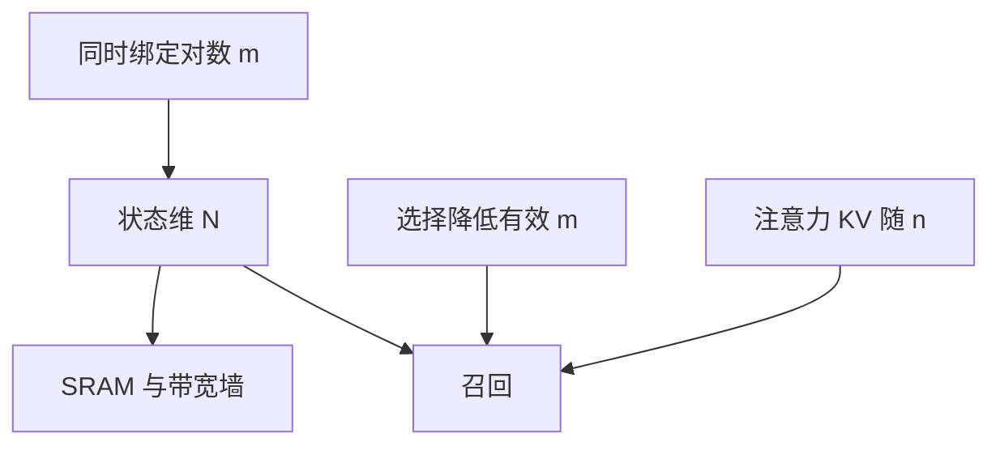

# 状态大小对上下文

状态维 $N$ 是记忆的比特预算；上下文 $n$ 是要压缩的对象。二者不成比例时，召回先于困惑度崩掉。

<footer>—— 综合 Gu &amp; Dao, Mamba, 2023 中对状态扩张的讨论；Arora et al., 2024 中召回随状态与长度的权衡</footer>

[上一课](/llm/linear-recall-bottleneck)定性了压缩失败。本课把失败写成设计时要扫的一对量：状态大小（对角 SSM 的 $N$、GLA 的 $d_k d_v$、TTT 的内环参数量）对上下文长度 $n$（及同时要记住的键值对数 $m$）。SSM 与线性续到此结束。下一单元 MoE 改的是 FFN 容量，不再靠加大 $N$ 买记忆。

## 问题

Mamba 用状态扩张（把 $d$ 扩到 $dN$ 通道再扫描）加容量，GLA 用矩阵状态，看起来都能「加大记忆」。没有对照 $n$ 与 $m$，加大是盲目的。[硬件感知扫描](/llm/hardware-aware-scan) 又给 $N$ 加上 SRAM 上限。缺口是一条工程不等式： **$N$ 必须随 $m$ 涨，而不能只随 $d_{\mathrm{model}}$ 涨**； $n$ 很大但 $m$ 很小（长文档只有少数关键绑定）时，选择比蛮力加 $N$ 更有效。

本课不给严格信息论定理，给课序里可执行的对照实验：固定 FLOPs，扫 $N$ 与 $n$，画召回与吞吐。

KV 缓存的「状态」是 $\Theta(n d_{\mathrm{kv}} L_{\mathrm{attn}})$，随 $n$ 线性涨。线性模型的状态不随 $n$ 涨，这是优点也是上限来源。比较时要把注意力侧的缓存字节算进去。

## 方法

记每层每 token 的状态字节为 $B_{\mathrm{state}}$（与 $n$ 无关），注意力层缓存为 $B_{\mathrm{kv}}(n)$。混合模型总记忆 $ |\mathcal{A}| B_{\mathrm{kv}}(n) + (L-|\mathcal{A}|)B_{\mathrm{state}}$。在目标 $n$ 上先定延迟预算，反推 $|\mathcal{A}|$ 与 $B_{\mathrm{state}}$ 的可行域，再在可行域里用召回任务选点。

对对角 SSM，$N$ 成倍涨，扫描带宽与 SRAM 成倍涨，召回在 $m\lesssim N$ 量级前改善明显，之后边际下降（通道不正交、优化浪费）。对 GLA，$d_k$ 涨导致状态平方级涨，比 $N$ 更快撞硬件墙。TTT MLP 的权重向量同理。

### $m$ 与 $n$ 分开扫

$n$ 增长若只是重复填充、关键对数 $m$ 不变，选择型 SSM 可以保持召回，因为噪声被 $\Delta$ 滤掉。$m$ 与 $n$ 一起涨（每步都可能是新绑定），$N$ 必须跟 $m$ 走，否则线性层无解，只能加注意力层或承认失败。

## 机制

每条状态通道是一个有损特征。$m$ 个随机键的正交嵌入需要 $\Omega(m)$ 维才能线性可分；低于此，delta 也会误擦。选择降低有效 $m$（不把噪声当键），等价于省维。这把「加大 $N$」和「更好的门」连成同一预算：门的质量可以换 $N$，但换不掉 $m$ 的数量级。

[混合比](/llm/hybrid-layer-ratio) 在此落地：注意力层的 KV 按 $n$ 付费，专门服务 $m$ 随 $n$ 涨的任务；线性层按 $N$ 付费，服务 $m$ 有界的平滑依赖。

报「支持 1M 上下文」若只测困惑度或针在非常稀疏的 $m=1$，不能外推到 $m$ 很大的密集检索。

## 边界

SRAM、核实现、数值精度会在理论 $N$ 之前封顶。加大 $N$ 直到核变慢，再加注意力层可能更划算——这是混合比与本课必须联合扫的原因。MoE 下一单元加的是参数专家，不增加序列状态，**不能**用专家数替代 $N$ 来解决召回。把这句话带到 MoE 课：专家是容量，不是 KV。

## 小结

- 状态维对照的是同时要记住的绑定 $m$，不是单纯的 $n$；选择可以降低有效 $m$。
- $n$ 与 $m$ 同涨时线性层必须加 $N$ 或加注意力层，否则召回有上限。
- GLA 状态随 $d_k$ 平方涨，更快撞硬件；对角 SSM 的 $N$ 更细。
- MoE 专家数不是状态维，带不走本课的记忆预算。
- 出处：Gu & Dao, 2023；Arora et al., 2024。
