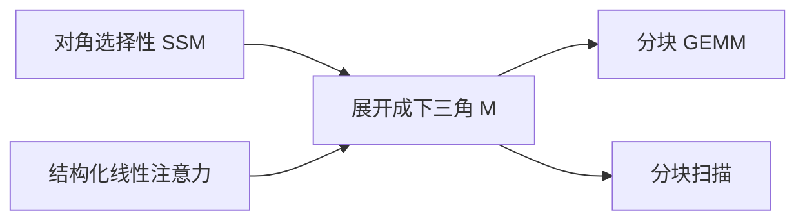

# 状态空间对偶 SSD

一类对角 SSM 与一类结构化掩码注意力写出同一个二次型；扫描和分块 GEMM 是同一层的两种算法。

<footer>—— Dao &amp; Gu, Transformers are SSMs: Generalized Models and Efficient Algorithms Through Duality, 2024</footer>

[上一课](/llm/chunked-parallel-form)给了扫描的分块并行。[线性注意力](/llm/linear-attention) 给了核特征下的矩阵形式。[Mamba](/llm/mamba) 与注意力在实现上长期分家。本课补状态空间对偶（SSD）：在对角、选择满足一定结构时，**SSM 扫描与一种带结构掩码的注意力在数学上等价**，从而训练可以用分块矩阵乘，推理可以用循环。Mamba-2 建在这条对偶上。后课 GLA 把门再加回去，默认你会「线性注意力 $\Leftrightarrow$ 某种 SSM」。

## 问题

课序里已经有两条线性时间路线：核化注意力先乘 $K,V$ 成状态；SSM 先按 $A,B$ 更新再读 $C$。实现、初始化、论文词汇都不通。缺口是一张对应表：何时 $y=\mathrm{scan}(A,B,C;x)$ 能写成 $y=\mathrm{mask}(QK^\top)V$ 的结构化特例，从而复用注意力侧已经打磨的 GEMM 与分块核。

对偶不是「softmax Transformer 等于 S4」。Softmax 非线性打破对偶。对象是线性（或对角加门在扫描外）的那一族。

[Mamba-2](/llm/mamba-2) 若已读，本课是补层里把对偶写成可引用定义，不把型号当课。

## 方法

对角 SSM 每通道 $h_t=\alpha_t h_{t-1}+b_t x_t$，$y_t=c_t h_t$。展开

$$
y_t=\sum_{s\le t}\Big(\prod_{k=s+1}^{t}\alpha_k\Big) c_t b_s x_s.
$$

右边是下三角权重 $M_{ts}=\big(\prod_{k=s+1}^{t}\alpha_k\big) c_t b_s$ 乘 $x$。令查询、键吸收 $c,b$ 与 $\alpha$ 的前缀积，则 $M$ 来自某种 $QK^\top$ 再逐点乘一个只依赖距离与选择的结构（或被吸收进 $Q,K$ 的累积）。于是前向可走：构造 $Q,K,V$ 后做**分块掩码乘法**，等价于分块扫描。

算法选择：短块、高状态维时 GEMM 更香；长依赖、状态在 SRAM 里时扫描更香。对偶允许同一层在两种核之间切换，而不是两套模型。

### 对偶破坏项

行 softmax、头间耦合的稠密 $A$、扫描内部的非线性门，都会让 $M$ 不能写成上述低结构。这些项要么移到扫描外（如输出门），要么放弃 SSD 核走通用扫描。

## 机制

前缀积 $\prod\alpha$ 扮演因果掩码加衰减位置编码的角色：离当前越远且中间 $\alpha$ 越小，贡献越弱。选择 $\alpha_t(x_t)$ 时，衰减变成内容相关，对应「结构化的、输入依赖的注意力矩阵」，但仍是 rank 受状态维约束的矩阵，不是满秩 softmax。

这解释了线性模型的召回上限：等价注意力矩阵的秩或生成元宽度被 $N$ 限制，无法表达任意稀疏的单点检索。后课会用基准打这条。

对偶是算法身份，不是容量身份。说「Mamba-2 是 Transformer」若指 SSD 核，可以；若指 softmax 表达力，不可以。

## 边界

对偶给出高效核，不自动给出更好的语言建模。把已有 softmax 模型的权重解释成 SSM 通道，一般做不到。混合架构仍要在层上显式选择走哪一种核。下一课 GLA 在线性注意力一侧加数据依赖门，对偶仍可能成立，但门的位置必须落在扫描外或对角结构内。

## 小结

- SSD：对角（选择）SSM 与结构化线性注意力展开为同一下三角作用，训练 GEMM、推理扫描可互换。
- Softmax 与扫描内非线性不在对偶里。
- 等价注意力矩阵受状态维约束，精确召回仍有上限。
- 对偶是核与身份，不是把 Transformer 检查点改写成 Mamba。
- 出处：Dao & Gu, 2024。
