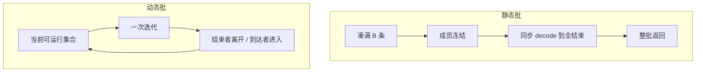

# 静态批 vs 动态批

请求级批处理把一批请求绑到全部结束；迭代级批处理允许成员在逐步生成中途改变——二者的空隙与延迟画像完全不同。

<footer>—— 对照 Yu et al., Orca, OSDI 2022 中对 request-level 与 iteration-level 批处理的区分</footer>

批处理是把多条请求的张量叠在一起，摊掉启动开销、吃满矩阵乘。自回归之前，这个「一起」的时间范围通常是一次完整前向：进一条、出一条，批的寿命等于一次模型调用。生成式 Transformer 让一次请求变成许多次调用，于是「静态批」和「动态批」不再只是 padding 技巧，而是两种对**批之寿命**的定义。静态：组成批次后，成员集合冻结，直到所有人写完。动态：成员集合可在逐步生成中更新——[连续批处理](/llm/continuous-batching) 是其在线形态。本篇对照二者的空隙、延迟、实现假设，以及何时静态反而更好。

## 问题

推理框架若从分类、embedding、encoder-decoder 一次性解码的经验出发，会自然写成：凑满 $B$ 条或等到超时，pad 到批内最大长度，一次（或固定步数）跑完，整批返回。这对「每条请求恰好一次前向」是对的。对 GPT 类解码，一次前向只产一个 token，总步数等于输出长度。把「凑批」的语义沿用成「这 $B$ 条必须同步走完所有步」，就会出现两类浪费：步数已结束的行在陪跑；尚未凑进批的请求在等待最长同伴。

动态批要回答的问题对称：若允许每步改变成员，引擎还能不能走同一套矩阵乘？注意力序列长度各异，线性层的 token 却可以拼在一起。静态批用 padding 回避这个问题；动态批必须正视变长，否则只是把静态批的 $B$ 改成「有时小一点」——那叫可变批大小，还不是成员可变的动态批。

### 三种容易混的「动态」

「动态」在文献和产品里至少三义。其一，**可变批大小**：这一次前向 $B=8$，下一次 $B=4$，但每次前向内部成员固定且通常跑完请求。其二，**动态 padding / 打包**：训练或离线推理按 token 数凑包，减少 pad。其三，**迭代级成员变更**：Orca 意义上的动态，批的身份在 decode 步之间改写。本篇的静态 vs 动态，主要指第一、第三义在生成服务里的对立；打包是正交的长度对齐手段。

产品文档写「支持动态 batching」时，先问一句：已结束的序列能不能在下一步从前向里消失、新序列能不能在下一步出现。能，才是生成服务要的动态批；只能在两次「整请求」之间改 $B$，对自回归气泡没有帮助。

## 方法

静态批的生命周期：队列中取出最多 $B$ 条 → 分配连续 KV → 循环 decode 直到批内全部 EOS 或触达 `max_new_tokens` → 整批释放。实现简单：批维稳定，CUDA Graph 好捕获，注意力可以用规整的 `[B,S,H,D]`。代价是 $S$ 取批内最大，短序列的 pad 在注意力里被掩掉但仍占计算与显存；更致命的是短序列在步数维上的陪跑。

### 静态批如何用 padding 换规整核

设批内提示长度 $s_i$、生成预算 $t_i$。静态实现常把张量做到 $\max s_i$ 与 $\max t_i$。注意力 FLOPs 按最大值计，有效工作按均值计。长度越不齐，效率越差。离线、可排序的负载可以把相近长度的请求分桶，让静态批重新变好——这是「静态批 + 长度分桶」，不是动态批。在线对话无法等待未来的短请求来填桶，分桶策略失效。

动态批的生命周期：每步根据当前 KV 与公平策略选出集合 $\mathcal{B}_t$ → 只对 $\mathcal{B}_t$ 做一次迭代 → 更新结束标记 → $t\leftarrow t+1$。张量形状每步可变。线性层把各请求的当步 token 拼成一维再 GEMM，即 Orca 的选择性批处理里「非注意力可批」的那一半；注意力按请求或按分页块来，避免为短序列垫到长序列的 $S$。

### 等待凑批 vs 立即开跑

静态批还有一个时间轴上的旋钮：为了抬 $B$，可以等待更多到达。等待提高算术强度，损害 TTFT。动态批通常来一条、下一迭代就能进引擎（受 KV 槽限制），用时间上的连续填充代替空间上的凑批等待。高 QPS 时两者都容易把 GPU 填满，差别主要在空隙；低 QPS 时静态批的等待策略特别伤交互延迟，动态批可以在 $B=1$ 时立刻开跑，有人来了再胀上去。

## 机制

从利用率看，静态批的有效算力份额大致是 $\mathbb{E}[\mathrm{mean}(T)/\max(T)]$ 再乘以 padding 效率。输出长度服从长尾时，$\max(T)$ 被尾部拉高，均值跟不上，空隙是结构性的。动态批的有效份额接近「当时能放入 KV 池的并发」，空隙来自瞬时到达不足或槽位耗尽，而不是来自批内同步。

从延迟看，静态批的 E2E 含凑批等待 + 批内最慢同伴的生成时间；动态批的 E2E 含排队等槽 + 自身 $T$ 步，每步的墙钟随当时 $\lvert\mathcal{B}\rvert$ 变。所以动态批改善的是**别人的长度不再进入你的关键路径**，不是让你自己的每步更快。批变大时每步更慢，这是吞吐–延迟权衡，静态动态都有；动态只是把权衡从「整批」改成「当前迭代」。

把动态批理解成「每步更快」会在容量规划里犯错。它提高的是系统吞吐和短请求的排队，单步延迟往往因平均并发上升而略增。SLA 要分开写 TTFT 与 TPOT，不能只用一条 E2E。

## 边界与工程取舍

静态批没有过时。离线评测、温度采样对比、同一提示的 beam 族、embedding 与分类、长度几乎相同的批处理作业，规整核 + 一张 CUDA Graph 往往更快、更好 profiling。动态批的调度税、形状变化、图捕获失效，在这些负载上是纯开销。

在线生成里，静态批只适合能接受「整批返回」语义的 API（一些内部管道、一次性摘要）。面向聊天与流式 token 的网关，动态批几乎是默认。两者可以分层：入口按优先级分成若干队列，队列内部动态批；离线低优队列用静态大包打满空闲。不要在同一引擎实例里用一套超参同时追求离线峰值和在线 P99。

对照实验若把静态批的 $B$ 设得很小以「降低延迟」，再拿动态批的大并发比吞吐，是在比两个不同工作点。应在同一延迟约束下画吞吐曲线，或在同一吞吐下画延迟分位数——Orca 相对 FasterTransformer 的读法就是这样。

## 小结

- 静态批冻结成员直到全结束，实现规整，空隙等于批内长度不齐与同步步数。
- 动态批在迭代边界改写成员，短请求不再陪跑长请求，在线生成是主场。
- 「可变 $B$」不是「成员中途可进出」；生成服务要的是后者。
- 动态批改善排队与气泡，不保证每步更快；TTFT / TPOT 要分列。
- 齐整离线负载上静态批加长度分桶仍然更干净。
- 二者可以按队列分层，不要用同一工作点比较峰值。
- 出处：Yu et al., *Orca*, OSDI 2022（request-level vs iteration-level）。连续批是动态批的在线名称，机制专文见 iteration-level 调度。
