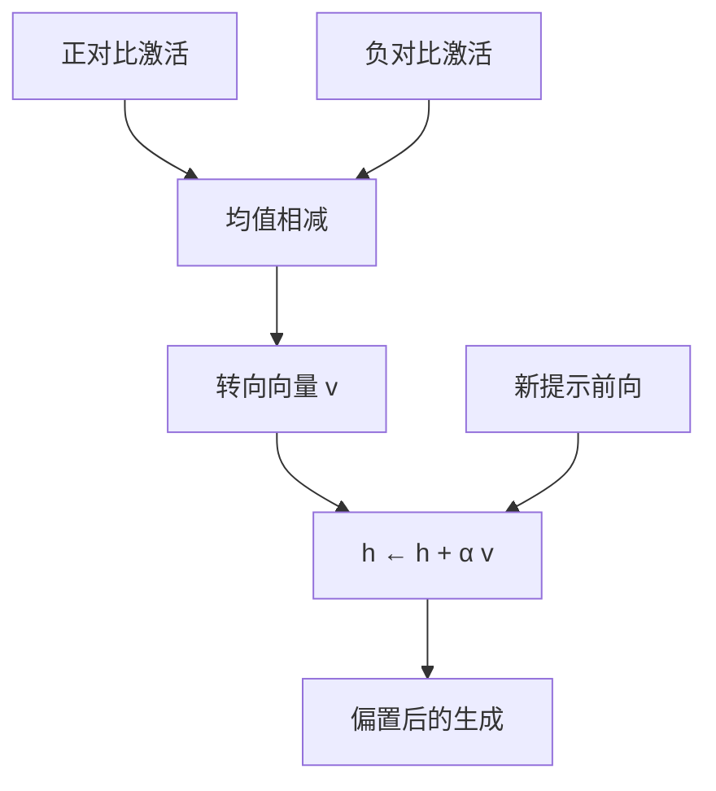

# Steering Vectors 表示操纵向量

不必优化权重：把从对比提示里读出的激活差加到残差上，就可以在推理时推动语言模型的行为。

<footer>—— Turner et al., Activation Addition: Steering Language Models Without Optimization, arXiv:2308.10248, 2023</footer>

转向向量（steering vector）是一条在推理期加到激活上的方向。构造通常很轻：跑两组对比输入，把某层激活相减，得到 $v$，再在新提示上做 $h\leftarrow h+\alpha v$。Turner 等人称之为 Activation Addition（ActAdd）；Rimsky 等人在 Llama 2 上做成对比激活加法（CAA），用选择题式对比集提取更稳的方向。Zou 等人的表示工程把同一思想推广到多种概念的读写。本篇写如何构造、加在哪、以及线性加法能控制什么、不能控制什么。

## 问题

改行为的默认路径是改权重：SFT、DPO、RL。周期长，且每次更新都可能伤别的能力。若目标概念在残差里近线性，推理期加法就是一个可开关的旋钮：$\alpha=0$ 回到原模型，$\alpha$ 变号则反向。问题化成三条：方向是否稳定、层与 token 位置如何选、$\alpha$ 如何在有效控制与能力损伤之间折中。

对比集的质量决定向量的语义。用「我热爱 …」减「我厌恶 …」得到的情感方向，和用「有害请求」减「无害请求」得到的安全方向，不是同一类对象。表面词面若在两组里不对称，向量会变成关键词触发器。

### 相关方向与因果方向

均值差是相关：它指向两组激活差异最大的方向，不一定是模型用来产生行为的方向。加法干预能改变行为，说明该方向充分驱动输出；平行通路仍可能存在。Park 等人后来用因果内积把探针方向与干预方向接到同一几何里，但工程上仍应把「提取」和「验证」分开：在保留提示上测行为，而不是只看训练集上的分类间隔。

同一套加法也可以降低拒答或放大偏见。公开文本若只写提取步骤、不写部署约束，会被反向使用。工程上应将 $\alpha$ 的符号与范围放在服务端，并把向量当安全控制面而不是用户可调参数。

## 方法

ActAdd 的原型：两条短提示（如「Love」与「Hate」）在选定层取残差，相减得 $v$，在生成时对后续位置广播加法。CAA 把对比做成同一题干下的正负选项，在每个选择题的最后位置取激活，平均差再归一化，得到更少词面污染的方向。推理时把 $v$ 加到若干层的残差，或只加在助手回复的起始 token。

$$
h^{(\ell)} \leftarrow h^{(\ell)} + \alpha\,\hat{v}^{(\ell)}.
$$

$\alpha$ 用验证集网格搜索。多层可以共用一个 $v$，也可以每层一个。层数越多，控制越强，越容易伤流畅度与任务准确率。Rimsky 等人报告，中后层往往比最浅层更有效，这与「概念在中层线性可分」的探针曲线一致。

### 与权重编辑、提示工程的比较

转向不改参数，可按请求开关，适合做运行时策略。ROME 类编辑改的是 MLP 权重，持久且针对事实。提示工程改的是输入，不保证内部沿固定方向移动。三者可叠加：提示提供任务，转向提供风格或安全偏置，编辑提供必须改写的事实。评估时要分开测，否则说不清增益来自哪一段。

## 机制

线性表示假设给出机制草图：概念 $c$ 对应方向 $v_c$，加法相当于在反事实上滑动 $c$ 的取值，而不（理想情况下）移动正交概念。叠加使正交只是近似：加情感方向时，偶尔会带动语体、长度、甚至话题。$\alpha$ 过大时，残差离开训练流形，解码变成乱码——这是几何越界，不是「概念太强」。

### 位置广播与解码耦合

把 $v$ 加在每一个生成步，等于持续施加偏置，风格控制更稳，但会抑制需要反向特征的续写。只加在第一枚回复 token，影响较小，后续步可能漂回去。采样温度会放大或掩盖转向：低温度下 $\alpha$ 的 logit 效应更醒目。评测应固定解码参数，再扫 $\alpha$。

对比激活若在「正确选项 token」上提取，向量可能混进「选 A / 选 B」的格式方向。CAA 用题干末位置而不是选项字母位置，就是为了减少这种污染。提取位置与施加位置可以不同，但必须在实验里分开报告。

Zou 等人展示真实性、有害性等概念可被线性读写；这支持「加法是通用控制原语」。通用不表示无副作用。每个向量都应在能力基准与对照概念上做泄漏测试：情感向量不应把事实问答的准确率打崩。

## 边界与工程取舍

转向不是对齐训练的替代。对抗后缀、越狱模板可以让激活走出 $v$ 能纠正的区域，$\alpha$ 再大也只是把乱流再推一把。对不可信客户端，用户若能关掉加法，运行时转向就不是安全边界。它更适合：产品里的风格旋钮、研究里的因果干预、以及在已对齐模型上做小幅偏置。

向量会过时。继续预训练、合并模型、换聊天模板，都会让均值差方向失效。应把对比集与提取层纳入版本，换检查点就重提。多概念同时转向时，方向之间的内积决定冲突；需要正交化或分层施加，而不是把 $\alpha$ 简单相加。

不要用单一演示提示宣称「我们控制了诚实」。应在固定套件上看：目标行为的变化量、无关任务的掉点、以及反向 $\alpha$ 是否给出反向行为。没有反向测试的转向，可能只是在加噪声。

## 小结

- 转向向量从对比激活提取方向，在推理期做残差加法，从而不改权重地推动行为。
- ActAdd 用短提示对；CAA 用选择题对比集，通常更少词面捷径。
- 层、token 位置、$\alpha$ 与解码参数共同决定有效性；必须在保留集上调，并测能力损伤。
- 加法检验的是充分性；概念纠缠与流形越界会带来副作用。
- 运行时转向可开关，但不能单独充当对抗鲁棒的安全边界。
- 出处：Turner et al., arXiv:2308.10248, 2023；Rimsky et al., *Steering Llama 2 via Contrastive Activation Addition*, ACL 2024；概念读写见 Zou et al., 2023。
