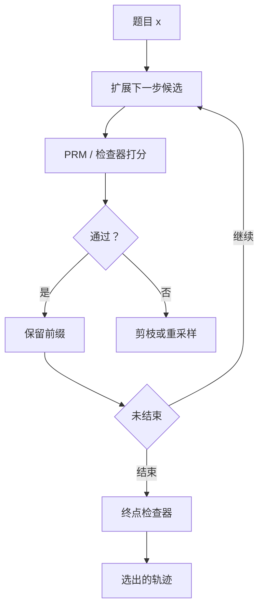

# 逐步验证与搜索

把验证器插进解码：每一步先问是否还合法，再决定展开、剪枝或换一条前缀；算力花在搜索上，而不是只把 $N$ 条完整错解都生成完再打分。

<footer>—— Lightman 等，Let's Verify Step by Step 中的验证器实验；接到过程奖励引导的搜索</footer>

[过程监督](/llm/process-supervision) 训练出逐步分数之后，默认用法有两种：离线给完整候选打分（Best-of-N），以及在生成中途用分数引导搜索。Lightman 等人主要把 PRM 当完整轨迹的验证器，并显示随候选数增加，过程验证继续提高 MATH 正确率，结果验证器则饱和。工程上一旦分数在前缀上可计算，就可以做逐步验证：非法步骤不往下写，束里只保留高分前缀，或从该点重采样。本篇写验证与搜索如何接在一起、算力花在哪、以及自我打分为什么常常不是验证。

## 问题

自回归解码是一条贪心或随机的路径。错一步之后，后续 token 条件在错误前缀上，几乎不可救，除非模型学会「发现矛盾再推倒重来」——那是 [自我批判](/llm/self-critique-revise)，不是默认解码。结果级 Best-of-N 的补救是：平行生成 $N$ 条完整路径，用 ORM 或最终检查器挑一条。浪费是结构性的：大量路径在第 2 步已错，却仍要解码到结束。

逐步验证要回答：在 $s_t$ 刚写完时，能否以足够低的错误率判定它，并据此改变搜索树。判定太松，等于没剪；太紧，把非常规但正确的步骤剪掉，搜索坍缩到标注风格。问题是验证器工作点与搜索算法的匹配，不是「有了 PRM 就自动会搜」。

### 验证器相对生成器必须有余量

若验证器与生成器共享所有盲点，搜索只是把同一错误换一种采样顺序写出来。Lightman 把独立标注的 PRM 当验证器，生成与验证分离。用模型自己的逐步对数概率当验证，测的是流畅，不是合法。用同一检查点既生成又打分，余量往往不够，表现为 $N$ 增大收益很快没。独立 PRM、独立人标、或硬检查器（代码执行、符号计算）才是余量的来源。

最终答案检查器仍应作为搜索结束时的门控。逐步验证减少错前缀上的展开，不替代终点的硬对错——尤其是算术，PRM 也可能给错步打高分。

## 方法

把解码看成树：根是题目 $x$，边是一个步骤（或一小段 token）。逐步验证在每个新节点上计算 $q_t=p_\phi(\text{ok}\mid x,s_{1:t})$，然后按算法行动。

**Best-of-N + 过程打分。** 仍生成 $N$ 条完整 $y$，但用 $\mathrm{agg}(q_{1:T})$ 而不是 ORM。实现简单，不改解码器，浪费完整展开。Lightman 的主结果在这条线上：同一批候选，换验证器就换曲线。

**逐步拒绝重采样。** $q_t$ 低于阈值则丢掉 $s_t$，在同一前缀上再采；多次失败则回退一步。阈值与重试次数是延迟旋钮。

**束搜索 / 树搜索。** 每层保留 $B$ 个高分前缀，每前缀扩展 $k$ 个下一步，用 $q$ 或 $q$ 与生成对数概率的混合排序。算力约为 $B\times k\times$ 深度，比 $N$ 条独立完整轨迹更集中在高质量前缀上。价值归约仍是 min 还是乘积，决定束里长解答是否被系统性淘汰。

$$
\mathrm{score}(s_{1:t})=\alpha\sum_{i\le t}\log\pi_\theta(s_i\mid x,s_{<i})+(1-\alpha)\log q_i
$$

$\alpha=1$ 退回普通束搜索，$\alpha=0$ 纯 PRM。需要在验证集上扫：纯 PRM 会偏向标注风格的短步，纯似然会偏向流畅的错步。

### 步宽与 token 宽不要混用

PRM 在「步骤」上训练，搜索却很容易在 token 上每步都问一次验证器。token 级询问又贵又错：半句话不是一个可判定断言。应先按训练时的边界切出 $s_t$（换行、编号、特殊分隔 token），再调用 PRM。若生成器不肯按边界吐步，先 SFT 格式，再开搜索。这与偏好优化前先对齐 [chat template](/llm/chat-template) 是同一类前置。

## 机制

### 为何过程验证随 $N$ 还能涨

ORM 拟合终点，候选增多时，欺骗终点分类器的样本也增多，排序误差抵消覆盖收益。PRM 对局部错误敏感，多出来的候选里「错步但终点像对」的那一类被压下去，覆盖收益更能体现。这是 Lightman 对照实验的机制读法，不是「过程分数永远随 $N$ 单调」的定理：PRM 本身有误差，当 $N$ 大到开始系统性地攻击 PRM 的盲点，同样会饱和，只是平台来得更晚。

树搜索的机制是把预算从「错误前缀的后缀」转移到「正确前缀的分支」。若验证器召回低（错步常被放过），树仍然很宽，优势不明显，还多了每步前向。若验证器精度低（对步常被剪），树变瘦，正确路径被剪死，Best-of-N 完整生成反而更安全。应先画 PRM 在逐步标注验证集上的精度–召回，再决定剪枝阈值，而不是先上树。

搜索改变的是测试时计算，不自动提高模型参数里的能力。关掉搜索，同一检查点应退回原先水平。把搜索收益写成「模型变强」会在部署关掉 PRM 时踩空。

### 与结果检查器如何叠

硬检查器只在终点或可执行节点可用：代码跑测试、表达式送计算机代数。混合策略是：符号步骤尽量执行；执行不了的自然语言步骤走 PRM；整条结束再对答案。执行失败可以当作 $q_t=0$ 的硬剪枝，比 PRM 更干净。不要让 PRM 去「预测测试会不会过」而跳过真正跑测试——那是把硬结果监督软化成幻觉。

## 边界与工程取舍

逐步验证的成本是 PRM 前向次数 $\times$ 节点数。线上对话往往付不起；离线做题、竞赛、数据造样本更合适。延迟 SLA 紧时，用小 $N$ 的过程 Best-of-N 比深树更可预测。阈值、束宽、$\alpha$、归约、步边界必须成套冻结，改切分就要重评全部。

生成器经过程搜索产出的数据可以再拿去 SFT，这是把测试时计算蒸馏回参数。蒸馏后线上可不跑 PRM，但会把验证器的偏差写进学生。应留一部分题目在搜索关闭时评测，防止「只有开搜索才会做」。攻击面：对手可以针对 PRM 风格优化步骤文风，让 $q_t$ 高但内容空。终点硬检查能挡数学与代码，挡不住开放推理。

不要把自洽投票当成逐步验证。投票发生在答案上，步骤仍未检查。它可以和过程搜索并存：先搜出多条高 $q$ 轨迹，再对答案表决，但两者不是同一个模块。

### 何时不必逐步搜索

PRM 逐步 AUC 只略好于随机，搜索会伤害。题目极短、一步即答案，Best-of-N + 结果检查更简单。没有步骤格式、模型输出散文，先不要搜。验证器与生成器几乎相同、又没有独立标注，加 $N$ 的结果 Best-of-N 可能更诚实。需要模型在单次前向里改稿，走自我批判，而不是部署一棵树。

## 小结

- 逐步验证在前缀上打分，使搜索能剪枝、重采样或扩束，而不必把错解写完。
- Lightman 的主证据是过程验证器上的 Best-of-N 比 ORM 更不易饱和；树搜索是同一分数的在线用法。
- 验证器须相对生成器有余量；自身对数概率不是验证。
- 在步骤边界上调用 PRM，不要在半个 token 断言上调用。
- 终点硬检查仍应门控；搜索收益是测试时计算，关验证器会退回。
- 先看逐步精度–召回再定阈值，剪得太狠会杀掉正确但非常规的步。
- 出处：Lightman 等，*Let's Verify Step by Step*；过程反馈的背景见 Uesato 等，2022。
