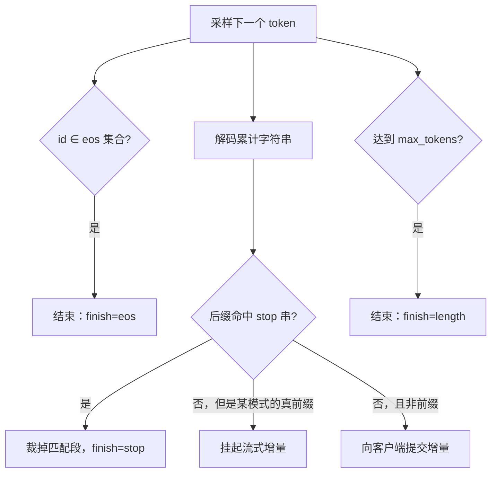

# 停用词与 stop sequences

    
生成侧的停止条件是字符串或 token 序列上的匹配，不是检索里那张高频虚词表；二者都叫 stop，切断的是完全不同的管道。

    <footer>—— 开放 API 的 stop / eos_token_id 约定；检索停用词见经典 IR 教材，不要混进解码器</footer>

「停用」在两个社区里指两件事情。信息检索的停用词（stop words）是索引前丢掉的高频虚词，为的是倒排表更短、相似度不被 `的` 与 `the` 主导。语言模型解码器的 stop sequences 是生成过程中的终止模式：一旦已写出的文本匹配到某条字符串或某个特殊 token，本轮解码结束，匹配片段通常不交给用户。OpenAI 兼容接口的 `stop`、聊天模板里的 `<|eot_id|>`、代码补全里的 `\n\n`，都属于后者。混用会导致「把虚词从词表里禁掉」这种无效实现，或「模型不停地写下去直到 max tokens」这种产品事故。

## 问题

自回归没有内建的句子边界。训练里 EOS 或对话结束符被当成普通 token 学到，推理时只有当采样抽到它、或外部规则判定匹配，序列才停。只靠 EOS 不够：补全代码时要在函数结束处停，不一定抽到 EOS；聊天里模型可能在角色轮次结束后继续扮演用户；工具调用要在结束标签处切开，把后面的胡话丢掉。Stop sequences 把这些边界从「希望模型学会」改成「解码器强制执行」。

匹配必须定义在哪一层。Token 级匹配快，但对不齐分词：用户写的 stop 字符串 `}\n` 可能对应一个 token，也可能对应 `}` 与 `\n` 两个，还可能与前后字节粘在一起。字符串级匹配在解码后的 UTF-8 上做，跨 token 边界仍然正确，却要处理流式：最后一个 token 可能只是停用串的真前缀，不能立刻把这块增量交给客户端，否则用户会看见闪一下又被撤回的 `</`。检索停用词完全不在这条链上——那些词往往正是语法骨架，从支撑里禁掉会把句子打成碎片。

### 结束符、停用串、与最大长度

三条终止条件同时存在：抽到 EOS / 对话结束 token；已解码文本命中 `stop` 列表中的某一条；达到 `max_tokens`。前两条是内容边界，第三条是预算边界。预算触发时序列在语言学上并未结束，调用方看到的是截断，不是完整话语。把截断当 EOS 再送进多轮历史，下一轮会在半句话后续写。实现应分别返回 `finish_reason`：`stop`、`eos`、`length`，而不是一律叫 finished。

聊天模板规定的结束符是模型词表里的特殊 token，通常应放进 `eos_token_id` 集合，而不是只当普通 stop 字符串。只做字符串匹配会漏掉「同一逻辑结束、不同表面编码」的情况，也会在流式里多缓存无用尾巴。

## 方法

Token 级：维护一个结束 id 集合，每步采样后若 `y_t\in S_{\mathrm{eos}}$ 则停，该 token 默认不进入可见输出。多 id 结束在对话模型里很常见，系统、用户、助手各有一个结束符，解码助手轮时应把用户开始符也视为 stop，以免模型把下一轮用户的话写完。

字符串级：在累计解码文本 $s$ 上对每个模式 $p$ 检查 $p$ 是否为 $s$ 的后缀（或是否在本步新增长的窗口内首次出现）。命中后从 $s$ 中裁掉 $p$ 及其右侧。为支持跨 token，缓存尚未提交的尾部：若存在某个 $p$ 以当前未提交串为真前缀，则这段增量对客户端挂起，直到后续 token 证明匹配失败或匹配成功。这与 SSE 取消不是同一件事：取消是调用方中止；stop 是模型输出触达了约定边界，见流式接口的结束语义。

词表禁令（bad words）把某些 token 的 logit 置 $-\infty$，每步都生效，序列不必结束。它更接近约束解码的掩码，而不是 stop。把停用词表当 bad words 喂给聊天模型，等于禁止虚词，语言会崩。Stop 是 *终止*，bad words 是 *禁止出现*；产品文档必须分开。

### 与约束、采样截断的接合

文法约束保证结构合法，不保证在合法结构结束时停下。JSON 对象已经闭合后，无约束模型仍可能继续写注释。Stop 列表里放 `}\n\n` 或依赖 schema 自动机进入接受态后的强制 EOS，是两种收尾。前者对自由文本补全友好，后者对严格 schema 友好。Nucleus 与 min-$p$ 改变的是下一步支撑，不改变匹配规则；但截断若把 EOS 概率切掉，模型会更常撞上 `max_tokens`。实现若允许 `stop` 与 EOS 同时存在，截断应把结束符留在支撑里，或显式降低「切掉 EOS」的概率。

## 机制

强制停止改变的是序列的长度分布，不是条件 token 分布本身：在停止之前，每步仍按采样器从 $p(\cdot\mid x_{<t})$ 抽取。它把「何时结束」从模型内部的 EOS 决策，部分外置到字符串协议。好处是协议可以由产品定义（XML 标签、Markdown 围栏、工具调用括号），不必为每种边界微调模型。坏处是模型不知道你要在这里停，它可能把停用串当成普通内容的一部分来规划；若停用串在训练里很少作为真正的结束，模型会在停之前写出半截结构。

流式挂起是正确性要求，不是优化。设 stop 为 `</script>`，当前尾巴是 `</scr`。若先把 `</scr` 发给前端再撤回，XSS 过滤与打字机 UI 都会闪错。算法是：对每个模式维护 KMP 失败函数或简单的「当前匹配长度」，只释放不可能成为任一模式前缀的确定前缀。模式很多、且包含彼此前缀时，挂起窗口会变长，首 token 延迟不变，但可见延迟变差。这是 stop 列表过长的真正成本，不是匹配本身的 CPU。

包含空字符串或纯空白的 stop 会立即命中或永不命中，取决于是否 trim。实现应拒绝空模式。只含 `\n` 的 stop 在散文里极容易误触发，更适合代码补全。

### 检索停用词为什么不能搬进解码

IR 停用词假设查询与文档的相关性主要由内容词承担。生成要的是合法、可读的字符串，虚词是句法。把停用词当 bad words，等于每步从支撑里拿掉 `的`、`是`、`in`，nucleus 会在剩余的实词里乱跳。若目标是减少套话，应调 [重复惩罚](/llm/repetition-penalty) 或截断采样，而不是借用检索词表。唯一接近的合法用法是：在 *分类或检索前端* 仍可对用户查询去停用词，与后端 LLM 解码器无关。

## 边界与工程取舍

Stop 不提供安全。模型可以在命中停用串之前写完违规内容；也可以用同义改写绕过固定标签。安全应在整段可见文本上做分类，并与取消通道分开。多模式匹配要注意重叠：同时设 `}` 与 `}\n`，较短的先命中会改变裁剪位置。顺序应定义为「最长匹配优先」或「列表顺序优先」，并在测试里钉下来。

分词器规范化（NFKC、空格合并）让用户写的 stop 与模型输出的表面形式不一致：用户以为停在 `Human:`，模型输出的是 `Human :`。应以模型实际解码字符串为准做匹配，并在文档里给出分词器。投机解码在草稿上提前命中 stop、目标却尚未接受该前缀时，必须以已接受文本为准，草稿上的假命中不能提交。约束解码进入接受态后的强制结束，应写成自动机动作，而不是指望碰巧采样到 EOS。

评测脚本若用 `max_tokens` 截断再与参考答案比精确匹配，失败里有一部分是停止协议错误而不是模型能力。报告应拆开 `length` 截断率。产品默认把对话结束符放进 eos 集合，把任务相关的围栏放进 `stop`，不要用一张一百条的停用词表。

出处是各推理引擎与开放 API 的解码终止约定，不是一篇单独的「stop sequences 论文」。Holtzman 讨论的是核采样与退化，不定义停用串。不要给 `\n\n` 编造 arXiv。

## 小结

- 检索停用词丢掉高频虚词；解码 stop sequences 在生成文本上匹配并终止，二者不可互换。
- 终止条件包括结束 token、字符串模式、以及长度预算，应用 `finish_reason` 区分。
- 字符串匹配必须跨 token，流式要把可能的真前缀挂起后再提交。
- Bad words 是逐步掩码，stop 是序列结束；虚词不应当成 bad words。
- 结束符应进入 `eos_token_id`，任务围栏进入 `stop`，并与聊天模板对齐。
- 投机与约束解码要以已接受前缀和自动机接受态为准，不能只看草稿或只靠 EOS。
- 出处：OpenAI 兼容 API 与主流引擎（vLLM、llama.cpp、Transformers）的 `stop` / `eos_token_id` 行为；IR 停用词见经典检索教材。
