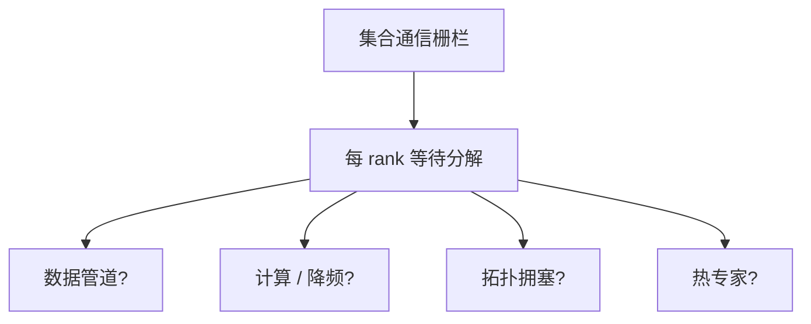

# 落后者缓解

同步迭代的时间等于最慢那张卡；热专家、坏 GPU、抖动的数据加载，都会让其余千卡陪着等。

<footer>—— 据 Dean 等对同步系统落后者的经典观察；Jiang 等 MegaScale 的大集群训练实践</footer>

[上一课](/llm/elastic-training)处理已经死掉的 rank。更常见的是：心跳还在，集合通信每次都最后完成。本课不重讲世界缩小。缺口是识别与缓解落后者——热 MoE 专家、SP 组里的慢注意力、磁盘偶发、时钟降频——以及哪些手段会破坏训练重放。训练重放需要确定性；本课的缓解若包含「丢弃慢微批」，就必须声明对梯度的影响。

## 问题

1F1B、All-Reduce、All-to-All、Ulysses 置换全是栅栏。分布的尾延迟决定步时。MegaScale 在万卡上把落后者当成一等故障：不杀进程也要把尾部剪掉或隔离。来源分三类。计算：路由把 token 堆到少数专家，或某卡降频。通信：拓扑不对称，某跨架链路拥塞。数据：某个 rank 的加载器在解压超大文档。数据课的长文档上采样若没做长度分桶，会系统性制造数据落后者。

误杀的代价是弹性风暴。缓解应先分级：观测 → 迁移负载 → 换节点，而不是第一步就 shrink 世界。

### MoE 热专家是结构性落后者

负载均衡失败时，落后者每周出现。应先把辅助损失或偏置调到容量曲线平坦，再谈硬件。把结构性问题当坏卡，会永远换到下一张仍热的卡。

profiler 只看均值会看不见尾部。应报每 rank 步时的 P99，以及 All-to-All 等待分解。

## 方法

每步记录各 rank 在各栅栏上的等待时间。超过阈值：先把该 rank 的数据管道与计算分开看（加载器队列是否空）。数据问题：预取加深、把超长样本改到专用微批、或对该文档切片。计算问题：查 GPU 错误计数、功耗、是否与检查点 writer 抢拷贝。通信问题：对照拓扑放置是否把 TP/EP 跨到了弱链路。

缓解手段按侵入性排序：绑核与 NUMA、隔离异步保存到少数 rank、动态把热专家副本增加（若框架支持）、把该节点标脏并在下一检查点弹性换出。不要在步内丢弃未完成的微批充数，除非实验明确接受有偏梯度。

### 与重叠的关系

重叠把均值变好看，尾部仍在 wait。落后者会使「通信暴露时间」在单 rank 爆炸，其余 rank 的重叠窗口空转。治理落后者往往比再调一版 DualPipe 更赚。

训练中评测若打在同步路径上（每个 n 步全员等评测），评测机会成为周期性落后者。应异步、降频、或只用子集 rank。

## 机制

同步 SGD 的一步是 $\max_i T_i$。优化均值 $T$ 而不优化 $\max$，集群越大越亏。这与数据并行线性加速的假设相反：加速比被尾部卡住。弹性处理的是 $T_i=\infty$；本课处理 $T_i$ 处于分布右尾。

## 边界

缓解不能承诺消除物理故障，只降低活着的尾延迟。确定性重放要求：不能把「随机跳过慢 batch」当作默认。下一课规定如何在需要时重跑同一串微批，以区分软件 bug 与真正的坏硬件。

## 小结

- 本课不重讲掉卡拉起；只补活着的尾延迟。
- 先分解等待：数据、计算、网络、MoE 负载。
- 侵入性从小到大；步内丢微批会偏梯度。
- P99 与栅栏分解比平均 MFU 更有用。
- 出处：Jiang et al., MegaScale, 2024；Dean 等对同步落后者的讨论；对照 MoE 负载均衡。
