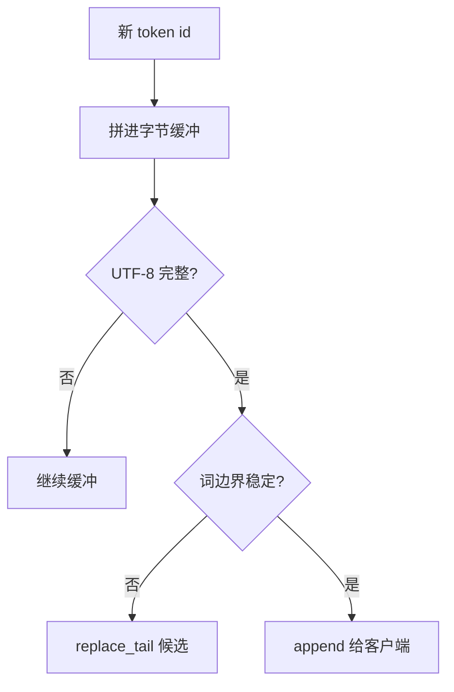

# 流式 detokenize 边界

Token 不是字符：一个片可能是半个 UTF-8 码点，也可能跨过词的边界；过早把字节刷给客户端，会打出替换符或把词切成两次闪烁。

<footer>—— Sennrich et al., Neural Machine Translation of Rare Words with Subword Units, ACL 2016；实现对照 HuggingFace TextStreamer 与 tiktoken 的增量解码</footer>

[上一课](/llm/jacobi-decoding)在 token 空间并行猜。产品交付的是字符串，而且是 *边生成边推*。本课补 token 与 Unicode 之间的缝：detokenize 不能每来一个 id 就 `decode` 一次并立刻发送。BPE / byte-level BPE 下，未完成的 UTF-8 序列、尚未合并的尾片、以及带空格标记的片，都会让增量解码与整段解码不一致。后课的采样器内核仍在 id 空间；本课把字符串边界钉死，避免把 UI 闪烁当成模型问题。

## 问题

训练与评测都在完整序列上 `tokenizer.decode(ids)`。流式把 `ids[:k]` 的解码结果当已交付文本，假设它是 `decode(ids)` 的前缀。该假设对字符级词表成立，对 BPE 不成立：下一个 token 可能改写最后一个码点（byte-level 下续上 UTF-8 尾字节），或吞掉一个尚未显示的空格标记。缺口是增量协议：哪些后缀是 *稳定前缀*，可以发给客户端；哪些必须缓冲，直到再来一个 token 或遇到 EOS。

另一类边界是多字节标点与 CJK：一个汉字常是一个 token，看起来没有问题；英文 `ing` 后缀却可能把已显示的 `runn` 变成 `running`，若 UI 已画出 `runn`，只能闪烁改写。协议应允许「替换最后一段未稳定后缀」，或等到稳定再发。

n-gram 阻断在 token 空间；用户看见的重复在字符串空间。两者对不齐时，会出现「模型没重复 token、屏幕上重复了词」或反过来。日志应同时存 id 与稳定字符串。

## 方法

维护字节缓冲。每来一个 token，先转换成字节（byte-level BPE）或拼到暂定 Unicode 串，然后：

- 若缓冲末尾是未完成 UTF-8，不发送，等后续 token。
- 若分词器带 `Ġ` / `▁` 一类前缀空格标记，只有当空格已经确定属于已完成词，才把上一个词标为稳定。
- 对客户端提供两种帧：`append` 稳定前缀，`replace_tail` 修正未稳定后缀。SSE / WebSocket 必须声明哪一种；只支持 append 的网关只能延迟发送。

停止词、JSON 括号匹配若在字符串上做，必须用 *已稳定* 前缀，不能用含半个码点的缓冲，否则会误触发。约束解码的掩码仍在 token 空间，不要用字符串停止词替代文法。

## 机制

整段 `decode` 通常会在末尾做一次「尽量解释」的容错；增量路径若每步都走容错，就会把半序列解释成 `�` 再在下一步撤回。正确的增量解码器与 tiktoken / HuggingFace 的 stream decoder 一样：内部状态机记住未完成字节，绝不把非法 UTF-8 当字符发出。投机与 Jacobi 若一次提交 $k$ 个 token，应按批跑增量状态，而不是 $k$ 次独立 `decode`——后者会把中间不稳定态泄漏到网上。

[KV 布局](/llm/kv-layout)与 detokenize 无关：缓存里没有字符串。但流式 TTS / 终端 UI 的延迟会把「先等一个 token 再发」放大成可感知卡顿；权衡是稳定 vs TTFT 字符串。

## 边界与工程取舍

不要在网关用 Python `tokenizer.decode(ids[:k])` 每 token 一次当协议。不要把替换符发给用户再删除。工具调用的 JSON 解析应对稳定前缀做增量 parse，半个字符串 token 不是合法 JSON。多语言混合时，byte-level 与 sentencepiece 的稳定规则不同，转换检查点必须换对应解码器。

出处：Sennrich et al., ACL 2016；增量行为以 tiktoken 与 HuggingFace `TextIteratorStreamer` 的实现为准。无单独「流式 detokenize」会议论文，不编造。

## 小结

- 流式可发送的是稳定前缀，不是每个 id 的即时 `decode`。
- 未完成 UTF-8 与未定空格标记必须缓冲或允许改尾。
- 停止词与 JSON 只认稳定字符串；掩码仍在 token 空间。
- 一次提交多 token 时按批走增量状态机。
- UI 闪烁往往是协议只支持 append。
- 后课回到 GPU：采样器本身也是内核。
- 出处：Sennrich et al., ACL 2016；HuggingFace / tiktoken 增量解码实现。
