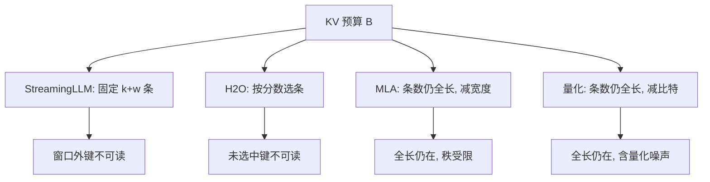

# StreamingLLM 作 KV 策略

不必为了流式生成去重训模型；把最初几个注意力汇点留在缓存里，再拼上最近窗口，KV 体积就与生成长度脱钩。

<footer>—— Xiao et al., Efficient Streaming Language Models with Attention Sinks, 2023</footer>

把长生成写成 KV 预算，最直接的一刀是砍条数：每个新 token 都追加一对键值，缓存随 $t$ 线性涨，decode 每步还要把已驻留的键全部扫一遍。Xiao 等人 2023 年的 StreamingLLM 给出一种**推理期、固定形状**的驻留策略：可见集永远是「少数文首汇点 ∪ 最近窗口」，$n_{\mathrm{keep}}=k+w$，与已经写出多少 token 无关。它和量化、低秩不是同一根轴——精度与头宽可以仍是满的，省的是条数。本篇只把 StreamingLLM 当成 KV 策略来写：它改哪一项、误差从哪来、和 H2O / MLA 如何并表；汇点现象与配方步骤见 [Attention Sink](/llm/attention-sink) 与 [StreamingLLM](/llm/streaming-llm)。

## 问题

满缓存的承诺是位置 $t$ 仍能精确读到位置 $1$ 的键。兑现承诺的存储是每层 $O(t\,h_{\mathrm{kv}} d_k)$。对话、日志、无限续写会把 $t$ 推到远超训练长度，服务进程先被 KV 填满，再被带宽拖死。产品往往并不真要「三小时前那句话的逐 token 键」，只要**当前句稳定、缓存常数、不必微调**。

朴素滑窗把 $n_{\mathrm{keep}}$ 钉在 $w$ 上，却会在某个 $t>w$ 把文首覆盖掉。softmax 分母失锚，窗口内权重被放大，即使当前句完全在窗口里也会崩。于是「减条数」这件事多了一个约束：不能按时间无脑淘汰最老的键，必须给归一化留锚。StreamingLLM 的策略价值正在这里：它不是又一种注意力公式，而是一条写进 KV 管理器的驻留规则。

### 预算式里它动的是 $n_{\mathrm{keep}}$

令每层可保留的 KV 字节为 $B$。满精度时

$$
n_{\mathrm{keep}}\cdot h_{\mathrm{kv}}\cdot d_k\cdot b_{\mathrm{bit}}\;\le\; B.
$$

MLA 改 $d_k$ 为潜宽，KIVI 一类改 $b_{\mathrm{bit}}$，H2O 按内容选 $n_{\mathrm{keep}}$ 里是谁。StreamingLLM 把 $n_{\mathrm{keep}}$ **写成常数** $k+w$，并且用位置规则而不是注意力分数来决定谁留下。实现简单：两段环形缓冲，汇点区永不滚动，窗口区覆盖最老槽。代价也清楚：中间历史的键精确为零，不是被量化噪声污染，是根本不在可见集里。

先写 $B$ 再选策略。若 $B$ 只够 $k+w$ 个满精度槽，StreamingLLM 是在给「还能不能稳定生成」一个下限；若 $B$ 还装得下全提示，它反而在主动扔掉可检索的键。不要把「能跑四百万步语言建模」听成「提示里的针还在」。

## 方法

时刻 $t$ 的驻留集合为

$$
\mathcal{C}_t=\{1,\ldots,k\}\cup\{t-w+1,\ldots,t\},
$$

$t\le k+w$ 时退化为全前缀。注意力仍是因果缩放点积，只是键、值只来自 $\mathcal{C}_t$。每个槽保存写入时的**逻辑下标**，RoPE / ALiBi 跟逻辑位置走，不跟环形数组的物理下标走。滚动只发生在窗口段。

### 位置规则与内容规则

按位置留槽，是 StreamingLLM 相对 H2O、SnapKV 的分界。H2O 累积注意力分数，重击中 token 可以来自文中任意处，再加 recent 窗口；StreamingLLM 的常驻区固定在序列开头，$k$ 通常取 4 量级，不随文档结构变。优点是零统计、零校准、每步 $O(1)$ 更新；缺点是「很早出现、很晚才被问到」的事实一定会被窗口丢掉，而 H2O 有机会把它当 heavy hitter 留下。

和 [MLA](/llm/mla) 的并表更干脆：MLA 的 $n_{\mathrm{keep}}$ 仍等于全长，省宽度；StreamingLLM 的宽度仍是满头，省条数。两者可以叠，但叠完要重新量——低秩键上再切窗口，汇点锚的 logit 尺度会变，不能把两篇论文的压缩比相加。

### 服务进程里它是一块常驻池

对调度器，StreamingLLM 把「每条请求的 KV 占用」从随生成长度增长，变成**与 max tokens 无关的常数块**。并发上限近似 $B_{\mathrm{gpu}}/(L\cdot(k+w)\cdot \mathrm{bytes\_per\_token})$，规划可以按窗口而不是按用户声称的 128K 去买显存。前缀缓存、分页 KV 仍可用：汇点页标成钉住，窗口页按环形复用。不要用 LRU 去驱逐汇点页——内存压力下把 BOS 挤掉，故障是偶发胡言，不是 OOM。

## 机制

策略有效，是因为训练分布里 softmax 的配分函数几乎总含汇点那一项大贡献。驻留汇点等于把

$$
Z_t=\sum_{j\in\mathcal{C}_t}e^{s_j}
$$

里的锚留住，窗口内内容键的比值 $e^{s_i}/e^{s_j}$ 不变。生成稳定性来自归一化，不来自把历史压缩进更少的槽。随机、无语义的初始 token 也能当锚，说明这些槽不是记忆，是电位基准。

因此它在 KV 压缩谱系里的位置是：**有损、不可训练补偿、损失集中在中段历史、对局部续写几乎无损**。语言建模困惑度在滚动之后仍平坦，测的是「下一个词还像训练时那样写」；针测、多跳问答测的是「中段证据还在不在」，StreamingLLM 默认交白卷。把这两张表混报，会把一种 KV 策略宣传成长上下文方法。

和滑窗重算基线的对比写在 Xiao 等人原文里：保留汇点后不必为了纠正失真去重算窗外前缀，流式场景相对重算可到约 22 倍量级的加速。加速来自「不重算」，不是来自「记得更多」。

## 边界与工程取舍

不要用加大 $k$ 去读章节开头。$k$ 从 4 加到 64，延迟按窗口预算涨，却仍读不完整章；多出来的槽应还给 $w$，让当前句的键更完整。需要真读长前缀，应上检索、地标或训练期长上下文，而不是把 StreamingLLM 的常驻区当内存。

已用滑窗训练、且训练掩码总含文首的模型，再套一套汇点区可能重复保留。全注意力预训练、推理才改窗的模型，这套策略几乎是必需。单次提示本身已超过训练长度时，可见集虽短，位置相位仍可能出界——那是外推问题，不是 KV 条数问题。量化若先把汇点槽打到极低比特，锚的 logit 被噪声抬歪，等于在策略层留了汇点、在数值层拆了锚。

调试「窗口一开就胡言」时，先做同 $w$、强制留前 $k$ 个 KV 的对照。立刻恢复就是汇点，应改驻留规则而不是加长窗口。对照失败再查 RoPE 是否按物理下标重排——那是另一类分布偏移。

## 小结

- StreamingLLM 作为 KV 策略，把 $n_{\mathrm{keep}}$ 钉成汇点加窗口，缓存与生成长度脱钩。
- 它按位置留槽，不按内容；中段历史精确丢失，局部续写靠 softmax 锚保持稳定。
- 与 MLA、量化动的不是同一因子，压缩比不能横加；与 H2O 的差别是位置规则对内容规则。
- 服务上它把每请求 KV 变成常数块，汇点页必须钉住，不可交给普通 LRU。
- $k$ 取很小即可；加大 $k$ 当记忆会挤占窗口。
- 它不是 128K 预训练的替代，也不能通过针测。
- 出处：Xiao et al., *Efficient Streaming Language Models with Attention Sinks*, 2023（ICLR 2024）。对照滑窗见 Mistral 2023；预算式对照见 KV 压缩专文。
