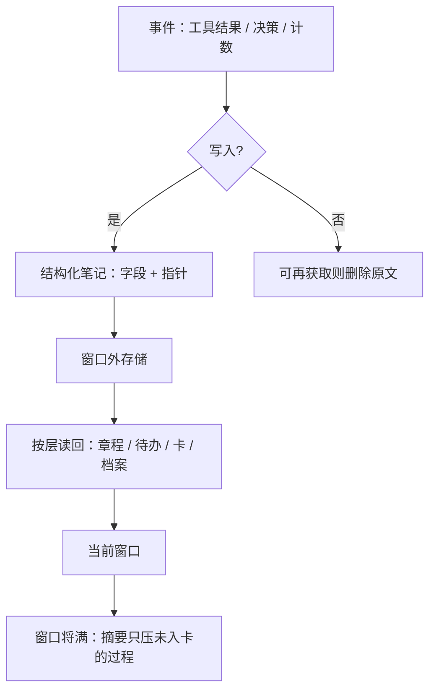

# 结构化记忆压缩

代理定期把笔记写到窗口之外的持久存储，需要时再拉回来；跨过摘要边界之后，仍然能继续数小时的策略，靠的是这些笔记而不是窗口里的原文。

<footer>—— Anthropic Applied AI，Effective context engineering for AI agents，2025-09-29；对照 Packer 等 MemGPT 与 Xu 等 A-Mem</footer>

窗口内 [摘要压缩](/llm/compaction-summarize) 解决的是「这一次会话怎么继续」。会话一重置、摘要一写丢，过程性细节就没有了。Anthropic 把 **structured note-taking**（结构化笔记 / 代理记忆）列为长程三件套的第二件：代理把进度、地图、计数、约束写到窗口外的文件，之后再读回来。Claude 打宝可梦的例子里，模型在数千步上维护「在 1 号道路练了 1234 步、皮卡丘还差两级」这类精确计数；压缩之后靠读自己的笔记续上。Packer 等的 [MemGPT](/llm/memgpt) 把同一思想写成操作系统分页：工作上下文可写，档案与回忆在盘上。Xu 等的 [A-Mem](/llm/amem-agent-memory) 再把笔记变成带链接、可演化的原子卡。本篇写 **结构化外存如何当压缩**，而不是再讲一遍向量检索入门。

## 问题

摘要是对整段轨迹的一次投影，投影基是自然语言段落。段落不适合存：精确计数、已排除的分支、文件路径、接口契约、用户偏好的时间戳。多次摘要之后，这些字段会变成「大概记得」。Park 等的生成式代理（Generative Agents，UIST 2023）已经用记忆流 + 定期反思，把流水账压成更高层的观察；没有结构的流水账在检索时会淹没当前目标。代理编码场景里，Claude Code 的待办列表、`NOTES.md`、Sonnet 4.5 的 memory tool（把目录当外存）都是在承认：**压缩的目标格式不应只有散文**。

另一极是把一切丢进向量库。向量相似找得到「像」的句子，组不好「这是当前里程碑、那是已否决方案」。A-Mem 批评固定 schema 的图数据库对新出现的知识类型不友好；MemGPT 的函数菜单固定，但至少区分工作记忆与档案。结构化压缩要回答：写出什么字段、何时写、读回时带多少 token，以及错误笔记如何不污染全库。

### 压缩发生在写入时，而不只在读出时

窗口内摘要是读时压缩：历史已经烂了，再补救。结构化记忆把压缩提前到 **事件发生时**：刚验证完一条约束，就写成一条笔记，原文工具输出可以清掉。Anthropic 的记忆工具让代理在目录里创建、编辑文件，跨会话保留。写入质量决定以后所有检索。坏摘要一旦链进 A-Mem 式网络，演化步骤会把错误传播到邻居的情境描述里——Xu 等的系统有这个能力，也就有这个风险。

结构化记忆不是更大的上下文窗口。它是可寻址的外部状态。窗口仍然遵守注意力预算；笔记通过工具进入窗口时，照样会腐烂、照样会丢在中间。一次召回十条长笔记，等于没压缩。

## 方法

一层实用的字段不必等论文 schema。待办：目标、状态、阻塞。决策：选项、选择、原因、时间。约束：来源（用户 / 测试 / 编译器）、是否仍有效。指针：路径、URL、查询，而不是文件全文——全文留给 [即时取上下文](/llm/jit-context-retrieval)。Park 等的反思把近期观察聚合成更高层记忆，定期运行，类似「压缩作业」。MemGPT 用 `working_context_append/replace` 维持人设与关键事实，用 archival 检索文档块。A-Mem 每条 $m_i$ 含原文、时间戳、关键词、标签、情境、向量与链接；新笔记触发近邻演化。

读回策略应分层，而不是 top-$k$ 散文。始终在窗口里的只留 **当前章程与进行中的待办**（Letta / MemGPT 的 core）。按需拉：与本步相关的决策卡、相关文件指针。档案只在指针不够时打开。Anthropic 说选择取决于任务：压缩维持对话流，笔记适合有里程碑的迭代开发，多代理适合可并行的研究。结构化记忆压缩是把「笔记」做成默认外存，摘要变成对 **尚未结构化** 的那一段轨迹的补丁。

### 与分页、卡片盒、记忆流的对应

MemGPT 的类比是虚拟内存：缺页是模型决定去搜，不是硬件陷阱。A-Mem 的类比是卢曼卡片盒：原子笔记 + 链接 + 演化。生成式代理的类比是情景记忆加睡眠式反思。三者都可以当压缩器：MemGPT 压缩的是 **放置**（什么留在 RAM）；A-Mem 压缩的是 **关系**（多跳靠链接而不是把全文塞进窗口）；反思压缩的是 **时间**（把一天流水账收成自我观察）。生产系统往往混用：章程文件（始终加载）+ 卡片或 Markdown 目录（按需）+ 偶发窗口摘要。

## 机制

结构化写入把高熵轨迹变成低熵记录。计数器、枚举状态、路径字符串的熵远低于「刚才在那一页点来点去」的 HTML。LLM 作为写入器会引入两种失真：过概括（把「测试在 Python 3.11 失败」写成「环境有问题」）与虚构链接。缓解是 **原文不可变、笔记可变**：MemGPT 的 recall 存完整事件，工作记忆才允许 replace；A-Mem 保留 $c_i$ 原文。检索应能回到原文，压缩层只用于导航。

读回时的 token 会计必须显式。每条笔记带预估 token（Claude-Mem 一类在索引里展示检索成本），让模型决定是否深挖。这是在记忆层做 [渐进式披露](/llm/progressive-disclosure)。没有成本信号时，模型倾向一次拉很多「可能有关」的卡，结构优势被长度吃掉。

宝可梦例子证明的是「无提示时模型也会发明结构」，不是「任意任务都会发明正确结构」。仓库迁移需要你提供 NOTES.md 的栏目；否则笔记会变成又一篇会腐烂的日记。

### 压缩作业的调度

三种时钟。事件驱动：决策刚做出就写卡（最及时，最打扰生成）。阈值驱动：窗口到 60% 把未入卡过程冲进笔记再摘要（与 SelfCompact 可组合）。会话驱动：结束时反思，生成式代理的日总结。长程编码代理常用事件驱动待办 + 阈值摘要：待办防止压缩抹掉目标，摘要防止工具输出撑爆窗口。不要只在崩溃后才写笔记，那时模型已经不记得该写什么。

## 边界与工程取舍

MemGPT 实验窗口是 4k–32k 时代的数字；今天更大窗口只推迟分页，不提供跨月无损日志。A-Mem 的 LoCoMo 数字见其专篇，对抗题上全文窗口仍更会拒答——压缩记忆会丢「我不知道」的证据。Anthropic 记忆工具是产品能力，跨会话路径与权限由宿主实现，论文式对照要以博文与 cookbook 为准，不要把内部 100 轮搜索 +39% 的自报数字当成独立复现。

结构化压缩失败时表现为自信的过期笔记：用户改了需求，卡没改。需要失效策略：时间戳、来源、覆盖写。图结构还需要删除与矛盾边，否则演化会把过时情境写进邻居。权限上，记忆目录与用户不可见文件不应混放，否则 JIT 读取会变成越权。

若笔记只是把摘要换了个文件名，你没有结构化，只有外置散文。检查标准：能否不打开原文就回答「当前目标 / 已否决项 / 下一步命令」。不能，就还缺字段。

## 小结

- 结构化记忆压缩把轨迹写成窗口外的字段、指针与链接，使摘要不必承担精确状态。
- Anthropic 将其与 compaction、子代理并列；MemGPT 用工作记忆与档案分页；A-Mem 用可演化原子笔记。
- 压缩应发生在写入时：可再获取的原文删除，决策与计数入卡。
- 读回必须分层并暴露 token 成本，否则一次召回会重新撑爆窗口。
- 原文应可回溯；笔记可改写。错误链接会在演化网络中传播。
- 出处：Anthropic，*Effective context engineering for AI agents*，2025-09-29；Packer 等，*MemGPT*，arXiv:2310.08560；Xu 等，*A-Mem*，NeurIPS 2025，arXiv:2502.12110；Park 等，*Generative Agents*，UIST 2023。
