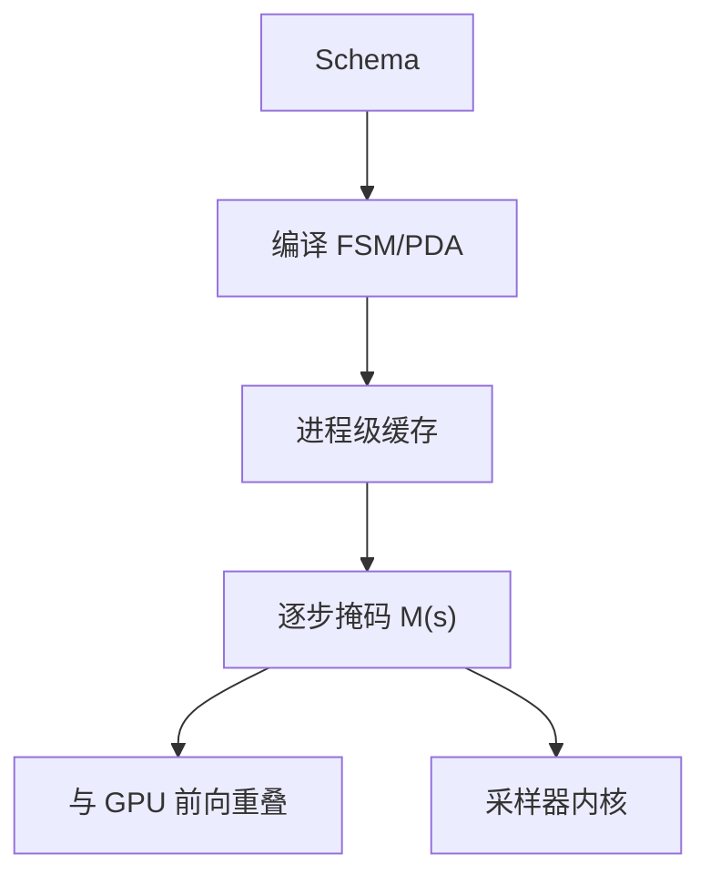

# 结构化输出的开销

合法集可以预编译成查表，但热路径上仍要取掩码、施加、并与 GPU 前向重叠；结构保证不等于零开销。

<footer>—— Willard & Louf, Efficient Guided Generation for Large Language Models；CFG 热路径见 Dong et al., XGrammar</footer>

[上一课](/llm/sampler-kernel)把采样留在设备上，并点出：掩码若在主机生成，内核再快也要等。[约束解码](/llm/constrained-decoding)已经说明 FSM / PDA 如何保证 JSON 可解析。本课只补 *开销*：编译、逐步掩码、与 decode 步的重叠、以及空集回退。产品常把 structured output 当成免费质量；账记在 TTFT 的编译与 TPOT 的掩码上。后课用多样本投票换质量，那是另一张算力账单。

## 问题

无约束采样的逐步额外工作接近一次稀疏 bias。结构化路径每步需要 $\mathcal{M}(s)\subseteq\mathcal{V}$。Willard 与 Louf 把正则的扫词表挪到编译期，逐步接近查表；XGrammar 用自适应掩码缓存与 GPU 重叠，使 CFG 在服务上可承受。缺口不是再讲自动机，而是：这些「接近常数」在哪些情况下回到线性，以及开销与[核采样](/llm/sampling-temperature-topp)谁先谁后。

三类可见成本：（1）首次见到 schema 的编译（冷启动，打在 TTFT）；（2）逐步取掩码与 D2H/H2D；（3）合法集极小时采样退化，但前向仍付完整 decode。第三项常被忽略：结构不减少权重搬运。

压缩 FSM 在出度为 1 的边上可以不询问模型、直接写确定 token。那一段 *跳过了前向*，是真的省 decode 步。开销分析必须把「确定边」和「有分支的掩码步」分开，否则会把加速与减速平均成一句「差不多」。

## 方法

把 schema 编译结果按进程缓存：同一 JSON Schema 不应每请求重新建 FSM。热路径：状态 $s$ → 查 $\mathcal{M}(s)$ → 传到采样核（稀疏下标或 bitmask）→ 与上一拍 GPU 前向重叠下一拍掩码。XGrammar 把与栈无关的 token 类预计算，运行时只处理依赖栈的集合；缓存命中时逐步 CPU 工作可以藏进 GEMM。

测开销要用两条曲线：相对无约束的 TPOT 比，以及「确定边跳过前向」的步数比。只报前者，会低估键名很多的 schema；只报后者，会低估高度分支的枚举。与连续批混合时，一批里只有部分请求带结构，采样核必须分派，掩码张量不能按最大词表给每条都分配。

## 机制

掩码是稀疏向量或位图，词表 $10^5$、batch $256$ 时，稠密 bitmask 已是数 MB 级逐步流量，值得压缩。开销从「CPU 扫词表」变成「PCIe 传掩码」时，重叠才能救；同步点（必须等 CPU 算完 $s$ 才启动核）会把 decode 带宽墙变成 *延迟墙*。投机时草稿也要走自动机：确定边可以当 $\gamma$ 很大的免费草稿，分支处接受率受合法集大小限制——合法集越小，草稿越容易猜中，结构化与投机往往 *互相帮忙*。这与「结构总是变慢」的直觉相反，但只在确定边或小枚举上成立。

## 边界与工程取舍

不要每条消息现场编译巨大 CFG。不要在合法集上再叠很紧的 top-$p$ 而不写回退。不要把结构化准确率写成模型能力：掩码已经禁止了非法 token，解析成功是契约，事实仍可能错。流式 JSON 应对稳定前缀 parse，先修 detokenize。评测延迟必须包含冷编译或明确排除并标注缓存命中。

出处：Willard & Louf；Dong et al., XGrammar。SGLang 压缩 FSM 是同族工程。不发明 arXiv 号。

## 小结

- 结构化的逐步成本是取掩码与传掩码，不是自动机理论本身。
- 编译要缓存；冷启动打在 TTFT。
- 确定边可跳过前向，真省步；高度分支则可能同步等待。
- 结构不减少权重 IO；合法集小时间谍式加速来自投机接受率。
- 与采样核、连续批分派绑定，不能只在 Python 里 `if json`。
- 后课把质量从「一条合法串」换成「多样本再聚合」。
- 出处：Willard & Louf；Dong et al., XGrammar。
