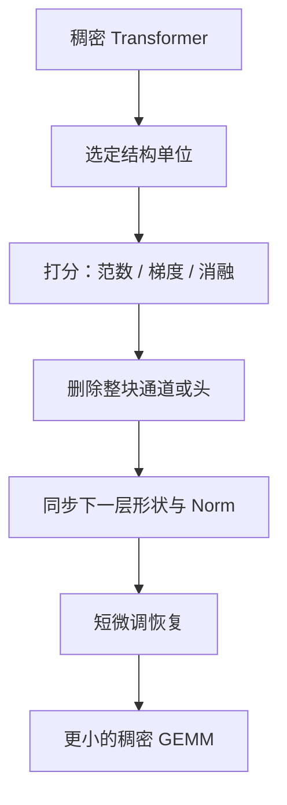

# 结构化剪枝

删掉的应是硬件仍能当成稠密矩阵乘的整块：滤波器、通道、注意力头、整层；只把单个权重打成零，加速不会自动出现。

<footer>—— 对照 Li et al., Pruning Filters for Efficient ConvNets, ICLR 2017；Michel et al., Are Sixteen Heads Really Better than One?, NeurIPS 2019；以及 Han / Zhu 的剪枝传统</footer>

剪枝把「不重要」的参数去掉。Han、Pool、Tran、Dally 2015 年的工作证明可以先学连接再删；Han、Mao、Dally 的 Deep Compression 把剪枝与量化、编码串起来；Zhu 与 Gupta 2017 年问的是逐步幅度剪枝是否真能在固定 FLOPs 下换来更好的精度。那些经典结果大多是**非结构化**的：任意位置的权重可以为零，见 [非结构化稀疏](/llm/unstructured-sparsity)。加速器上的大模型推理却几乎只认稠密 GEMM。结构化剪枝把删除单位抬到通道、头、块、层，使留下的张量仍是密的，墙钟才跟着参数量走。本篇写结构单位怎么选、重要性怎么估、以及它和层剪、稀疏核的边界。

## 问题

Transformer 一层里，计算量集中在几个矩形：$W_Q,W_K,W_V,W_O$ 与 MLP 的两到三块。若只把 50% 的元素置零、形状不变，cuBLAS / 等价 NPU 核仍按密矩阵计费，除非有 2:4 那种硬件模式。服务延迟不会降一半。要降延迟，必须减 $d_{\mathrm{ff}}$、减头数、减层数、或减序列无关的通道宽，让 GEMM 的 $m,n,k$ 变小。

结构约束带来更难的重要性问题。删一个权重只影响一个乘项；删一个注意力头，等于砍掉该头在所有位置上的子空间，残差流少一个加法项。删错头，长程依赖或某类句法现象会整块消失。Michel 等人在 2019 年对编码器注意力发问：16 个头是否真需要那么多——实验表明许多头可以拿掉，但**哪几个**依赖层与任务。结构化剪枝要在「删得够整」与「别把功能子空间一次性挖空」之间找单位。

### 单位比算法先决定屋顶线

可选单位从细到粗：输出通道（卷积里的滤波器，Li 等人 ICLR 2017；线性层里的一列）、注意力头、MLP 的中间宽度切片、整块（attention+MLP）、整层。单位越粗，核越简单、加速越可预期，精度风险越集中。单位越细，越接近非结构化，越要靠稀疏硬件。LLM 上常见的可部署结构是：把头数从 $H$ 收到 $H'$（$H'$ 仍整除 TP 切分）、把 $d_{\mathrm{ff}}$ 按分块减小、或直接 [层剪](/llm/layer-prune)。先定单位，再谈幅度、梯度或重建误差，否则会做出一份「稀疏 50% 但形状不变」的检查点，基准上看起来压缩了，线上不变快。

张量并行把头和 $d_{\mathrm{ff}}$ 切到多卡。结构化剪枝后的宽度必须仍能被并行度整除，否则要补零或改切分，加速被对齐浪费吃掉。剪枝方案是分布式布局的一部分，不是只在单卡 notebook 里看参数计数。

## 方法

经典滤波器剪枝：对卷积核按 $\ell_1$ 或 $\ell_2$ 范数排序，删掉最小的那些输出通道，并在下一层删对应输入通道，保持连接合法。线性层同构：删 $W$ 的若干行（输出维）就要删后续层对应列。Transformer 里 LayerNorm 的缩放与残差相加维数必须跟着走，否则图断。

头剪枝：每个头对应 $W_Q,W_K,W_V$ 的一组列（或行，视实现）以及 $W_O$ 的对应块。重要性可以用该头输出对损失的梯度、对该头置零后的损失增量、或验证集上的注意力熵（低熵常被当成可删，但不总可靠）。Michel 等人用的是对头输出做消融与梯度敏感度。删头后，$d_{\mathrm{head}}\times H'$ 变小，$W_O$ 的输入宽跟着变。

MLP 宽度剪枝：按中间神经元的激活幅度或权范数删列，门控线性单元要让门与上投影同步删，否则门控错位。粗粒度还可以一次删 $k$ 的倍数以迁就 Tensor Core 的 tile。

几乎总需要恢复训练。Han 传统里是剪完再训；Zhu & Gupta 主张逐步提高稀疏度，让网络边训边适应。结构化同样：一次性砍 30% 宽度，比分几轮各砍一点更易塌。恢复可以用全参小学习率，或 LoRA——但 LoRA 在已经变窄的层上插，秩的相对容量变了，不能直接抄原宽超参。

## 机制

结构化删除等于把表示投影到坐标对齐的子空间（通道基或头基）。若重要功能恰好轴对齐——某些头专门做位置、某些通道专门放大异常值——按轴删是干净的。若功能是旋转过的、散在许多通道上，按范数删会把每个功能削一层皮，累积成不可恢复的混叠。这是结构化比非结构化更伤精度的几何原因：非结构化还能留散落的大权重；结构化强迫整轴归零。

恢复训练把剩余轴重新转回任务需要的方向。数据不够时，剪完的窄模型只是原模型的残缺投影，不是「本来就能窄」。蒸馏（用原宽模型当老师）往往比单纯 CE 更能把子空间转回来，因为老师还在提供被删轴上的软目标。

「FLOPs 减半则延迟减半」只在算力墙且核高效时成立。Decode 带宽墙下，宽度减半确实减加载；若同时 KV 头数减少，KV 容量也降。若只剪 MLP、注意力宽度不变，decode 加速会小于参数比例——注意力路径仍在扫完整 KV。

### 与量化、低秩的叠加顺序

先剪后量化：形状小了，PTQ 更快，但校准统计来自窄模型。先量化后剪：整数网格上打分不稳定。先 LoRA 再剪：适配器与基座通道要对齐删除。产品上常见「宽模型量化」或「窄模型全精度」，两者都比「又窄又 2-bit」容易签字。结构化剪枝与 W4A16 叠用时，应在最终形状上重跑 GPTQ/AWQ，不要复用宽模型的尺度。

## 边界与工程取舍

没有恢复数据时，大幅结构剪枝对指令模型很危险：对齐行为可能集中在少数 MLP 通道上。医疗、法律等垂直领域应把剪枝当一次新的能力回归，而不是无损压缩。MoE 上「剪专家」是另一种结构单位，路由统计替代权范数，本篇不展开，以免与稠密 MLP 通道剪枝混名。

自动化搜索（每层不同宽度）能多挤一点，但服务栈讨厌每层不同 $d_{\mathrm{ff}}$：核要特化、TP 对齐更烦。生产往往选全局统一的头数与中间宽，牺牲一点理论最优。

### 不要用非结构化稀疏度去报结构化结果

50% 非结构化零与 50% 通道删除不是同一压缩比：前者参数计数降了，GEMM 形状没降；后者形状降了，稀疏度在密矩阵意义下是 0。论文表格必须写单位。把 Deep Compression 的压缩比抄到「我们剪了 Transformer 头」上，数字不可比。

Li 等人的滤波器剪枝实验在 VGG/ResNet 上；Michel 等人在翻译编码器上。LLM 宽度剪枝要自己测生成与长上下文，不要引用卷积 mAP 掉点当证据。

## 小结

- 结构化剪枝删除通道、头、宽度切片或整层，使留下的计算仍是稠密 GEMM，墙钟才能降。
- 单位先于算法：过细则不加速，过粗则一次挖空子空间。
- 头与 MLP 通道删除必须同步后续层与归一化；TP 切分要仍整除。
- 几乎总需要逐步删除加恢复训练或蒸馏；一次性大砍易塌。
- 与量化叠加应在最终形状上重做 PTQ。
- 报压缩比必须写结构单位，不能与非结构化零的比例混用。
- 出处：Li et al., *Pruning Filters for Efficient ConvNets*, ICLR 2017；Michel et al., *Are Sixteen Heads Really Better than One?*, NeurIPS 2019。传统见 Han et al., NeurIPS 2015 与 Deep Compression, ICLR 2016；Zhu & Gupta, 2017。
