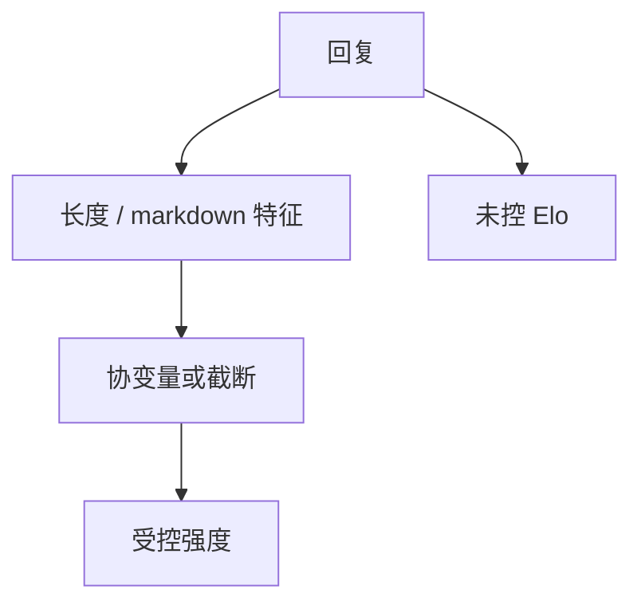

# 风格控制

人与法官都爱列表和长文。不把风格从偏好里拆开，Elo 测的是排版，不是任务完成。

<footer>—— 对照 Dubois 等 AlpacaEval 的长度控制；Arena 后续的风格协变量</footer>

[上一课](/llm/elo-bt-rating)承认未控风格时强度含混淆。本课写控制。缺口是：截断再评、回归去长度、或强制短答，会改名次——那才说明原榜吃了风格。后课自我偏好是风格混淆的一种族谱特例。

## 问题

Dubois 等人在 AlpacaEval 2.0 里展示：长度与胜率强相关，控制长度后许多「领先」缩小或翻转。Arena 加风格特征（长度、markdown、第一人称）进回归，得到「风格控制后的 Elo」。不控制时，RLHF 对冗长的奖励与评测仪器同构，优化器在刷仪器。

控制不是「风格无价值」。产品若真要健谈助手，应把健谈写成声明，用显式指标，而不是让它偷走「更正确」的名次。

简单截断会误伤需要长文的任务（代码补全、合同条款）。应按任务设长度预算，或在回归里把长度当协变量，而不是全局砍到 200 词。

## 方法

三种互补。**截断**：两条回复裁到同一 token 预算再送法官或人。**回归**：在 BT 里加长度等协变量，报告受控 $s$。**分层**：按任务类型分别排名。AlpacaEval 的长度控制胜率是回归路线的一个实现，换数据集不要照抄系数。

与[长度惩罚](/llm/length-penalty-degeneration)课对照：解码侧惩罚长度是生成策略；本课是评测侧不让长度决定名次。两边可以同时做，声明要分开。

## 机制

偏好模型（人脑或 LLM 法官）把「看起来费了工夫」当质量代理。长度是最廉价的工夫信号。控制相当于在估计里偏掉这条代理，逼迫剩余胜负来自内容。若控制后名次坍缩，说明原差距主要是代理；若名次稳定，说明内容差够大。两种结果都是信息，不要只发表稳定的那种。

## 边界

过度控制会把合法的详尽解释当作弊。应预先规定：哪些任务允许长、哪些任务风格应中性。下一课自我偏好：即使长度相同，法官仍可能偏爱「像自己」的句子。

## 小结

- 长度与列表是偏好评测的一等混淆，必须控制或分声明。
- 截断、协变量、按任务分层可并用，系数不可跨库照抄。
- 控制后名次翻转是有效发现，不是事故。
- 出处：Dubois 等 AlpacaEval 2.0；Arena 风格控制实践。
