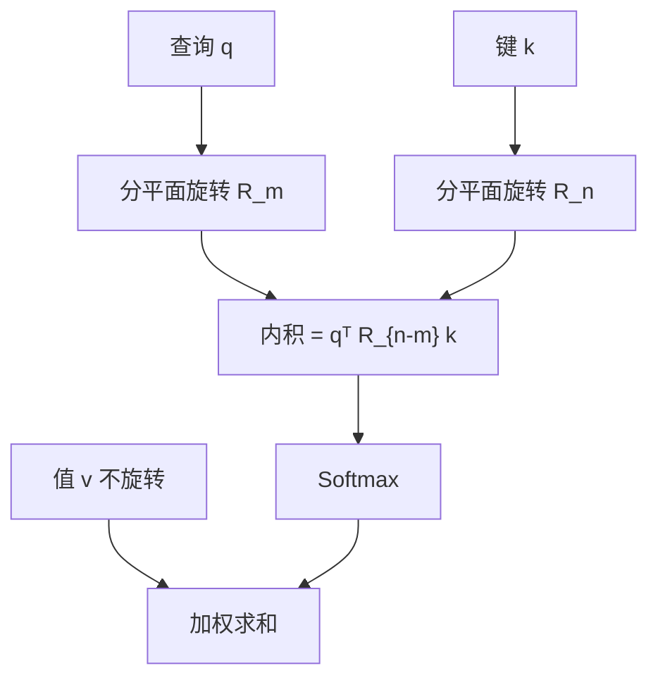

# RoPE 原文

    
把位置编进查询与键的旋转，相对位移就会出现在内积里；不占位置表，也不改 softmax 的形式。

    <footer>—— Su et al., RoFormer: Enhanced Transformer with Rotary Position Embedding，arXiv:2104.09864，2021；期刊文本 Neurocomputing 2024</footer>

Su 等人 2021 年的 RoFormer 论文把旋转位置编码（RoPE）写进 Transformer：在点积之前对查询与键做二维平面上的旋转，使 $(R_m q)^\top(R_n k)=q^\top R_{n-m}k$。绝对下标差成相对角度，值向量不旋转。本篇按原文把相对位置约束、复数/分块旋转的构造、长期衰减，以及 RoFormer 实验场写完。几何导读见 [RoPE](/llm/rope)；窗口拉长是后事，见 [YaRN 原文](/llm/peng-yarn)。2024 年期刊文本把同一套公式固定为后来 Decoder-only 的默认位置几何，但命题在 2021 年已经写全。

## 问题

自注意力对位置置换等变，必须另注入顺序。绝对位置把 $p_i$ 加到嵌入上，相对几何要靠网络从绝对名字里统计，长度一变就垮。Shaw 等（2018）把可学习的 $a_{i-j}$ 加进 logits，相对是真的，但多一张距离表，桶成为新超参。T5 一类偏置同样把相对距离参数化。原文要的方案是：不占位置表，不改注意力的 softmax 形式，却让 $q$ 与 $k$ 的内积只通过 $m-n$ 依赖位置。

他们把目标写成函数方程。设 $f_q,f_k$ 把内容与位置编成向量，希望存在 $g$ 使得

$$
\langle f_q(x_m,m),\,f_k(x_n,n)\rangle = g(x_m,x_n,m-n).
$$

左边是点积注意力要用的分数；右边禁止单独依赖 $m$ 或 $n$。加性绝对嵌入一般不满足；相对偏置满足右边，却把 $g$ 从内积里拿出去、改成「内积再加一项」。RoPE 的回答是：内积本身就应当已经是 $g$。

### 相对约束比「有一个位置向量」更强

许多方法都能让模型「知道位置」，但知道的是绝对名字还是相对距离，行为完全不同。外推时绝对名字出界；相对距离只要差 $m-n$ 仍在训练见过的范围里，几何就还在。原文把相对写成内积的恒等式，而不是希望网络自己学出来。这为后来「训短测长」留下接口——尽管 RoPE 本身在超长下标上仍会遇到相位走出训练弧长的问题，那是频率设计的外推，不是绝对表缺行。

RoPE 只旋转 $Q$ 和 $K$，不旋转 $V$。位置进入匹配，不进入加权和的被加项。值保持内容。若对 $V$ 也转，输出会随查询位置旋转，残差流的几何被扭弯，原文明确不采取。

## 方法

二维情形用复数最干净。把一对分量看成 $q^{(0)}+iq^{(1)}$，位置 $m$ 乘 $e^{im\theta}$。两位置的内积变成

$$
\mathrm{Re}\bigl[(qW_q)(kW_k)^{*}\,e^{i(m-n)\theta}\bigr],
$$

相对角度 $m-n$ 出现在相位里。矩阵形式是平面旋转

$$
R_{\theta,m}=\begin{pmatrix}\cos(m\theta)&-\sin(m\theta)\\ \sin(m\theta)&\cos(m\theta)\end{pmatrix}.
$$

把头的维度 $d$ 切成 $d/2$ 个二维平面，第 $i$ 个平面配频率 $\theta_i=10000^{-2i/d}$（与 Transformer 正弦编码同一套基数）。整头的 RoPE 是这些 $2\times 2$ 块的直和 $R_m$。注意力 logits 为

$$
(R_m q)^\top(R_n k)=q^\top R_m^\top R_n k=q^\top R_{n-m}k.
$$

实现上不必物化 $R_m$：对每对分量算 $\cos,\sin$ 再做一次线性组合。与加性位置相比，没有可学习的位置行；与相对表相比，没有 $O(L)$ 或分桶参数。多头各自旋转自己的 $d_{\mathrm{head}}$ 维。

### 二维位置与视觉

原文给出 2D 推广：图像上的 $(x,y)$ 用两套旋转或把维度对半分给两个坐标，使相对位移 $(\Delta x,\Delta y)$ 进入内积。这是 RoFormer 面向视觉与 2D 结构的一节，不是后来 ViT 里所有 RoPE 变体的总集。语言实验仍是 1D 序列。写「RoPE 原文」时应把 2D 当成同一构造在网格上的直积，而不是另一套位置理论。

### RoFormer 实验场

RoFormer 把 RoPE 接到 Transformer 上，在中文、GLUE、机器翻译等编码器或编解码设定里对比正弦与相对偏置。主张是：同样预算下相对几何更稳，长序列上衰减性质有助于把质量留在近邻。这些表格是 2021 年的存在性证据，不是 2024 年 Decoder-only 的缩放律。后来 LLaMA 一类采用 RoPE，是公式被证明好接因果 LM，而不是 RoFormer 的 GLUE 分数直接迁移。

## 机制

旋转群把两个绝对角差成相对角：$R_m^\top R_n=R_{n-m}$。这是构造能满足函数方程的原因，与频率具体取多少无关。频率表决定「多远的相对距离还能在第 $i$ 个平面上分辨」。$\theta_i$ 大（高频）时，$\Delta=1$ 已有明显相位差，负责邻域；$\theta_i$ 小（低频）时，只有大 $\Delta$ 才看得出余弦变化，负责长程。基数 $10000$ 沿用正弦编码的经验，原文没有把它推导成唯一合法值。

### 长期衰减

原文讨论：在随机投影假设下，旋转后内积的期望幅度随 $|m-n|$ 增大而下降。高频平面上的相位迅速走散，对远距离的贡献在期望上抵消；低频平面衰减慢。于是 RoPE 带有「离得越远，点积越不该自然很大」的归纳偏置，却不像 ALiBi 那样对 logits 加一条硬的线性罚。衰减是频谱的统计效应，不是对每个样本都单调的硬约束——内容对齐足够强时，远处仍可出尖峰。这解释了为何 RoPE 后来能做长程依赖，却又在窗口外推时对高频相位敏感。

长期衰减不是证明「远处永远看不清」。它是无内容时的先验。有内容的键可以把低频平面对齐，打穿衰减。ALiBi 的线性偏置无论内容多强都在减；RoPE 把位置留在内积几何里，内容可以压过位置。二者都在做远近，手段不同。

### 与加性正弦、相对表的机制差别

正弦加性把位置加进输入，注意力里位置与内容已经绑在同一向量上，点积既含内容匹配也含位置匹配，无法保证相对恒等。相对表把距离加在 softmax 之前，内容点积与位置项可加分离，但位置项是查表，不是旋转群。RoPE 把位置放进正交变换，内容向量的范数不变，只改方向；相对信息严格经 $R_{n-m}$ 进入。实现友好：无额外表，与因果掩码正交，KV 缓存只需存旋转后的键（或存未旋转的键、在查询侧补相对旋转，两种实现等价）。

## 边界与工程取舍

RoPE 不自动外推到任意长度。训练最大位置 $L$ 之内，相位 $m\theta_i$ 落在见过的弧上；$m\gt L$ 时高频可能在单位圆上多转几圈，相邻 token 的相对相位像噪声。这正是位置插值、NTK-aware、YaRN 要补的洞，不是 RoPE 原文的缺陷声明——原文主场是在训练长度内提供相对几何。基数与「哪些维旋转」是实现细节：部分头或部分维关闭旋转（后来的部分 RoPE）会改变衰减谱，已离开 2021 年默认。

绝对位置表在 512/1024 上很稳，RoPE 的优势在「长度会变、且不想维护相对桶」时才明显。机器翻译的相对位置研究早于 RoPE；原文贡献是把相对写进无需表的旋转，并能接到标准 SDPA 内核。不要把 RoFormer 的中文预训练数字当成现代 LLM 的规格。也不要把「旋转位置编码」写成对值向量或对 FFN 输入的旋转——那会破坏残差的加法结构。

复数写法与分块矩阵写法是同一件事。实现若把奇数维、偶数维配错，等于转错平面，相对恒等被破坏，表现为长度一变就乱。复现应检查 $\cos/\sin$ 配对，而不是只检查基数是否 10000。

### 原文没有解决的窗口问题

函数方程保证相对，不保证「相对距离 $L+k$ 的相位仍像训练里的 $k$」。外推失败来自频率，不是来自绝对缺行。因此 RoPE 原文与 Press 的 ALiBi 原文是两条平行的位置论文：一个改内积几何，一个改 logits 线性偏置。后来的长上下文工作大多在 RoPE 上打补丁，是因为 Decoder-only 生态选了 RoPE，不是因为 2021 年的定理覆盖了 128K。

## 小结

- Su 等人的 RoPE 用分平面旋转把相对位移写进 $q^\top k$，满足内积只依赖 $m-n$ 的函数方程。
- 只转 $Q,K$，不转 $V$；无位置表，不改 softmax。
- 频率沿用正弦基数；高频管邻域，低频管长程；期望上有长期衰减。
- RoFormer 在 2021 年的 NLU/MT 设定里给出证据；成为 LLM 默认是后事。
- 训练窗口外的相位失真不在原文解决范围内，由后续插值与 YaRN 处理。
- 出处：Su et al.，*RoFormer: Enhanced Transformer with Rotary Position Embedding*，arXiv:2104.09864，2021；Neurocomputing 2024。
