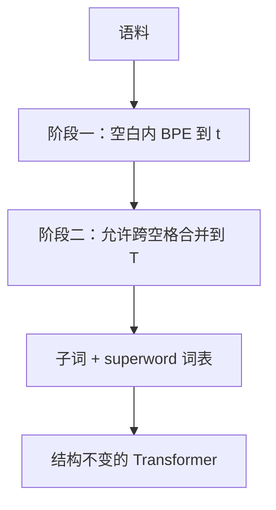

# SuperBPE

    
空白不是可靠的意义边界：多词表达、跨语言的词数差异、以及根本不用空格的文字，都在问同一件事——token 为什么不能跨过空格。

    <footer>—— Liu, Hayase, Hofmann, Oh, Smith, Choi, SuperBPE, COLM 2025</footer>

标准 BPE 在预分词之后禁止跨空格合并，于是词表里只有子词。[Tokenizer 设计](/llm/tokenizer-design) 把这条约束写成默认承诺；[词表大小](/llm/vocab-compression) 讨论的是 $V$ 加大之后压缩率如何饱和。Liu 等人把约束拆成两段课程：先按常规 BPE 学子词，再关掉空白预分词，让高频词序列收成 superword。改动只发生在词表学习，模型结构、训练框架与解码都不变。

## 问题

空格对齐的是正词法，不一定对齐语义。英语里 `by the way`、`in the long run` 作为整体被存储；德语用一个词写的概念，英语可能拆成两个；中文、日文甚至没有空格，现有大模型词表里早已出现跨「词」的片段。把 token 锁在词内，是 2016 年神经翻译为了改进词级切分而留下的归纳偏置，不是硬件定理。

BPE 的压缩率因此有硬顶：即使词表无穷，上限仍是「每个空白分隔词都是单 token」。作者在 OLMo 2 语料子集上量到，这个上界大约 4.68 字节/token；200k 词表的常规 BPE 约 4.45，已经贴着天花板。再加大 $V$，只会往词表里塞更稀的子词，编码效率几乎不再涨。若允许跨空格合并，词表可以继续吸收常见词序列，压缩率才有第二段曲线。

完全从头就关掉空白预分词并不是 SuperBPE。贪心 BPE 会过早合并「上一词词尾 + 下一词词首」，得到跨界碎片而不是完整多词表达。两段课程的第一段，就是为了先保住可组合的子词原子。

### 压缩率不是下游质量

更高压缩意味着同样字符更少 token，注意力二次项与 KV 都按 token 计会变便宜。它也可能把不该粘在一起的模板短语收成原子，让模型失去内部结构。SuperBPE 必须同时报编码效率与在固定训练 FLOPs 下的下游分数，并且把有效上下文字节数对齐，避免「同样 4096 token 其实多看了文章」这种对照漏洞。

## 方法

### 预分词课程：$t$ 之前与之后

第一阶段与常规 BPE 相同：按空白切块，只在块内合并，学到词表大小 $t$（转换点）。第二阶段从这份词表接着训，但不再做空白预分词，相邻对可以跨空格，superword 进入词表，直到目标大小 $T$。$t=T$ 退回 BPE；$t=0$ 退回从未用空白约束的朴素 BPE。作者在 200k 词表上试 $t\in\{80\mathrm{k},160\mathrm{k},180\mathrm{k}\}$。编码效率在 $t=80\mathrm{k}$ 最好，下游最好的却是更晚转换的 $t=180\mathrm{k}$：多留一些纯子词名额，换一点压缩，换更稳的语义原子。

无空白预分词时，训练词典几乎不能按「词」去重，内存和 CPU 时间明显高于第一阶段。词表只训一次，作者用约 100 个 CPU、数小时，在 10 GB 子集上完成；相对 8B 预训练可以忽略。

### 8B 对照：只换词表算法

模型跟 OLMo 2 7B 的结构与数据配比，词表一律 200k，训练 FLOPs 对齐到约 $1.72\times 10^{22}$（约 330B 个 BPE token 的预算）。有效上下文按字节对齐到约 18.3k 字节，因此 SuperBPE 的 token 窗口更短（$t=180\mathrm{k}$ 时 3000，对 BPE 的 4096），步数更多，以免它靠「同一预测看见更多字符」取巧。推理 FLOPs 按字节计，$t=180\mathrm{k}$ 比 BPE 少约 27%，$t=80\mathrm{k}$ 少约 35%。

最强的 8B SuperBPE（$t=180\mathrm{k}$）在 30 项下游上平均 43.8 对 BPE 的 39.8，绝对 +4.0，赢下 25/30；MMLU +8.2，ARC-Easy +20.5，OpenbookQA +21.2。选择题子集平均约 +9.7。唯一统计显著落后的是 LAMBADA。另训一个 11.3B、匹配推理 FLOPs 的 SuperBPE，用来回答「省下的推理算力若加回宽度，质量还在不在」。

## 机制

### 每 token 难度被抹得更匀

按字节归一的 bits-per-byte 上，8B BPE 与 SuperBPE（$t=180\mathrm{k}$）几乎打平（约 0.7465 对 0.7482）。分布却不同：SuperBPE 更少极低损失、也更少极高损失。极低损失来自 BPE 里反复出现的 `_the`、`_of`、`_to`；这些词在 SuperBPE 里常被吸进更大的短语 token，模型不再靠「预测最常见的单功能词」刷低损失。去掉这三类后，BPB 排序对调，SuperBPE 更低。

定性上看，superword 大量对应固定搭配与介词短语：`_by_accident`、`_for_a_living`、`_in_the_long_run`。内部词几乎没有选择余地，BPE 模型在这些位置损失极低，却并不等于更理解整体。下游选择题往往落在难 token 上，于是平均 BPB 不涨、任务分涨。这与「压缩越高越好」的简单叙事相反：最能压的 $t=80\mathrm{k}$ 不是下游最强。

代码与括号语言不一定吃 superword 的糖。HumanEval pass@10 从 15.9 降到 13.4，Dyck 也略降。多词表达的统计来自自然语言；API 与缩进的高频单元是另一套共现，需要在含代码的混合物上重训词表。

### 为什么必须先子词再跨空格

贪心合并没有全局最优。若一开始就允许跨空格，高频「词尾+词首」会抢走名额，得到既不是形态也不是短语的碎片。第一阶段相当于给算法一套形态/词级先验，第二阶段只在这套原子上做短语压缩。编码效率随 $t$ 平滑变化，说明转换点是可调超参，不是架构分叉。

## 边界与工程取舍

实验是英语 8B、约 330B token 量级，不是 4T 的 OLMo 2 全预算。缩放补充显示：欠训时同参数 SuperBPE 的 BPB 更好；过训时要靠更大的、匹配推理算力的 SuperBPE 才稳定优于 BPE。不要把 +4.0 直接外推到万亿 token 或多语言。中文本身就没有空白约束，SuperBPE 的第二段在中文上会退化成「更晚才开始跨块合并」，收益来自短语而不是空格。

服务端要接受可变的「词」边界：空格不再保证 token 不跨词，检索、高亮、词级对齐、有些安全过滤会变难。词表 200k 对 8B 尚可，嵌入矩阵已不小；再叠 superword 不会减小 $V$，只改变 $V$ 里装的是什么。解码端 BPE 贪心切分仍然可用，因为合并规则还是确定性的，只是规则集里多了跨空格条目。

不要在已经训完的 BPE 模型上「热切换」SuperBPE 词表。嵌入行没有对应初始化，等于换输入定义。本方法的合同是从头预训练只换词表算法。

对比时必须固定词表大小、训练 FLOPs 和按字节计的有效上下文。只对齐 token 窗口，SuperBPE 会因压缩多看见字符，那是另一场实验。

## 小结

- SuperBPE 用两段预分词课程：先学词内子词，再允许跨空格合并，得到 superword。
- 200k 词表上编码效率可达约 6.6 字节/token，而 BPE 受空白词长限制，大约停在 4.5。
- 8B、固定训练 FLOPs 下平均下游 +4.0，MMLU +8.2，推理按字节计约少 27% 计算。
- 最能压缩的转换点不一定是下游最强；短语级原子会改变损失在 token 上的分布。
- 完全无空白约束的贪心 BPE 会学到跨界碎片，两段课程不能省。
- 代码、多语言、超长训是否同号，原文没有打包票。
- 出处：Liu et al.，*SuperBPE: Space Travel for Language Models*，COLM 2025，arXiv:2503.13423。
