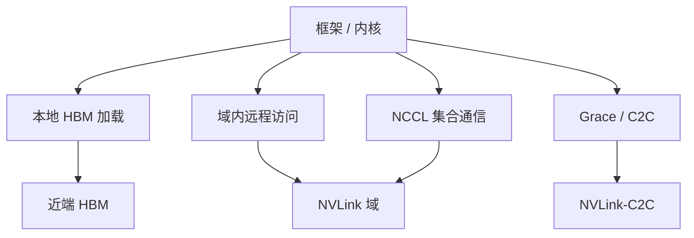

# 超节点内内存语义与集合通信

    
域内有很多 HBM，并不自动等于一块统一堆；能用的是远程访问与集合通信两条原语，语义以厂商编程模型为准。

    <footer>—— 对照 NVIDIA 对 NVL72「像一块巨大 GPU」的表述，以及 CUDA / NCCL 仍然按多 device 工作的事实</footer>

超节点把 72 张 GPU 收进同一 NVLink 域之后，软件会碰到一个诱人的比喻：13.4 TB 或 20 TB 量级的 HBM「在一起」。比喻对调度成立——一份模型可以按整柜切——对指针不成立。每张 GPU 仍有近端 HBM；经 NVLink 读远端是另一次访问；Grace 侧还有 LPDDR，经 NVLink-C2C 与 GPU 相连。集合通信（All-Reduce、All-Gather、All-to-All）是把多份缓冲合成数学上需要的那一份，并不把 72 份显存熔成 `malloc` 出来的单一数组。本篇写超节点里内存到底是什么语义，以及集合通信如何吃这张图。不发明「机柜级 cudaMalloc」，也不把官方 130 TB/s 写成任意 kernel 的访存屋顶线。

产品见 [NVL72](/llm/gb200-nvl72)；拓扑见 [全互连 vs Clos](/llm/all-to-all-vs-clos)。

## 问题

训练与推理框架习惯两种内存故事。单卡：指针在 HBM，kernel 按 coalesced 访问，屋顶线是 [HBM 带宽](/llm/hbm-roofline)。多机：每台一份，要的数据用 MPI / NCCL 搬，一致性靠消息。超节点夹在中间：物理上像一台大 SMP，编程接口仍是多 CUDA device。若按单卡故事去写，以为 `device 0` 的指针能直接给 `device 71` 的 kernel 当本地加载，会在非法访问或静默的极慢远程上摔倒。若按多机故事去写，每一步都走 Socket 或网卡，又绕开了域内 NVLink。

需要显式分开的三类访问是：（1）本地 HBM；（2）域内远程 HBM（NVLink / NVSwitch）；（3）主机内存（Grace LPDDR，经 C2C 或传统主机路径）。集合通信是第四种：不是某条加载指令的地址语义，而是一组 rank 对缓冲做归约或交换。把四者混成「统一内存」一词，调试时会分不清慢在 kernel 还是慢在 NCCL。

### 容量相加 ≠ 统一寻址

NVIDIA GB200 NVL72 产品页给出机柜 13.4 TB HBM3E 与 17 TB LPDDR5X；GB300 产品页给出 37 TB Fast Memory，技术博客对照表写 20 TB HBM。这些是容量相加。CUDA 设备枚举仍然是 72 个 id。Unified Memory / 地址映射若在 Grace–GPU 之间提供一致性访问，范围与故障语义以 NVIDIA 编程指南为准，不能外推成「72 张卡一份页表」。远程访问的延迟与带宽低于本地 HBM，却高于柜外 RDMA——它是加速器互连档，不是 DRAM 档。

因此容量规划可以按整柜 HBM 排 KV 与专家；内核编写仍按「数据在哪张卡上」排。TP 把权重切到近端，是为了让 GEMM 吃本地 HBM。需要远端数据时，要么显式拷贝 / 对称内存，要么走一次集合通信把缺失的分片补齐。

把「acts as a single, massive GPU」读成单一 PCIe 功能，会在 `cudaSetDevice` 上找不存在的 13 TB 设备。正确读法：通信域与调度单位是一块，内存控制器仍是 72 套。

## 方法

进程布局先保证：同一集合通信组的 rank 落在同一 NVLink 域。然后选原语，不要先选「内存叫什么名字」。

- **本地 GEMM / 注意力**：操作数在本卡 HBM。这是屋顶线最高的一档。
- **P2P / 对称堆**：CUDA P2P、NVSHMEM 一类接口允许 rank 读远端对称缓冲。适合不规则访问、流水线边界上的点对点。带宽受 NVLink 约束，官方每 GPU 1.8 TB/s 是这张网的规格上限，不是单 kernel 实测。
- **集合通信**：NCCL All-Reduce / Reduce-Scatter / All-Gather / All-to-All。TP 用前三者配对切矩阵；EP 用 All-to-All 换专家。库在域内应走 NVLink，而不是 `NCCL_SOCKET`。
- **主机参与**：预处理、批次拼装、部分流水在 Grace 上，经 C2C 进 GPU。NVIDIA 技术博客给出 C2C 双向 900 GB/s。不要把主机缓冲当第三份 HBM 来扫 KV。

### 集合通信在超节点里改变了什么

相对 8 卡 HGX，域变大带来三件事。第一，组的宽度可以到 72，TP 与 EP 的上界后移，层内通信不必在第 9 张卡上换以太网。第二，算法的延迟项更敏感：72 路 ring 的步数变多，NCCL 更可能选树或层次算法；应用不需要手写拓扑，但需要避免把跨柜 rank 混进同一组，否则层次会在错误的一层切。第三，消息尺寸的工作点变化：decode 一步的 All-Reduce 仍小，域再大也救不了「消息小于延迟主导阈值」——超节点的价值是**避免跨柜**，不是把小消息变成大带宽。

All-to-All 在域内是交叉矩阵；在 Clos 上是多对多。超节点内存语义帮不上 Clos 上的 All-to-All：那一步已经离开 HBM 与 NVLink，进入网卡。PD 分离若发生在超节点内，KV 传输可以走域内远程拷贝或集合，而不是柜外 RDMA，见 [PD 分离](/llm/pd-disaggregation) 的跨机对照。

## 机制

本地加载走 HBM 控制器，算术强度按 Williams 屋顶线衡量。远程加载走 NVLink 包：地址在远端，数据经交换托盘回来，占用的是互连预算，不是本卡 HBM 的全部 带宽规格。两者可以在同一 kernel 里混用，混用时屋顶线变成「HBM 与 NVLink 的较小者再打折」，不要用单卡 FLOPS 去除。集合通信则是许多远程搬运加片上归约：NCCL 用 GPU kernel 做 reduce，链路用 NVLink。有效带宽看 `nccl-tests` 的 busbw，不看标称 1.8 TB/s。

一致性方面，本地 HBM 的普通 `device` 指针遵循 CUDA 内存模型。跨 GPU 的可见性需要 P2P 使能、正确的 stream / event，或由 NCCL 在原语内部处理。Grace 与 GPU 之间的一致性以 NVLink-C2C 与统一内存文档为准：它解决的是 Superchip 内部 CPU–GPU，不是 72 张卡的单一缓存协议。把 CPU 缓存行当 GPU 共享 L2，会在错误的层上找一致性 bug。

130 TB/s 是域内 GPU 通信聚合规格。把它除以 72 得到每 GPU 约 1.8 TB/s，与产品页的每 GPU NVLink 对齐。它不是 72 张卡 HBM 带宽之和，也不是单核 memcpy 的保证值。

### 故障与部分可达

交换降级时，远程访问与集合通信一起变慢或超时；本地 GEMM 仍可能满速。这会导致「利用率看起来很高、一步时间却炸」：算力在本地打满，同步在域上等待。监控要分开看 SM 占用与 NCCL 耗时。维护时把整柜退出进程组，比在半通域上继续 64 路 TP 更安全。内存语义在故障下不会「降级成单卡」自动正确——远端指针可能失效，集合通信会挂。runbook 应按域隔离，而不是按单卡重启。

## 边界与工程取舍

不要实现一个自制的机柜级分配器，却假设任意 GPU 访问任意偏移都是本地延迟。不要在超节点上关闭 P2P「以简化调试」，那会把域内流量打到 PCIe 或主机。不要把 Fast Memory 37 TB 当 37 TB 可 kernel 直扫的 HBM。不要用 NVSHMEM 的全局地址空间掩盖切分错误：地址能写通，不等于屋顶线允许你每步远程扫一遍专家。

集合通信库与框架的进程网格必须携带拓扑标签。Kubernetes 若按 8 卡 Pod 切片，超节点内存语义对调度器不可见，TP 组会被拆到多柜。需要把「NVL 域」当成可分配资源。另一方向的错误是：所有通信都用 All-Reduce，包括其实是点对点的流水线边界——原语选错，语义对了也慢。

出处：NVIDIA NVL72 产品页的容量与 NVLink 规格、C2C 技术博客、CUDA 内存模型与 NCCL 文档。不引用未公开的远程访问延迟表。

## 小结

- 超节点 HBM 是 72 份近端内存的容量之和，不是单一堆；远程访问与集合通信是另外两条原语。
- 本地加载吃 HBM 屋顶线；域内 P2P / NVSHMEM 吃 NVLink；NCCL 在域内应走 Switch，不要落到网卡。
- Grace LPDDR 经 C2C 参与主机侧，不替代 GPU HBM 扫 KV。
- 域变到 72 路改变的是组宽度与算法选择，不把 decode 小消息变成带宽主导。
- 故障按域隔离；监控把算力与集合通信拆开。
- 出处：NVIDIA 公开规格与 CUDA / NCCL 文档；屋顶线见 [HBM 与算力墙](/llm/hbm-roofline)。
