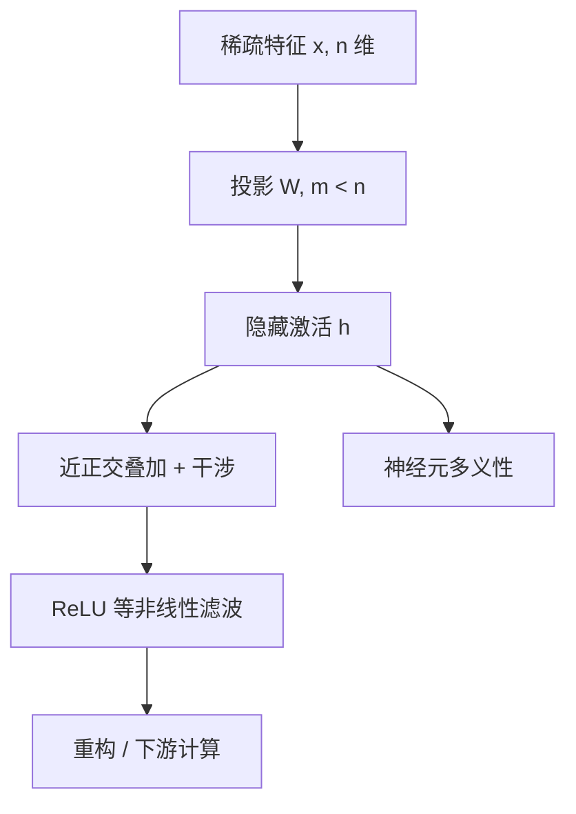

# Superposition 叠加假说

    
特征稀疏时，网络可以把多于维度数的特征塞进同一激活空间，代价是特征之间的干涉；非线性再把干涉滤掉。我们把这种现象叫做 superposition。

    <footer>—— Elhage et al., Toy Models of Superposition, Anthropic 2022</footer>

叠加假说（superposition hypothesis）说的是：神经网络表示的特征数目可以超过隐藏维度，做法是把稀疏特征放到一组近乎正交、但彼此略有重叠的方向上。单个神经元因此常常是多义的——同一根轴同时参与几个无关概念。Elhage、Hume、Olsson、Schiefer、Olah 等人在 2022 年的玩具模型里把这件事从「神经元不好解释」收成可检验的几何命题：何时发生、代价是什么、非线性在其中扮演什么角色。后续的 [稀疏自编码器](/llm/sae-sparse-autoencoder) 与 [Towards Monosemanticity](/llm/towards-monosemanticity) 都把「从叠加里把特征拆出来」当成可解释性的前提。本篇写假说本身，而不把字典学习的训练细节提前写进来。

## 问题

若每个特征独占一根神经元，解释可以按通道进行：看这根轴何时点火、对 logits 有何贡献。经验上这很少成立。语言与视觉模型里，大量神经元在几个语义无关的上下文里都亮，这种多义性（polysemanticity）让「读神经元」这条路断掉。一种解释是特征根本不存在；另一种是特征存在，只是没有对齐到神经元基。叠加假说取后者：特征是激活空间里的方向，数目可以远大于维度，因为它们不同时出现。

压缩必须付干涉税。两个方向不完全正交时，其中一个特征点火会在另一个方向上留下投影。线性网络无法消除这笔税；带 ReLU 一类半波整流的网络可以把小的负向干涉打到零，从而在稀疏条件下「假装」自己拥有更多神经元。假说要回答的不是「有没有压缩」，而是「这种压缩何时比独占神经元更划算」。

### 线性表示与叠加是两层断言

线性表示假说声称：人可命名的概念往往是方向，而不是弯曲的流形切片。叠加假说在它之上加一条：这些方向的集合是超完备的，不能与标准基一一对应。可以接受线性表示而拒绝叠加——例如认为特征数不超过维度，只是旋转了基。也可以接受叠加而在非线性电路里另有弯曲计算。机制可解释性的主流路线同时赌这两条：先找方向，再承认方向数目多于神经元，最后用过完备字典去对齐。Johnson–Lindenstrauss 型结果保证高维空间里可以塞进指数多条几乎正交的向量。叠加不需要神秘的「全息编码」，只需要稀疏性让大多数特征在大多数输入上保持关闭，于是偶尔的干涉可以被非线性容忍。

## 方法

把输入写成 $n$ 个非负特征 $x\in\mathbb{R}^{n}_{\ge 0}$，隐藏层只有 $m<n$ 维。最简线性瓶颈是 $h=Wx$，重构 $\hat x=W^\top h$。若 $W$ 的列（或行，视约定）近乎正交，活跃特征互不干扰；一旦 $n>m$，列无法全部正交，干涉项 $W^\top W$ 的非对角元变大。Elhage 等人给特征加稀疏性：每个 $x_i$ 以小概率独立出现。稀疏时，同时亮起的特征很少，干涉是偶发的，把额外特征塞进去的期望损失可以低于丢掉该特征的损失。

特权基来自逐坐标非线性。MLP 神经元有一套与 ReLU 对齐的轴；残差流没有这套轴，旋转等价，叠加更「自由」。假说在两处的表现不同：神经元上看到多义性，残差流上看到的是一团没有优先基的方向。字典学习针对的是后者或前者的激活，但几何来源是同一件事。

$$
\mathbb{E}\bigl[\|x-\mathrm{ReLU}(W^\top Wx+b)\|^2\bigr]
$$

当稀疏度与特征重要性跨过一条相变边界，最优 $W$ 从「只用 $m$ 个最重要特征、其余放弃」跳到「许多特征挤在一起、靠 ReLU 滤干涉」。这就是叠加作为相变，而不是平滑的一点点多塞。

### 从干涉到可拆解性

若叠加为真，可解释性的单位不应是神经元，而应是被恢复出来的特征方向。恢复的算法是 [超完备字典](/llm/dictionary-learning-interp)：在激活上学习一组过完备向量，要求系数稀疏。假说本身不指定算法；它只断言存在这样一套方向，使得「一次少量激活的线性组合」能解释隐藏状态。证伪方式包括：字典怎么学都不可解释、干预方向不能因果地改行为、或发现计算主要发生在无法线性化的弯曲结构上。

## 机制

稀疏性是关键资源。若所有特征总是同时亮，干涉无法回避，最优策略是丢掉不重要的特征、让剩下的正交。若特征几乎不同时出现，空间可以按「谁和谁很少共现」来铺方向：相关特征分得开，无关特征可以夹角很小。相图因此有两轴：特征出现概率，以及该特征对损失的重要性。重要且稀疏的特征最容易被塞进叠加；又密又弱的特征往往被放弃。

### 非线性是干涉过滤器而不是装饰

非线性不只是「激活函数」。它是干涉的过滤器：小的串扰落到 ReLU 的负半轴就被剪掉，大的真特征保住。Elhage 等人还展示，至少在玩具设置里，绝对值一类简单电路可以在叠加状态下计算——网络像是在噪声地模拟一个更宽、更稀疏的网络。这句话是假说最强的外推：真实 Transformer 也许在做同一件事，只是噪声与电路都更复杂。

叠加解释的是表示层的拥挤，不是注意力电路的算法。归纳头如何做前缀匹配，是另一条线，见 [Induction Heads](/llm/induction-heads)。两条线会在残差流里相遇：头读写的方向本身也可能处于叠加。

## 边界与工程取舍

假说来自合成数据上的小 ReLU 网络。真实语言模型的特征是否足够稀疏、是否线性、是否稳定跨层，都是开放的。即便叠加发生，恢复出的字典也可能不唯一：特征会分裂、会合并、会对齐到数据里的相关簇而不是人想要的概念。安全上的含义同样有限：知道「欺骗」可能是一个方向，不等于已经定位了所有欺骗计算，也不等于夹住该方向就能去掉能力。

工程上，若接受叠加，就不该把探针准确率当成「这个神经元的意思」。探针可以读到一个叠加方向上的投影，标签却来自另一个共现特征。干预必须打在假设的特征方向上，并检查是否破坏无关任务——这正是后来 SAE 特征转向要补的因果实验。

不要把 superposition 理解成量子叠加。这里没有振幅与测量公设，只是线性代数：多个稀疏向量共享有限的坐标。译成「叠加」是为了强调「同时把多套基挤进同一空间」，不是把模型写成量子系统。

## 小结

- 叠加假说：稀疏特征可以近正交地塞进低于特征数的维度，代价是干涉，由非线性过滤。
- 多义神经元是叠加在 privileged 基上的可见症状，不是特征不存在。
- 是否进入叠加由稀疏度与重要性的相变决定，不是维度一不够就平滑拥挤。
- 可解释性单位从神经元换成超完备方向，字典学习是恢复手段而非假说本身。
- 玩具模型证明「可以发生」；真实模型是否同等稀疏、字典是否完备，仍是经验问题。
- 出处：Elhage et al., *Toy Models of Superposition*, Anthropic / transformer-circuits, 2022（arXiv:2209.10652）。
