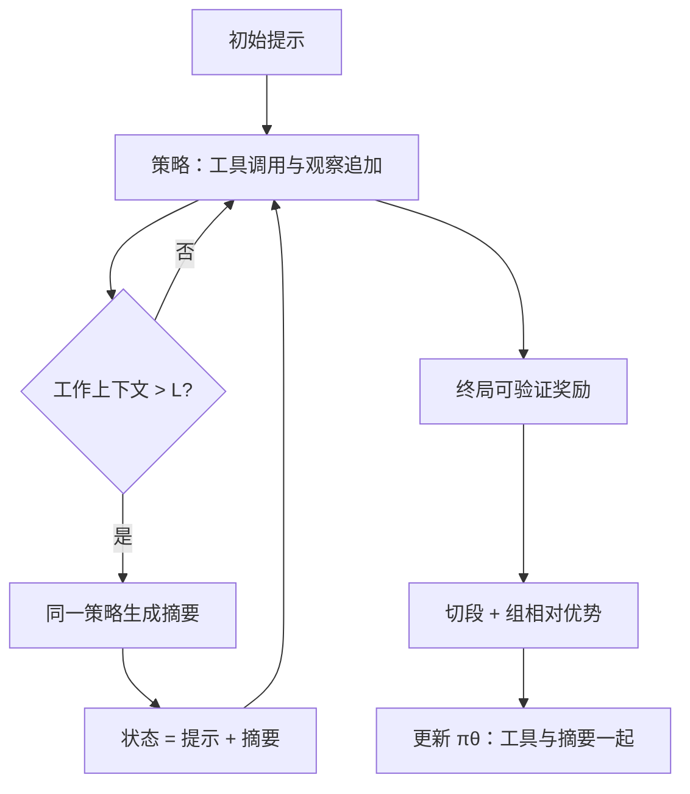

# SUPO 上下文优化

    
把摘要写进 MDP 的转移：上下文越过阈值就重置为「初始提示 + 模型自己写的摘要」，并用一条可分解的策略梯度让现成 RL 基础设施同时优化工具使用与摘要策略。

    <footer>—— Lu、Sun、Du、Ling 等，Scaling LLM Multi-turn RL with End-to-end Summarization-based Context Management，arXiv:2510.06727</footer>

ByteDance Seed / Stanford / CMU 的 Miao Lu、Weiwei Sun、Weihua Du、Zhan Ling、Xuesong Yao、Kang Liu、Jiecao Chen 提出 **SUPO**（SUmmarization augmented Policy Optimization）。多轮工具 RL 会被工作上下文顶死：指令遵循变差、滚动变慢、任务所需工具次数超过窗口。SUPO 不靠外挂冻结摘要器，而让**同一策略**在超阈值时生成任务相关摘要并端到端吃奖励。定理把长滚动的策略梯度写成若干摘要段之和，从而接上 GRPO 风格训练器。CodeGym 与 BrowseComp-Plus 上成功率提高且工作上下文持平或更短（文中绝对点约 +3.2% 与 +14.0%）；测试时可把最大摘要轮数加到超过训练时，搜索任务再涨最多约 7.0%。日期 2025-09-30。本篇写摘要增强 MDP 与过长掩码，对照 [ReSum](/llm/resum-context) 的切段广播。

## 问题

数学、代码、深搜的 RL 都把推理与工具调用建成 MDP，但滚动一旦含几十上百次工具，提示、模型输出、观察线性堆叠。三条后果：（i）长上下文上遵循与推理变差；（ii）滚动时间成为训练墙钟瓶颈；（iii）窗口硬顶规定了可训任务的难度上限。外挂启发式摘要不与任务奖励对齐；MEM1 覆盖内部状态但不走「分段摘要 + 标准 RL 基础设施」这条形式化路。

需要把摘要当成转移的一部分，而不是日志后处理。摘要必须由策略生成，以便「留什么」可学习。同时，工程上不能为新 MDP 重写整套 verl/slime 梯度路径——这就是可分解策略梯度的负载。

### 摘要增强转移

工作上下文长度越过 $L$ 时，下一状态不是追加后的历史，而是初始提示加上模型摘要。段与段之间任务继续，但 KV 从短前缀重生。摘要轮数有上限 $S$，步数有上限 $H$。复杂搜索在评估时可把 $S$ 加到大于训练值，等于测试时算力换更长程，而不需要更大窗口。

SUPO 的摘要器就是 $\pi_\theta$ 自己，不是 ReSumTool。因此摘要质量随 RL 进步，也会随奖励黑客退化（把摘要写成「我已经做对了」）。需要可验证终局奖励，不能只靠自说自话。

## 方法

算法是 GRPO 变体：一组 $G$ 条滚动，组内相对优势。长滚动按摘要点切段，每段形状像普通单轨样本。**过长轨迹掩码**：撞上长度上限的失败滚动不把噪声梯度灌进摘要策略，避免训练崩。动态阈值 $L$ 控制何时压。消融称去掉过长掩码或改优势计算会掉点。

环境：（i）CodeGym，合成交互式函数调用，要多轮调函数才能解；（ii）BrowseComp-Plus，难搜。相对无摘要或固定上下文 RL，成功率升、工作上下文持平或更短。定性：学到保留迭代下标、关键事实等跨摘要边界仍需要的槽，而不是通顺空话。ACL 2026 长文版本标题为 *Beyond the Context Window: Scaling Agentic RL via End-to-end Optimized Context Compression*，算法名仍是 SUPO。

### 定理 3.2 对基础设施的意义

梯度按段相加、每段是标准轨迹项，意味着：现有 trainer 只需改如何切样本、如何把优势赋到段上，不必新反向路径。ReSum-GRPO 也切段，但摘要模型可冻结、优势来自整轨迹广播；SUPO 的摘要 token 本身是 $\pi_\theta$ 输出，梯度流过摘要文本。这是「上下文优化」一词在本篇的含义：优化的是压缩策略，不是离线指南（那是 [ACON](/llm/acon-context)）。

与 CompactionRL、AutoCompact 等后续工作的对照见工程综述：触发条件、谁写摘要、优势来源不同。引用 SUPO 时用 arXiv:2510.06727，不要把后作数字写回这篇。

## 机制

联合优化消除「摘要器与策略分布不一致」：策略不会面对训练时从未见过的摘要风格，因为摘要就是它自己的语言。测试时加大 $S$，等于允许更多次重置，搜索类任务还能涨——说明学到的是可重复使用的压缩技能，而不是背训练轮数。过长掩码防止「撑满窗口的失败」被当成摘要失败来惩罚或奖励，稳定早期训练。

风险：摘要段成为奖励黑客的信道；组相对优势在全组都撞顶时信号弱。CodeGym 是合成环境，迁移到真实 IDE 工具集要重训。BrowseComp-Plus 的 +14.0 绝对点是该设定下相对所列基线，不是任意搜索代理。

工作上下文更短不等于总生成 token 更少：多次摘要本身要生成。报成功时同时报摘要次数与总输出长度，以免把费用藏进「峰值上下文」指标。

### 与 MEM1、ReSum、AgentFold

MEM1 每步覆盖单槽，训练用 PPO+2D 掩码，不强调可接标准 GRPO 切段。ReSum 即插 + 冻结/特化摘要器 + 广播。AgentFold 用 SFT 学可变 $k$ 折叠，不在本文 RL 公式里。需要「开源可训模型 + 接现有 GRPO 栈 + 突破窗口训长程」时用 SUPO。

## 边界与工程取舍

论文明确未来方向：更细的优势估计、外接记忆、更多域。摘要增强 MDP 不保存原文，合规与调试要另记日志。[ACM](/llm/acm-context) 把 SUPO 标为可压缩、可训练、有损、非代理发起（触发是阈值 $L$ 而非工具调用）。若产品要模型主动说「我现在要压」，需改触发器，不能直接声称论文已做代理发起。

出处：Lu, Sun, Du, Ling, Yao, Liu, Chen，*Scaling LLM Multi-turn RL with End-to-end Summarization-based Context Management*，arXiv:2510.06727。通讯 miaolu@stanford.edu，jiecao.chen@bytedance.com。GRPO：Shao 等。BrowseComp-Plus：Chen 等。

## 小结

- SUPO 将策略生成的摘要写入 MDP 转移，端到端 RL 同时训工具与压缩。
- 策略梯度按摘要段分解，可接标准 LLM RL 栈；过长掩码稳定训练。
- CodeGym / BrowseComp-Plus 上更高成功率、更短或持平工作上下文；测试时可加摘要轮数。
- 有损、阈值触发；摘要来自同一 $\pi_\theta$，与冻结 ReSumTool 不同。
- 出处：arXiv:2510.06727。
