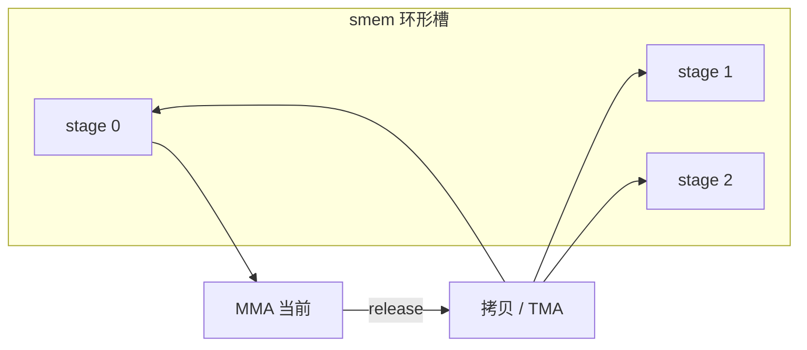

# 软件流水与 double buffering

    
计算当前瓦片时，把下一瓦片已经在路上的拷贝藏进同一段墙钟：缓冲至少两份，屏障按级握手，流水深度由片上容量与延迟比决定。

    <footer>—— NVIDIA CUDA 异步拷贝与 CUTLASS pipeline 文档，对照 Hopper 白皮书中的 TMA / MMA 重叠</footer>

分块 GEMM 在逻辑上是 `for k in K_tiles: load A_k, B_k; mma`。若 load 与 mma 串行，墙钟是拷贝延迟加计算延迟。Double buffering 把共享内存（以及可选的寄存器操作数）做成两套槽：计算槽 $i$ 时，拷贝填槽 $i\oplus 1$；翻转后再算刚填好的那一套。更深的软件流水把槽数加到 3、4、5，让「在路上」的拷贝覆盖一整段 HBM 往返。Ampere 用 `cp.async` 的 commit/wait group 做这件事；Hopper 用 [TMA](/llm/hopper-tma) + mbarrier，常再叠 [WGMMA](/llm/wgmma) 的 wait group。名字不同，账是同一笔：用容量换延迟隐藏。

本篇写级数怎么选、屏障怎么配对、以及和 [warp 特化](/llm/warp-specialization) 的关系。不编造未公开的 HBM 往返周期表。

## 问题

屋顶线上，算术强度够的核仍可能达不到峰值，因为**当前** MMA 所需的字节还在 HBM 上。硬件预取帮不规则程序有限；规则的 tile 循环里，软件明确知道下一块地址，自己发异步拷贝更稳。一份缓冲时，写与读必须互斥，重叠为零。两份缓冲是能重叠的最小值：一份被 Tensor Core 读，一份被拷贝引擎写。若单块计算时间短于一次 HBM 盒子的延迟，两级仍藏不住，需要更多 in-flight 拷贝，也就是更多槽。

约束是容量。每个 stage 要放下 $A$ 与 $B$ 的 CTA tile，还可能要为 epilogue 或注意力的 $V$ 块留空间。Stage 加一，每 CTA 的 smem 上升，驻留 CTA 数下降，延迟隐藏的「另一半」（占用率）被吃掉。问题是解一个不等式：`stages × tile_bytes ≤ smem`，且 `stages × copy_issue` 足以覆盖延迟，且占用率仍能喂饱 MMA。CUTLASS 把 stage 做成模板参数，用 profiler 扫，而不是固定「double 一定最好」。

### Double buffer 只是流水的 $s=2$

口语里 double buffering 常被当成全部。实现上它是软件流水的特例：prologue 填第 0 槽，循环里算 $i$、填 $i+1$，epilogue 把最后一槽算完。三级以上只是把「填 $i+1$」改成「填 $i+s-1$」，并用环形索引与多枚 barrier。注意力的 ping-pong warpgroup 是另一种双缓冲：缓冲的是**角色与时间片**，不一定是两块 smem，也可能是两组累加器。讨论时要写清缓冲的对象是 smem tile、寄存器操作数，还是 warpgroup 时间片。

寄存器双缓冲（下一 $A$ 碎片先进寄存器，当前碎片在 MMA 里）和 smem 双缓冲是两层。Hopper 上 $B$ 常留在 smem 由 wgmma 直接读，寄存器缓冲主要留给累加器与可选的 $A$。层数搞混，会在寄存器文件上溢。

## 方法

Ampere 路径：对每个 stage 发一组 `cp.async`，`commit_group`，在使用该 stage 前 `wait_group` 到「最多还剩 $s-2$ 个未完成组」这类文档给定的计数。Wait 太早，重叠变小；太晚，写穿正在读的槽。Hopper 路径：每个 stage 配 mbarrier 相位，TMA 完成 arrive，消费者 wait 后发 wgmma；生产者与消费者可以是不同 warp，见特化。CUTLASS `Pipeline` 类型把相位、arrive/wait、以及 `producer_acquire` / `consumer_release` 收成 API，手写时应对着示例做，而不是自造一套容易死锁的计数。

Prologue / epilogue 必须单独写。循环体假设「上一轮已经填好下一槽」；第一轮没有上一轮，要先填满 $s-1$ 个 in-flight 拷贝再进入稳态。最后几块 $K$ 不再发新拷贝，只把在途的算完。漏写 prologue，第一块 MMA 读到未初始化 smem；漏写 epilogue，最后一块被跳过或重复。这些 bug 不报 CUDA error。

### 如何选 stage 数

先定 tile（对齐 MMA 原子），算每 stage 字节，用 smem 容量减掉规约缓冲与集群预留，得到 $s_{\max}$。再从 $s=2$ 起测 Tensor Pipe 与 DRAM 吞吐：若计算单元等 barrier，加 stage；若占用率已经掉到每 SM 一个 CTA 且再加 stage 会装不下，应缩小 tile 或减少 [特化 warp](/llm/warp-specialization) 数，而不是盲目 $s=7$。Decode 瘦 $M$ 上，计算太短，再深的流水也填不满拷贝延迟，这时该减 tile 或接受带宽墙，而不是加 smem。

Cluster multicast 时，stage 规划还要算上「同一盒子到达多个 CTA」的完成：每个 CTA 仍有自己的 smem 槽与 barrier，不能假设邻居的 wait 能代替本 CTA。

## 机制

软件流水把循环展开成时间上的重叠窗口：时刻 $t$ 同时存在「正在 MMA 的 tile $k$」「正在拷贝的 tile $k+1,\ldots$」。硬件不保证自动做到这一点；没有软件发行的异步拷贝，编译器通常不敢跨 `__syncthreads` 重排出同样深度。Barrier 的相位位用于区分「这一轮的 arrive」和「上一轮残留」，环形缓冲必须翻转相位，否则会把旧完成当成新完成，或永远等不到。

与 [持久化核](/llm/persistent-kernel) 的交接：持久化让**工作项之间**不断流；软件流水让**同一 GEMM 的 K 循环内部**不断流。一个持久 CTA 取到新 tile 之后，仍要走 prologue 填满自己的 pipeline——除非调度保证下一个 tile 的 $A$、$B$ 描述符已经能接上同一套 stage（少见）。不要指望常驻能省略 prologue；最多把 prologue 从「每核一次」变成「每工作项一次」。

Nsight 里若看到 MMA 与 DRAM 不同时高，先查 wait 点是否把流水掐断（例如每个 K 都 CTA `__syncthreads`），再查 stage 是否为 1。工具比「代码里有 double buffer 注释」可靠。

### 正确性清单

每个 stage 的生产者 acquire（槽空闲）→ 拷贝 → arrive 完成；消费者 wait 完成 → MMA → release 槽。任何一条边反了都会覆盖或死锁。注意力核若在 MMA 与 softmax 之间还要复用同一块 smem 放 $S$ 碎片，等于额外一种缓冲对象，stage 图要重画，不能共用 GEMM 的双缓冲注释。数值对照应用关闭流水的串行核（$s=1$、同步拷贝）做基线；尾差应在浮点顺序容差内，数量级差异是屏障错误。

## 边界与工程取舍

不要在 smem 已经装不下两个 tile 时强行 double buffer——应先减小 tile，或把 $B$ 的一部分改走寄存器直供（若指令允许）。不要把主机 pinned 的 double buffer（CUDA 流上的 `cudaMemcpyAsync` 乒乓）和核内 smem 流水当成同一件事：前者藏的是 PCIe 或跨设备拷贝，后者藏的是 HBM 到 smem。不要跨架构复制 stage：A100 与 H100 的拷贝引擎、MMA 延迟比不同，CUTLASS 默认值也不同。

训练反向若重算激活，流水核要保证重算路径用同一套 stage 合同，否则正反向缓冲区别名会打到正在飞行的拷贝。服务捕获 [CUDA Graph](/llm/cuda-graph-infer) 时，pipeline 状态在核内，不进图的节点参数；不要试图用 Graph Update 去改 stage 数——那是编译期常量。

出处：CUDA 编程指南的 `cp.async`、pipeline 内建函数；Hopper 白皮书的异步拷贝与 MMA 重叠；CUTLASS 3.x `Pipeline` / mainloop stage 参数。PTX 中 mbarrier 与 `wgmma.wait_group` 给出完成语义，二者不可互相替代。

## 小结

- 软件流水用多份片上缓冲让「下一块拷贝」与「当前 MMA」重叠；double buffering 是 stage=2 的特例。
- Stage 受 smem / 寄存器容量与占用率约束，不是越深越好；应用 profiler 看是等拷贝还是装不下。
- Ampere 走 `cp.async` group，Hopper 走 TMA + mbarrier，常再叠 wgmma wait；配对错误是静默数据竞争。
- Prologue / epilogue 必须显式处理；持久化不取消这项。
- 缓冲对象可能是 smem、寄存器或 warpgroup 时间片，讨论时要分开。
- 出处：CUDA 异步拷贝文档、Hopper 白皮书与 CUTLASS pipeline。
