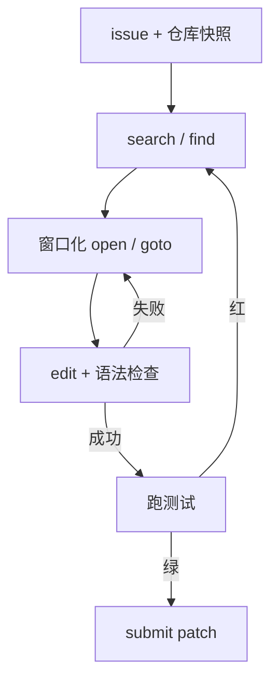

# SWE-agent

    
语言模型能修真实 GitHub issue，瓶颈往往不在再加一个通用工具，而在给它一套为软件工程设计的计算机接口：查、看、改、跑，观察还要适合模型读。

    <footer>—— Yang 等，SWE-agent: Agent-Computer Interfaces Enable Automated Software Engineering，arXiv:2405.15793</footer>

John Yang、Carlos E. Jimenez、Alexander Wettig、Kilian Lieret、Shunyu Yao、Karthik Narasimhan、Ofir Press（Princeton NLP 等）2024 年的 SWE-agent（arXiv:2405.15793）把 [SWE-bench](/llm/code-bench) 上的低分，从「模型不够强」部分改写成**接口不够强**。给 GPT-4 一类模型裸的 bash，它会在 `cat` 整文件、乱敲 `sed`、把终端噪声读进上下文里失败。SWE-agent 设计 **Agent-Computer Interface（ACI）**：专用的搜索、带行号的窗口化文件查看、带语法检查的编辑、精简观察。本篇写这套接口与工具循环，以及它在 SWE-bench 上量过什么。不写越权利用、漏洞利用或绕过测试沙箱；任务默认是合法仓库里的功能修复。

## 问题

SWE-bench 的一条实例是：冻结的仓库快照 + issue 文本，输出补丁，使 fail-to-pass 测试转绿且回归测试不红。定位比生成难。ReAct 式循环若只暴露 shell，动作空间过大：每个 Unix 选项都是合法 token，观察却是未截断的 stdout。模型会打开错误文件、一次编辑没有行号对齐、把测试日志整页塞进窗口把早期 issue 挤出去。Yang 等人要回答：在**同一类强模型**下，把接口从「通用计算机」收成「给 LM 用的 IDE」，resolved 率能不能从接近不可用变成可引用的两位数百分比。

这不是再训一个代码模型。基座可以是闭源 API。论文的自变量是 ACI 设计：命令集合、观察格式、编辑失败时是否立即回报语法错。对照是同一模型 + 原始 shell 的 agent。若 ACI 赢，说明软件工程代理的一等工程是**交互协议**，权重反而是给定条件。

### 观察必须像 IDE，不能像审计日志

人用的终端可以滚屏、可以 squint；上下文窗口不能。ACI 把文件显示成固定行数的窗格，带行号，滚动用专用命令而不是 `cat | head` 的即兴参数。搜索返回匹配行而不是整文件。编辑命令在应用后跑 linter/语法检查，失败观察写回「没改上」，避免模型以为补丁已落地。这些约束减少的是无效轨迹，不是模型智商。

引用写 Yang et al.，SWE-agent，arXiv:2405.15793。SWE-bench 原文是 Jimenez et al.；Yang 同时参与基准与 agent 论文，但两篇合同不同：一篇定义题，一篇定义接口。报分必须写 SWE-bench 全量还是 Lite/Verified，以及骨干模型日期（GPT-4 Turbo 的哪一版）。

## 方法

动作白名单大致包括：在仓库内搜文件名与文件内容、打开文件并跳转到行、在窗格内滚动、按行号区间替换文本、运行测试/项目命令、提交补丁结束。每一步是「模型输出命令 → 宿主执行 → 格式化观察 → 追加进历史」。历史有长度上限，旧观察被截断或折叠，只留命令摘要——否则测试日志会淹没 issue。系统提示示范成功与失败编辑，强调先搜再看再改，不要一上来整文件重写。

编辑接口是 ACI 的核心实验旋钮。相对 `sed`/补丁文件，行号窗格让模型的参数落在可见文本上，减少 off-by-one。应用后立即语法检查：这一步把「无效编辑」从测试阶段提前到编辑阶段，节省后面的 pytest 墙钟。搜索接口带过滤与次数限制，避免模型用过宽正则把半个仓库打进观察。

### 原文量过的数字，以及不能外推的部分

2024 年 5 月前后，SWE-agent + GPT-4 Turbo 在 SWE-bench 上给出当时领先的 resolved 率（全文常见引用约 **12.47%** 量级；Lite 子集更高）。对照裸 bash / 通用工具 agent 明显更低。消融指向：去掉专用编辑或窗口化查看，分数掉。量不出：换成 2025–2026 年的更强模型后 ACI 的边际是否变小（更强模型更能扛烂接口，但论文未主张接口过时）；多仓库语言生态（不只 Python）、需要 GUI 或外部服务的 issue。后续 Claude 等骨干把分数抬高，应引用新实验，不要把 12.47% 当成接口的上限。

## 机制

ACI 降低的是**策略学习的有效动作空间**。搜索/查看/编辑/测试构成软件工程的最小闭环，与人类在 IDE 里的循环同构。观察被截成「下一决策够用」的视图，等于在环境侧做了注意力——模型不必在 128K 里找那一行，接口已经把那一行放到窗格中央。语法检查是廉价的过程奖励：编辑失败立即惩罚，不必等完整测试。这与 [OpenCodeInterpreter](/llm/opencodeinterpreter) 的解释器反馈同类，但对象从函数 stdout 换成了文件编辑是否合法。

### 接口是论文自变量，模型是条件

把 SWE-agent 写成「一种模型」会引错。权重可以换，命令集与观察模板才是可复现的系统。换模型要重调提示里的示范命令，不能假设 GPT-4 的 ACI 提示原样适用于本地 7B。换仓库语言要换 linter 与测试运行器，ACI 抽象仍在，实现绑定生态。机制上，这篇把 [ReAct](/llm/react) 的 Action 从「任意 bash」收成 schema 化 IDE 原语，再把 Observation 做成适合 LM 的视图——function calling 只是信封，信封里装什么才是贡献。

不要把 ACI 理解成限制模型能力。它限制的是无效动作与不可读观察。测试命令仍在白名单内，模型可以跑 pytest；不能做的是把任意 URL 或越权命令从论文里「发明」出来。本仓库的代理编码讨论止于合法开发闭环。

## 边界与工程取舍

### 脚手架分数不是模型卡分数

同一模型、不同 ACI，SWE-bench 可以差一倍。对比代码模型时必须冻结接口，见 code-bench 文对代理脚手架的提醒。SWE-agent 默认假设可运行测试；没有测试的 issue 不在合同里。窗口化查看在超大文件上仍要多次滚动，定位成本还在。自动提交前应保留人类审查补丁的门——论文评测脚本是隐藏测试，产品不能把隐藏测试交给模型当 oracle 循环刷。

与 [OpenHands](/llm/openhands) 的差别：SWE-agent 论文聚焦 Python issue 与一套紧的 ACI；OpenHands 是通用平台，动作空间更偏 CodeAct（写代码当动作）。与 [Aider](/llm/aider) 的差别：Aider 以 git 与仓库地图为中心、人在回路确认每次编辑；SWE-agent 评测更接近全自动跑到 submit。选型看你要的是论文式自动修复率，还是日常结对工作流。

出处：Yang, Jimenez, Wettig, Lieret, Yao, Narasimhan, Press，*SWE-agent: Agent-Computer Interfaces Enable Automated Software Engineering*，arXiv:2405.15793，2024。SWE-bench 任务定义见 Jimenez et al.。

## 小结

- SWE-agent 主张：仓库修 bug 的关键工程是给 LM 的计算机接口，而不只是更强的代码模型。
- ACI：搜索、窗口化查看、带语法检查的编辑、精简观察、测试与提交。
- 2024 年与 GPT-4 Turbo 组合在 SWE-bench 上给出当时可引用的领先 resolved 率；后续骨干会改写绝对数。
- 报分必须冻结接口、子集与模型日期；脚手架不是模型本身。
- 出处：Yang et al.，arXiv:2405.15793。
