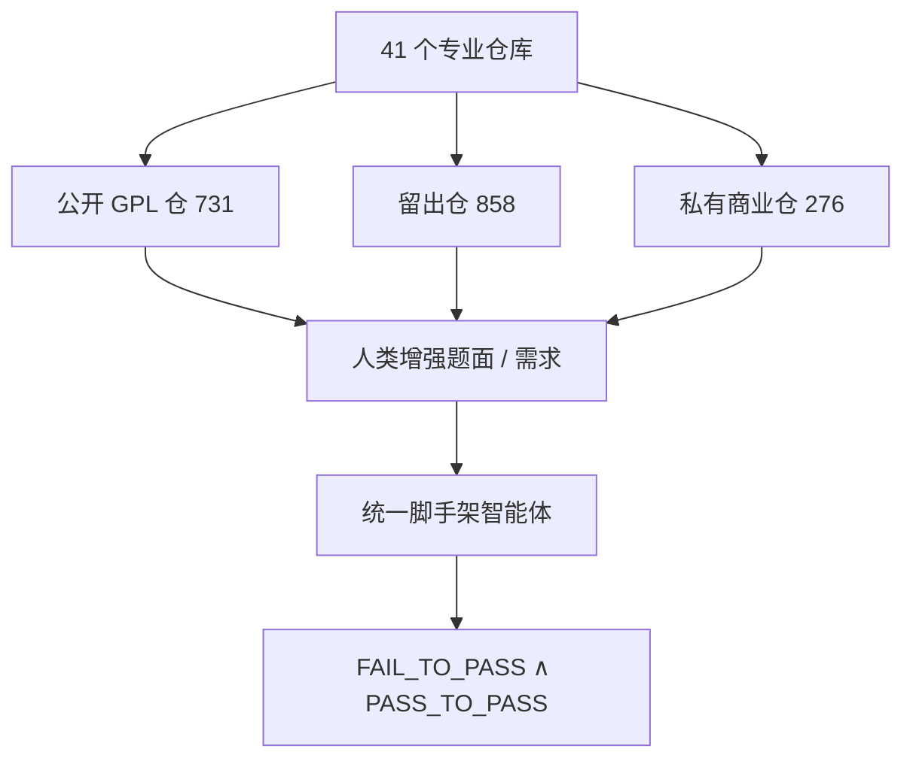

# SWE-Bench Pro

    
在 Verified 上七十多分的同一批前沿模型，在 Pro 的公开集上掉到约 23%；私有商业子集还更低——测的是陌生大规模仓库里的长程、多文件修改，而不是见过的 Python 明星库。

    <footer>—— Scale AI《SWE-Bench Pro: Can AI Agents Solve Long-Horizon Software Engineering Tasks?》（arXiv:2509.16941）与配套博客</footer>

[SWE-bench Verified](/llm/swebench-verified) 把可解、可复现的 GitHub issue 滤成一套干净的仓库修复考卷。到 2025 年，前沿模型在 Verified 上普遍超过约 70%，于是出现两种解释：智能体真的会做软件工程，或是题与补丁已经进了训练数据、且原题偏短偏单文件。Scale AI 的 **SWE-Bench Pro** 把考卷换成 41 个仍在维护的专业仓库、共 **1,865** 题，并切出公开 / 留出 / 商业三份，故意让模型很难背到答案。本篇按论文与 Scale 博客写构造、污染对策与失败模式。榜上分数会变，正文引用的是论文评估当时、统一 SWE-Agent 脚手架下的那一组。

## 问题

原版 SWE-bench 的生态真实性来自少量明星 Python 库。题短、改动面窄、互联网题解多，Verified 再滤掉含混项之后，剩下的往往是「描述清楚的单点 bug」。职业工程师的一周工作不是这样：跨四个文件改 100 行、需求来自不完整的工单、代码在 GPL 或不公开的商业仓里。若只报 Verified，产品会高估智能体在内部 monorepo 上的自主率。

污染是第二堵墙。公开 GitHub issue 与黄金 PR 会出现在预训练、博客和「仓库对话」合成数据里。Verified 没有 Live 题库的水龙头。Pro 要同时加难度和加**见不到的代码**：强 copyleft 的公开仓，以及创业公司私有仓。

### 三份数据不是同一张榜

总计 **1,865** 题、**41** 仓：公开 **731** 题 / 11 仓，留出 **858** 题 / 12 仓，商业 **276** 题 / 18 仓。公开集可下载，用 GPL 一类强 copyleft 作为法律与流程上的训练排除压力。留出集仓库不公开题目细节，用于防过拟合公开榜。商业集来自有协议的私有代码，论文发布该集上的结果，但不开放题目。两张官方榜：Public 与 Commercial。把商业集分数当成「可复现的开源数字」是错的；把公开集当成「无污染证明」也过强——copyleft 是威慑，不是密码学保证。

任务统计（博客）：平均约 **107.4** 行改动、跨约 **4.1** 个文件。人类专家重写真题说明与需求列表，指定行为、不指定做法，以保留难度并保证可解。原提交信息往往过烂，不能当提示。

论文评估用统一的 SWE-Agent 脚手架。换框架会移动分数。Pro 上的 23% 与 Verified 上的 70% 不能直接纵向比「模型一年进步了多少」，除非同一 agent、同一提示、两套题都重跑。

## 方法

实例结构沿用 SWE-bench：仓库快照、问题陈述、FAIL_TO_PASS 与 PASS_TO_PASS 测试。成功仍是补丁让该过的测试过、该绿的回归测试继续绿。Pro 的差异在题从哪来、有多长、以及人类增强了哪些字段。环境用可复现容器；不可靠测试是原基准的痛点，Pro 把「稳定可跑」写成设计目标之一。

论文当时的统一脚手架结果（Pass@1，公开集）：GPT-5 约 **23.3%**，Claude Opus 4.1 约 **23.1%**，显著低于二者在 Verified 上的七十多分。更老的 GPT-4o 约 4.9%，较小开源码模型更低。商业子集更难：博客写 Opus 4.1 从约 22.7% 降到约 17.8%，GPT-5 从约 23.1% 降到约 14.9%（两处公开/商业口径以论文表格为准，引用时对表）。语言维度：Go / Python 相对高，JavaScript / TypeScript 更散、常常更低。仓库维度：有的仓全体低于 10%，有的仓个别模型超过 50%。平均分会掩盖这种方差。

### 污染对策与人类增强

Copyleft：GPL 的传染性使许多预训练配方直接丢弃，从而降低「整仓进语料」的概率。私有仓：模型按设计不应见过。人类增强：把含混工单改成可测需求，但**不**把实现写进提示——否则任务退化成翻译规格。这与 Verified「删掉含混题」相反：Pro **保留**职业场景里的含混，再用专家补全到「可解但不剧透」。平均四文件、百行补丁，使「改一个字符串碰巧过测试」更难。

$$
\mathrm{Resolved}=\mathbf{1}\bigl[\mathrm{FailToPass}(\mathrm{patch})=1\ \wedge\ \mathrm{PassToPass}(\mathrm{patch})=1\bigr]
$$

公式与 Verified 相同；分布不同。Pass@1 默认一次尝试；多次采样必须另报。

## 机制

长程失败来自三类（论文对轨迹聚类的方向）：在陌生大仓库里导航；跨文件做高精度编辑；以及 JS/TS 一类工具链与异步语义。前两项是状态空间问题：文件数以千计，issue 不给出路径。第三项是生态问题：测试跑在特定 bundler / Node 版本上，智能体的「通用 Python pytest 策略」失效。顶模不仅平均分高，跨语言、跨仓的方差也更小；小模型会在某些仓上归零。

商业集更低，说明公开 copyleft 仓仍可能有风格或依赖上的「半熟悉」。真正的内部 monorepo（私有语言、私有框架）应以商业集为下界直觉，而不是以 Verified 为上界当承诺。Scale 对工程主管的建议很干脆：唯一真度量是你们自己的仓库；Pro 只告诉你「别被 Verified 骗了」。

脚手架再次是方法。SWE-Agent 的工具、步数、是否预跑测试，都会改变 23% 这个数。比较模型应锁框架；比较产品应把框架写进名字。隐藏地把测试文件喂进上下文，是与 Verified 同样的协议污染。

### 成本与「职业级」名不副实之处

题面写「可能需要人类数小时到数天」。智能体若用数千次模型调用穷举，墙钟和美元会超过人类。Pro 的 Pass@1 不自动含效率。报告应附中位步数、超时率、费用。否则「职业级基准」只是更难的单元测试，不是更便宜的工程师。

多文件补丁还带来可维护性：测试绿了但风格与架构崩了。Pro 仍以测试为裁判，与 SWE-bench 一致。若还要评审质量，需另加静态检查或抽检，不要偷偷改 Resolved 定义。

## 边界与工程取舍

公开集仍可能泄漏：GPL 仓也会被违规收录，issue 文本在互联网上。留出集与商业集减的是**题目过拟合**，减不掉「模型变强」本身。语言覆盖比早期 SWE-bench 宽，但仍不是所有企业栈。内部应建同构私有集，用同一套 FAIL_TO_PASS 逻辑。

不要把 Pro 公开榜的 23% 与后来更高的第三方数字在未对齐脚手架时直接连成曲线。不要用 Arena 或 HumanEval 代替 Pro。不要把商业榜缺失当成 0 分。与 [Terminal-Bench 2](/llm/terminal-bench-2) 一起用：一个考仓库补丁，一个考终端系统活。

出处：Deng 等（Scale）arXiv:2509.16941；scale.com/blog/swe-bench-pro。实例规模 1865/731/858/276、平均 107.4 行 / 4.1 文件、以及论文中的 23.3%/23.1% 以原文表格为准。

## 小结

- SWE-Bench Pro：1,865 题、41 仓，公开/留出/商业三份，针对污染与过短补丁。
- 统一 SWE-Agent 下，当时前沿约 23% Pass@1，远低于 Verified 的七十多分；商业集更低。
- 难度来自长程多文件修改与陌生代码库，失败常在导航、跨文件编辑与 JS/TS。
- Copyleft 与私有仓是污染对策，不是绝对保证；脚手架必须写入分数。
- 产品应以内部仓为准，Pro 用来打破对 Verified 的过度自信。
- 出处：Scale 论文与博客；构造对照 [SWE-bench](/llm/swebench-paper) 与 [Verified](/llm/swebench-verified)，智能体对照 [SWE-agent](/llm/swe-agent)。
