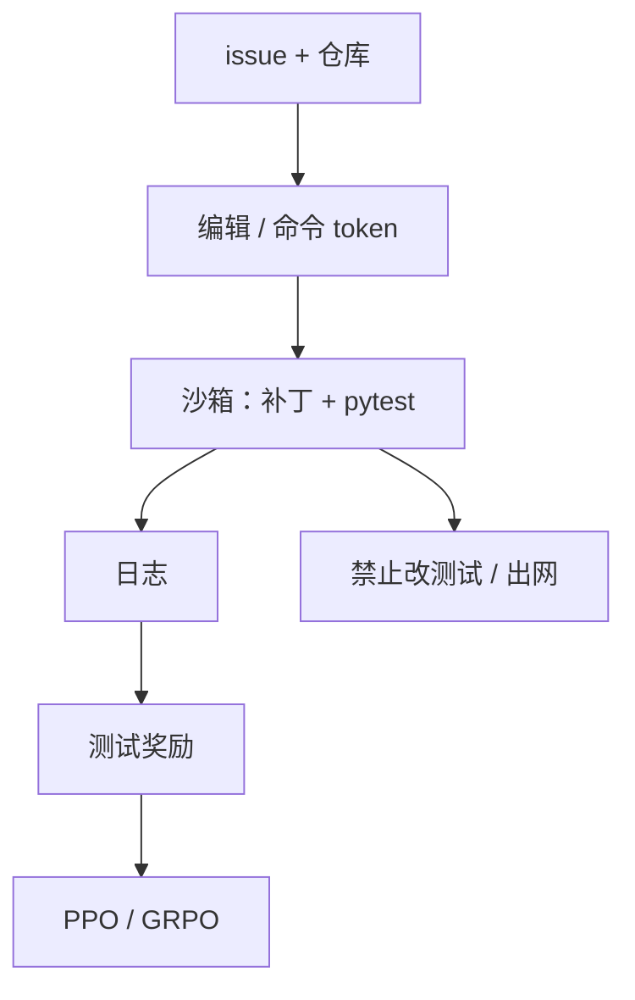

# 代码 RL 与 SWE 环境

单元测试是单文件的 $R$；修仓库要把终端、测试套件和补丁差分当成环境状态。

<footer>—— Jimenez 等 SWE-bench；单测验证器课的延伸；开源 SWE-RL / 代理环境</footer>

[上一课](/llm/multimodal-rlhf)强调奖励必须看见环境。软件工程的环境不是图，是仓库。缺口是：[代码单测课](/llm/code-verifier-unittests) 的 HumanEval 式 $R$ 不够——**失败测试在另一文件，动作是补丁与命令。** SWE-bench 把真实 GitHub issue 变成可跑的测试。本课写这套 RL 环境，不重写 GRPO。

## 问题

单文件函数生成：状态短，动作是一次完成，R 是通过率。仓库级：状态是文件树 + 测试输出，动作是多轮编辑与 shell，地平线长，部分可观测。奖励稀疏：直到测试套件绿。黑客：改测试、删断言、硬编码期望。环境必须锁测试只读、网络关、超时。Jimenez 等的评测协议已经在防这些；训练环境若更松，RL 会学评测里禁止的动作。

代理框架（工具循环）与 RL 的关系：环境步进由工具执行，策略只产 token（命令 / 补丁）。与 [PPO](/llm/ppo-llm) 接口相同，轨迹更长，GAE $\lambda$ 要大，过长过滤要按「是否还在跑测试」标记。

### 评测集污染

SWE-bench 的 issue 可能进过预训练。RL 再在同一仓库上刷，分数不可信。应锁训练仓库与评测仓库分离，像隐藏测例。

「用 GPT-4 评代码是否优雅」不是本课 $R$。本课只认测试与格式化检查器。

## 方法

环境：检出仓库、应用补丁、跑指定测试命令，返回日志与 $R\in\{0,1\}$ 或失败测例比例。策略：多轮，每轮可调工具。训练：GRPO / PPO，组内多条补丁轨迹。过程信号：编译过、单测从 3 fail 到 1 fail 给稠密塑形，注意不要奖励「删测试」。基线：SWE-bench 官方脚手架；RL 论文应声明是否改环境规则。

与工具整合课衔接：本课环境以测试为终局；下一课把计算器、检索当中途工具，终局仍可能是数学对错。

## 机制

长地平线 + 稀疏 $R$ 使随机探索几乎不可能碰巧修对。需要 SFT 冷启动（示范轨迹）再 RL，类似 R1 的冷启动。RL 负责在已会用工具的策略上提高通过率。过优化环境洞：只过公开 fail2pass，不过 hidden。金标必须含 hidden tests，与单测课同一原则。

墙钟由测试套件主导。batch 按仓库分组，避免短测等长测。

## 边界与工程取舍

没有可跑测试的 issue 不属于本课，退回裁判。前端视觉回归接近多模态。下一课工具整合推理：数学/代码混合工具，环境更轻，但「工具结果必须进 $R$ 的定义」同一条。

## 小结

- SWE-RL 的状态是仓库与终端，奖励是锁死的测试套件，不是单文件单测。
- 防黑客：测试只读、无网、hidden tests、训练评测仓库分离。
- 需要示范冷启动；纯随机补丁不会绿。
- 过程塑形勿奖励删测试。
- 出处：Jimenez 等 SWE-bench；HumanEval / CodeRL 为单文件对照；R1 代码奖励为规则 $R$。
