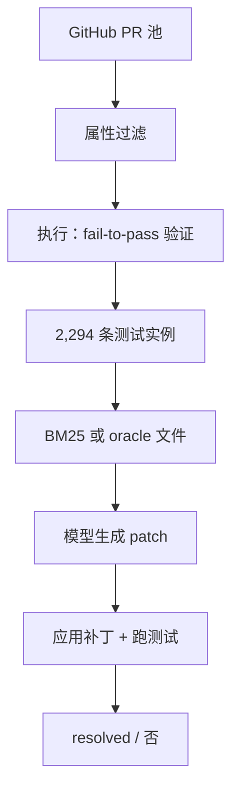

# SWE-bench 原文

    
从真实 GitHub issue 与对应 PR 构造仓库级任务：模型交补丁，必须让 fail-to-pass 测试转绿，且原通过测试不回退。

    <footer>—— Jimenez et al., SWE-bench: Can Language Models Resolve Real-World GitHub Issues?, ICLR 2024</footer>

Carlos E. Jimenez、John Yang、Alexander Wettig、Shunyu Yao、Kexin Pei、Ofir Press、Karthik Narasimhan 的 SWE-bench（arXiv:2310.06770，ICLR 2024 Oral）把代码评测从函数补全推到软件工程：给定某 commit 上的代码库与 issue 描述，语言模型要编辑代码以解决问题。任务来自 **12** 个流行 Python 仓库、**2,294** 条实例，由约 **90,000** 个 PR 经属性过滤与**执行验证**筛下。仓库平均数千文件、数十万行；金补丁常跨文件。原文设定下，即使用 BM25 检索相关文件，最强闭源模型 Claude 2 也只解决约 **1.96%**；ChatGPT-3.5 约 **0.17%**。GPT-4 因费用在 25% 子集上评，oracle 检索约 **1.74%**。他们还释放训练池 SWE-bench-train（约 19,000 条、37 个仓库）并微调 SWE-Llama。本篇写原文合同，不把后来的 Lite / Verified / 代理脚手架分数写进 2023 年这张表。合法修复公开仓库 issue，不涉及未授权入侵。

## 问题

HumanEval 一类基准测短函数合成：签名加文档字符串，隐藏单元测试打 `pass@k`。真实 issue 的失败信号是一段含噪声的自然语言、若干相关文件、以及必须在项目环境里跑的回归。定位比生成难；一次改多个函数与文件；上下文远长于面试题。Jimenez 等人要的可持续测试床是：任务从 GitHub 自然增长、有可执行规格（项目自己的测试）、难度足够让当时最强模型接近零。

构造必须避免「看起来像 issue、跑不起来」。很多 PR 不带测试、安装失败、或补丁与测试无关。执行过滤要求：应用 PR 的测试内容后，至少存在一条 **fail-to-pass**（补丁前红、补丁后绿），并尽量保留大量 **pass-to-pass** 以防破坏旧功能。约 40% 实例有不少于两条 fail-to-pass；pass-to-pass 的中位数约 51 条。安装或运行错误的实例丢掉。这样，resolved 才有操作定义：补丁能打上，测试命令在容器里跑完，门禁通过。

### 模型看见 issue 与代码，看不见隐藏测试的期望值

评测时应禁止模型改测试文件去骗门禁。原文管道把测试与非测试改动分开，用测试做裁判。输入是 issue 文本加检索到的文件（或 oracle 文件），输出是 patch。这与代理后来「自己跑 pytest 再改」不同：原文主实验更接近一次（或少轮）生成补丁，检索是 BM25，不是 IDE 循环。把 SWE-agent 的 2024 年双位数成功率写进这篇原文，是把接口自变量偷换成模型自变量。

引用 Jimenez et al.，ICLR 2024，arXiv:2310.06770。2,294 条、12 库、Claude 2 BM25 1.96%、ChatGPT-3.5 BM25 0.17%、GPT-4 子集 oracle 1.74%。后续 SWE-bench Lite、Verified、Multimodal 是新合同，必须改名报分。

## 方法

收集：爬指定仓库的 PR，过滤合并、改测试、可解析的候选，再在历史环境里安装依赖并跑测试对比。存活实例记录：仓库快照、issue、金补丁、测试命令、fail-to-pass / pass-to-pass 列表。推理：用 BM25 按 issue 检索文件，塞进模型上下文窗口能装下的数量；对照 **oracle**（金补丁实际改过的文件）。提示要求生成 patch。应用补丁失败时，原文实现含有限的格式修复；仍有大量生成物无法 apply。SWE-Llama 在 oracle 风格的训练上下文上 LoRA 微调 CodeLlama，序列超过约 30k token 的丢掉，有效训练大约一万条。

### 检索与窗口长度会同时改分

BM25 在约 27k token 限制下，大约 40% 实例能覆盖 oracle 文件超集，但近一半实例一个 oracle 文件都检索不到。加长窗口提高召回，原文里模型分数往往下降：更多无关代码干扰定位。SWE-Llama 在 BM25 上 unexpectedly 差，因为训练时上下文几乎都是「会改到的文件」，测试时却塞进许多不该改的文件，分布偏移。GPT-4 的 27k BM25 在 25% 子集上甚至出现 0% resolved 的行，说明「更大上下文 + 更强模型」不是单调改进。报原文数字必须写检索器与窗口。

## 机制

成功需要一条链：从 issue 语言对到代码位置，在正确抽象层编辑，保持其余不变量，并输出能 apply 的 diff。原文定性发现：模型常生成格式坏的 patch、改错文件、或写表面修复。把任务改成「重写整个文件」通常更差，因为生成更长、更易破坏未显示区域。oracle 把文件缩到金编辑附近（collapsed）能抬分（文中 GPT-4 约 1.3%→3.4%、Claude 2 约 4.8%→5.9% 量级，绑定该消融），说明瓶颈大量在**定位与长上下文使用**，而不只是「会不会写 Python」。

跨仓库难度不同，但各模型解出的集合重叠有限：oracle 设定下 Claude 2 与 SWE-Llama 13b 解出条数接近时，交叉仍只有四成量级。时间切割显示训练截止日期之后的 issue 更难，提示污染与仓库熟悉度。这些机制加在一起，解释为什么 HumanEval 高分与 SWE-bench 接近零可以共存——测的不是同一个归纳偏置。

原文训练数据 SWE-bench-train 来自与测试仓库不相交的 37 个库，用于 SWE-Llama，不是把测试 issue 拿来微调。引用开源模型分数时要声明 oracle 还是 BM25，否则 0.70% 与「接近 Claude 2」会在错误设定下被拼在一起。

## 边界与工程取舍

### 脚手架、子集、污染

2024–2026 年的高分几乎都来自代理接口（搜索、编辑、跑测试循环）与更强骨干，以及 Lite / Verified 子集。Verified 降低环境破碎与题面含糊，也改变难度。内部部署仍要私有仓库：公开 Python 库可能已进预训练。原文只覆盖 12 个 Python 生态，Java/Go/前端、需要 GUI 或外部服务的 issue 不在合同里。评测成本高：依赖时间旅行、非确定测试、安装失败会把环境错误算进模型头上。

不要用原文 1.96% 否定后来的代理系统，也不要用后来的 50% 回写「SWE-bench 一开始就很容易」。Jimenez 等人的贡献是任务定义与执行门禁；Yang 等人的 SWE-agent 证明接口是另一自变量。本仓库 [code-bench](/llm/code-bench) 写与 HumanEval 的对比；本篇停在 ICLR 原文表。

出处：Jimenez, Yang, Wettig, Yao, Pei, Press, Narasimhan，*SWE-bench: Can Language Models Resolve Real-World GitHub Issues?*，ICLR 2024，arXiv:2310.06770。

## 小结

- SWE-bench 原文：2,294 条真实 GitHub issue，执行式 fail-to-pass / pass-to-pass 门禁。
- 当时 BM25 设定下 Claude 2 约 1.96%，ChatGPT-3.5 约 0.17%；GPT-4 子集 oracle 约 1.74%。
- 检索、窗口、是否 oracle、patch 还是整文件，都是必须冻结的自变量。
- 定位与长上下文比「写对语法」更卡；代理脚手架属于后续工作。
- 出处：Jimenez et al.，ICLR 2024，arXiv:2310.06770。
