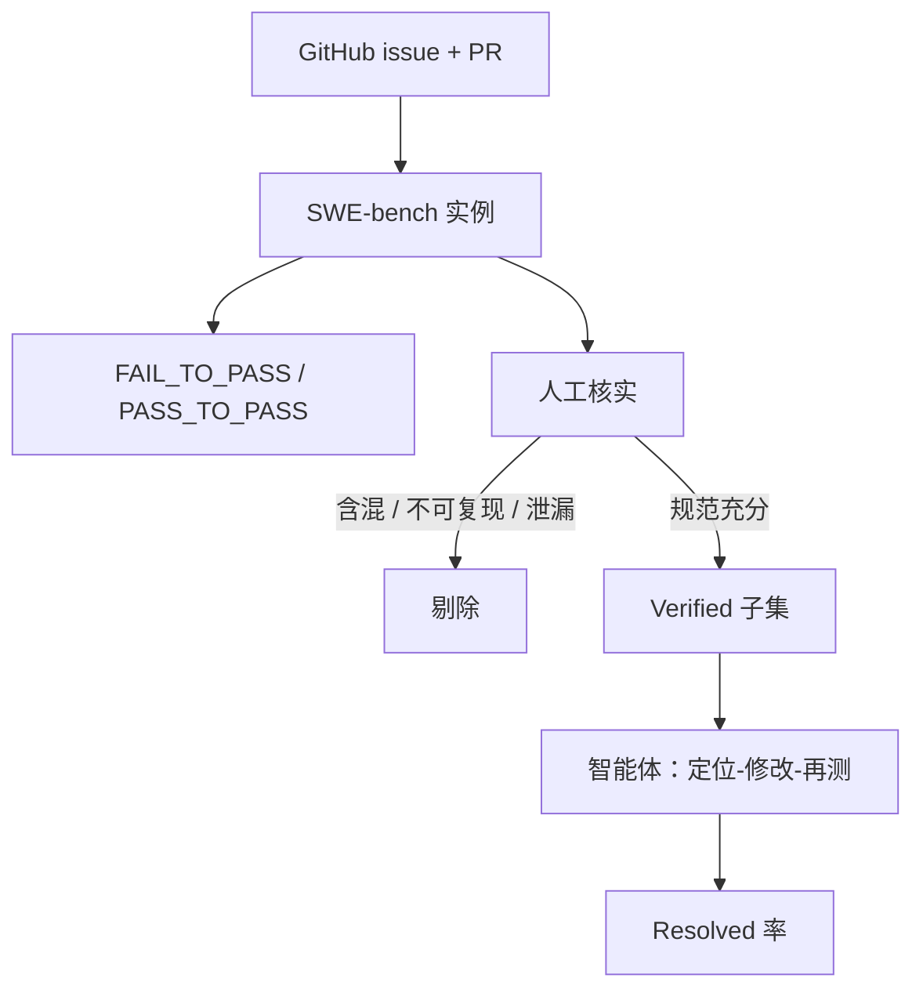

# SWE-bench Verified

从真实 GitHub issue 构造的修复任务，会混进描述不清、测试过宽或环境不可复现的条目；人工核实过的子集，测的才是「智能体能不能在仓库里把测试变绿」。

<footer>—— Jimenez et al., SWE-bench；Verified 是对任务可解性的二次质检</footer>

函数级代码生成问的是：空文件里能不能写出通过单元测试的片段。软件工程问的是：在别人的仓库里，根据 issue 定位文件、改实现、不破坏既有测试。Jimenez 等人提出 SWE-bench：从流行 Python 仓库收集 issue–pull request 对，用 PR 引入的测试作为验收，在失败的基线提交上让模型提交补丁。原始集合随后被指出含有不可解或含混任务——测试与描述不对齐、需要未给出的资产、或成功定义过宽。OpenAI 等参与的人工审核划出 SWE-bench Verified：去掉这些问题条目，使分数更接近「在公平任务上的仓库修复率」。本篇讲原基准的构造、Verified 滤掉了什么，以及智能体脚手架如何变成隐藏的测试时计算。

## 问题

从 GitHub 挖掘任务，得到的是生态真实性，不是心理测量学上的洁净。issue 可能依赖截图、外部服务、未粘贴的日志；PR 可能顺便重构无关文件；测试可能只覆盖作者想到的回归，模型用更窄的补丁也能碰巧通过，或用更对的补丁仍因环境钉死失败。把这些条目与清晰的单点 bug 平均成一个 resolve rate，会同时低估和过估能力。

评测成本也远高于选择题。每道题要检出指定 commit、安装依赖、跑测试套件，耗时长、易碎。若集合里 30% 的失败来自环境而不是模型，排行榜比较的是谁的 Docker 更幸运。Verified 要回答的问题是：在人类工程师认为描述充分、测试合理、环境可复现的子集上，当前智能体的修复率是多少——而不是「原始爬取集合上的通过率」。

### 可解性与难度不是同一筛选

去掉含混题，平均难度可能下降，因为最脏的任务往往也最难。Verified 的动机是降低噪声，不是制造一套更难的压力测试。报告 Verified 更高分，可能只是任务变干净了。与原始 SWE-bench 的数字不能直接纵向比，除非在完全相同的智能体与提示下重跑两套集合，把「滤题效应」和「模型改进」拆开。Verified 仍是静态快照。issue 文本、测试与仓库历史都在互联网上，后续预训练可以见过。它没有 LiveCodeBench 那种按月新赛的水龙头。干净不等于动态，见[题库轮换](/llm/live-benchmarks)。

## 方法

### SWE-bench：issue × FAIL_TO_PASS 测试

每条实例大致包含：仓库、基线 commit、issue 文本、一组本应失败而后应通过的测试（FAIL_TO_PASS），以及一组本应始终通过的测试（PASS_TO_PASS）。模型（或智能体）输出补丁，应用到基线后跑测试。成功通常定义为：FAIL_TO_PASS 全过，且 PASS_TO_PASS 不回归。这把「修了指定缺陷且没把主线修崩」写成可执行准则，比 BLEU 或人工看 diff 可扩展。

$$
\mathrm{Resolved}=\mathbf{1}\bigl[\mathrm{FailToPass}(\mathrm{patch})=1\ \wedge\ \mathrm{PassToPass}(\mathrm{patch})=1\bigr]
$$

原始论文展示当时的模型与简单检索基线成功率很低，说明仓库级修复远难于 HumanEval。后续智能体把文件定位、多轮 shell、测试反馈接进循环，分数上升——上升里有多少是模型、多少是脚手架，必须拆开报。

### Verified：人工审核任务规范

审核者检查：issue 是否足以定位问题、测试是否只验收该问题而非无关重构、是否存在泄漏（答案在 issue 里被贴出）、环境是否能稳定复现。不合格者剔除。子集规模小于原集，方差上升，但每个成功更可信。评测脚本、容器镜像、超时应冻结；换镜像导致依赖版本变化，会把 Verified 变成另一个基准。

## 机制

SWE-bench 难，是因为搜索空间在仓库而不在单函数。模型必须把自然语言缺陷映射到文件路径与代码实体，再在约束下编辑，使特定测试变绿。检索器、grep、测试运行器是合法工具，它们把测试时计算从「再采样 50 个函数」变成「再跑 20 轮终端」。这与 [LiveCodeBench](/llm/livecodebench) 的自修复同类，但状态是整个文件系统。

Verified 提高的是标签质量。若测试过宽，模型改一个表面字符串也能 Resolved，分数虚高；若测试过窄或环境损坏，真实修复被判失败，分数虚低。人工核实是对验收器做校准。它不提高模型的定位能力，只使 $\mathrm{Resolved}$ 更接近「人类认为这题该能做」。

### 脚手架是方法的一部分

同一 Verified 子集上，不同智能体框架（谁选文件、是否允许任意 shell、失败后怎样改提示、总步数与墙钟）会造成双位数分差。比较模型时应固定脚手架，比较系统时应把脚手架写进名字。隐藏的步数上限、隐藏的测试预跑、把 PASS_TO_PASS 当提示，都是协议污染。合理的消融是：同一模型换框架、同一框架换模型，两张表都给。

$$
\mathrm{cost}\propto\ \text{模型调用次数}\times\text{生成 token}+\text{测试 CPU}
$$

高 Resolved 若来自上千次尝试，产品上可能不可用。应同时报中位步数、超时率、美元成本，这与 [HELM](/llm/helm) 把效率列进矩阵是同一记账。有的成功补丁与黄金 PR 风格迥异但测试全绿。按「是否复现官方 diff」评分会惩罚同样正确的修复。SWE-bench 选测试当裁判是对的；若还要可维护性，需另加静态检查或人工抽检，不要偷偷改 Resolved 定义。

## 边界与工程取舍

语言与生态偏置明显：早期以 Python、若干明星仓库为主。Java、前端、原生系统、单仓巨型 monorepo 的缺陷分布不同。Verified 高分不能外推到这些环境。内部应建同构但不同语言的私有集，用同一套 FAIL_TO_PASS 逻辑。

泄漏有多层：issue 讨论里的代码块、后续博客、微调用的「仓库对话」合成数据。时间切分很难，因为仓库历史本身就是训练数据的合法部分——模型本该见过旧代码，不该见过该 issue 的修复。去污应针对「未来的 PR 与题解」，而不是把整个 GitHub 删掉。这比竞赛题更暧昧，报告里应写清扫了哪些解法镜像。

环境复现是持续负债。依赖消失、PyPI 包更新、测试依赖网络，都会让去年的 Verified 分数不可复跑。冻结镜像、记录哈希、允许跳过已损坏实例并公布名单，是基准维护而不是模型失败。

与函数级动态榜分工：LiveCodeBench 提供干净的新算法题；SWE-bench Verified 提供真实仓库的静态、但更接近工作的任务。产品发布应两套都看，再加内部工单。不要用 Arena 聊天胜率代替 Resolved 率。FAIL_TO_PASS 若在提示里被完整列出，智能体等于拿到了验收脚本，任务从「理解 issue」退化成「对着测试编程」。协议应只给 issue 文本，测试仅在沙箱评分时运行。泄漏测试用例与泄漏标准补丁是两类污染，要分开查。

## 小结

- SWE-bench 用真实 issue 与 FAIL_TO_PASS 测试定义仓库级修复，远难于函数生成。
- Verified 人工剔除含混、不可复现与泄漏条目，降低噪声，不自动等于更难。
- Resolved 依赖脚手架、步数与环境；比较时固定框架，并报销耗。
- 测试当裁判允许风格不同的正确补丁；可维护性需另测。
- 静态仓库任务仍会污染，且与「GitHub 作为合法训练数据」缠在一起。
- 语言与仓库偏置强，内部需同构扩展；镜像冻结是复现的一部分。
- 出处：Jimenez et al., *SWE-bench*；随后的 Verified 人工质检子集。
