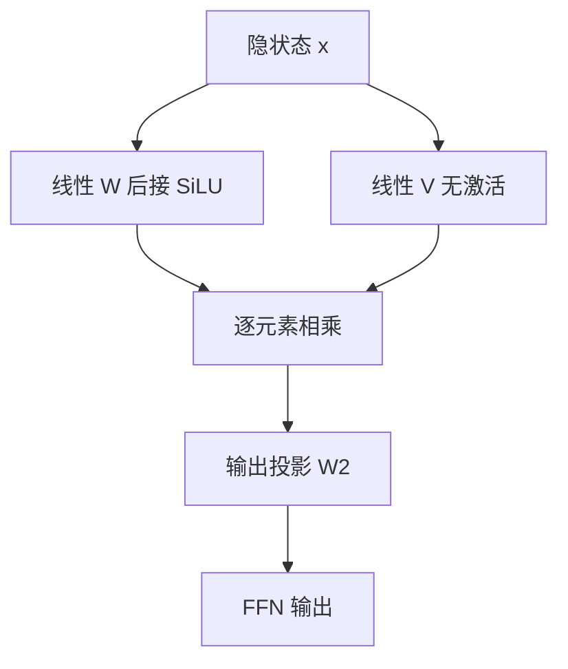

# GeLU / SwiGLU

用平滑的门代替硬截断，再用一条平行的线性支路决定放多少信息过去——这就是现代 LLM 默认的前馈层。

<footer>—— Hendrycks &amp; Gimpel, GELU, 2016；Shazeer, GLU Variants, 2020</footer>

ReLU FFN 把负值打成零。Hendrycks 与 Gimpel 在 2016 年提出 GELU：把 ReLU 的硬门改成按高斯尾部加权的软门，$x$ 本身乘上它大于零的概率。BERT 和 GPT-2 把 GELU 写进 Transformer 的 FFN，成为 2018–2020 年的默认激活。2020 年 Shazeer 的 *GLU Variants Improve Transformer* 把门控线性单元接到 FFN 上，比较 ReGLU、GeGLU、SwiGLU，结论是 SwiGLU 稳定地优于 GELU MLP。之后的 PaLM、LLaMA、Qwen、DeepSeek 稠密层几乎都用 SwiGLU：SiLU 门控点乘另一条线性，再投回隐藏维。本篇只讲这条激活与门控的演进，不把 GLU 的卷积起源展开成另一篇文章。

## 问题

ReLU 的梯度在负半轴是精确的零。深层网络里，一旦某中间单元的预激活长期为负，它就从优化里消失。生成式语言模型的表示又不是分类网络里那种「特征在或不在」：幅度、符号都携带语法和语义。硬截断等于过早丢信息。

GELU 要解决的是平滑：让负值以小系数漏过去，正值也不再是斜率为 1 的折线。SwiGLU 要解决的是另一件事——即使激活已经平滑，单支 MLP 仍然把「变换」和「是否采用」绑在同一个线性层上。门控把这两件事拆开：一条支路算内容，一条支路算门，点乘后再投影。Shazeer 的实验表明，拆开之后，同样参数量下困惑度更好。

### 从 GELU 到 SiLU 的连续性

GELU 定义为 $x\Phi(x)$，$\Phi$ 是标准正态 CDF。常用近似 $\,0.5x\bigl(1+\tanh[\sqrt{2/\pi}(x+0.044715x^3)]\bigr)$。SiLU（也称 Swish，Ramachandran 等人讨论过 $x\sigma(x)$）形状相近，计算更便宜。两者都是「输入乘自己的饱和函数」，和 ReLU 同属门控视角，只是门由数据相关的 $\Phi$ 或 $\sigma$ 给出，而不是 $\mathbf{1}_{x>0}$。BERT 论文写的是 GELU，GPT-2 也是。很多代码库用 `nn.GELU(approximate="tanh")`。SiLU 进入 LLM 主流，是因为 SwiGLU 选了它当门，不是因为 SiLU 单独赢了一次大规模预训练赛。

## 方法

稠密 GELU FFN 只是把 Vaswani 的 ReLU 换成 GELU：

$$
\mathrm{FFN}_{\mathrm{GELU}}(x)=\mathrm{GELU}(xW_1+b_1)W_2+b_2.
$$

SwiGLU 多一条平行线性 $V$，门控在中间维上发生：

$$
\mathrm{SwiGLU}(x)=\bigl(\mathrm{SiLU}(xW) \odot (xV)\bigr)W_2,\qquad \mathrm{SiLU}(z)=z\cdot\sigma(z).
$$

中间维若仍取 $4d$，参数会变成约 $3d\cdot 4d$（$W,V,W_2$）而不是 $2d\cdot 4d$。Shazeer 的建议是把中间维改成 $\tfrac{2}{3}\times 4d=\tfrac{8}{3}d$，使总参数与原来的两层 GELU FFN 对齐，比较才公平。LLaMA 采用了这一约定。

### GeGLU 与默认选择

同一篇 2020 笔记里，GeGLU 用 GELU 当门，ReGLU 用 ReLU 当门。Shazeer 报告 SwiGLU 与 GeGLU 都明显优于 GELU MLP，二者之间差距不大。工业界后来偏向 SwiGLU，原因偏工程：SiLU 在 CUDA kernel 里好写，和 Megatron / Flash 风格的融合 GEMM-激活-GEMM 合得来；GELU 的 tanh 近似多几次超越运算。PaLM 明确写了 SwiGLU，之后开源稠密模型基本跟进。

## 机制

门控的代数含义是：$\mathrm{SiLU}(xW)$ 给出一组介于「关」和「开」之间的系数，把 $xV$ 的各通道缩放。与 ReLU 不同，这里的「关」很少是精确零，于是反向传播总能漏一点梯度给 $V$ 和 $W$。与单支 GELU 不同，内容通路 $V$ 不必同时负责把值推到激活函数的线性区——线性区由门去选。

### 融合与数值

实现上，常把 $W$ 和 $V$ 拼成一次 $[x][W;V]$ 的宽 GEMM，再 split、SiLU、乘、再 GEMM。这减少一次读 $x$。BF16 下 SiLU 在零点附近的导数 $\sigma(z)+z\sigma(z)(1-\sigma(z))$ 有界，比某些高次近似 GELU 更听话。中间维 $\tfrac{8}{3}d$ 不是整数时要对齐到 128 或 256，以免 tensor core 浪费；LLaMA 系列的实际 `ffn_hidden_size` 往往略作取整。

参数与 FLOPs 在对齐中间维后，与 GELU FFN 接近，但多一次逐元素乘。这一点在 roofline 上几乎看不见，质量增益却稳定，所以它成了默认，而不是可选项。SwiGLU 是现代稠密 LLM 的默认 FFN，不是 MoE 才用。Mixtral、DeepSeek MoE 的每个专家内部同样是 SwiGLU；稀疏的是「哪几个专家」，不是激活函数。

## 边界

SwiGLU 不改变 FFN 的位置：它仍是逐 token、与注意力交替的通道混合器。它也不解决长上下文，不减少 KV cache。有人把 GLU 的门误当成 MoE 路由——二者都叫 gate，但 SwiGLU 的门是对中间通道的稠密点乘，每个 token 都算完全部中间维；MoE 的门是对专家的离散选择。

GELU 仍出现在 BERT 类编码器和一些视觉塔里，迁移已有权重时不要强行改成 SwiGLU。从 GELU MLP 蒸馏到 SwiGLU 学生，形状都对不齐，需要额外投影。量化时，SiLU 前的预激活分布和 GELU 不同，标定要分开做。

Shazeer 2020 是技术笔记风格的小规模对比，不是千亿参数消融。真正把 SwiGLU 钉成默认的，是 PaLM 与 LLaMA 的大规模复用。写进自己的模型卡时，应同时写中间维如何按 $\tfrac{8}{3}$ 对齐，否则「我们用了 SwiGLU」无法复现参数量。

GELU 与 SwiGLU 不要写在同一层里混用：中间维形状不同，检查点对不上。从 BERT 编码器接到生成式解码器时，视觉塔或文本编码器可以继续 GELU，解码器 FFN 用 SwiGLU，中间用线性投影对齐宽度即可。另一条常见分叉是 GeGLU：门用 GELU 而不是 SiLU。若预训练日志写的是 GeGLU，推理内核却调了 `silu`，门的形状会错，损失会莫名其妙地高一截。融合 kernel 还要注意：$W$ 与 $V$ 拼接后的宽 GEMM 要求中间维偶数对齐，SiLU 只作用在前半段；切分反了就会把内容支路做非线性、把门支路当线性，等于训了一个没见过的激活。LLaMA 把无偏置、SwiGLU、$\tfrac{8}{3}d$ 取整到 256 倍数写成默认。复现时「差不多的 SwiGLU」不够：差一个对齐，参数量对不上公开数字，通信切分也会偏。相对 GELU MLP，SwiGLU 多一次读 $x$ 的线性，显存峰值更高一点；激活重计算时要整段重算门和内容，不能只存 SiLU 后的半边就指望反传完整。这些是把它设成默认之后仍然要付的工程账，质量收益通常盖得住。

门控幅度在训练后期往往集中在中间区，很少像 ReLU 那样大量精确为零，所以「SwiGLU 更稀疏、更好压缩」并不成立。想要参数稀疏，应走 MoE 而不是指望 SiLU 的近零输出。想要激活稀疏加速，需要另外的阈值或 Top-K 激活，那已经离开标准 SwiGLU 的定义。

## 小结

- GELU（Hendrycks & Gimpel, 2016）用 $x\Phi(x)$ 平滑 ReLU，成为 BERT / GPT-2 的 FFN 激活。
- SwiGLU（Shazeer, 2020）是 $\mathrm{SiLU}(xW)\odot(xV)$ 再投影；中间维常取 $\tfrac{8}{3}d$ 以对齐原 FFN 参数量。
- 门控把「内容」与「是否通过」拆成两条线性，质量优于同参数的 GELU MLP。
- 现代稠密 LLM 默认 FFN 就是 SwiGLU；MoE 专家内部通常同样如此。
- 它不替代注意力，也不等于专家路由，只改前馈槽位里的激活与矩阵数。
- 出处：Hendrycks & Gimpel, *Gaussian Error Linear Units*, 2016；Shazeer, *GLU Variants Improve Transformer*, 2020；PaLM / LLaMA 将 SwiGLU 用作大规模默认。
