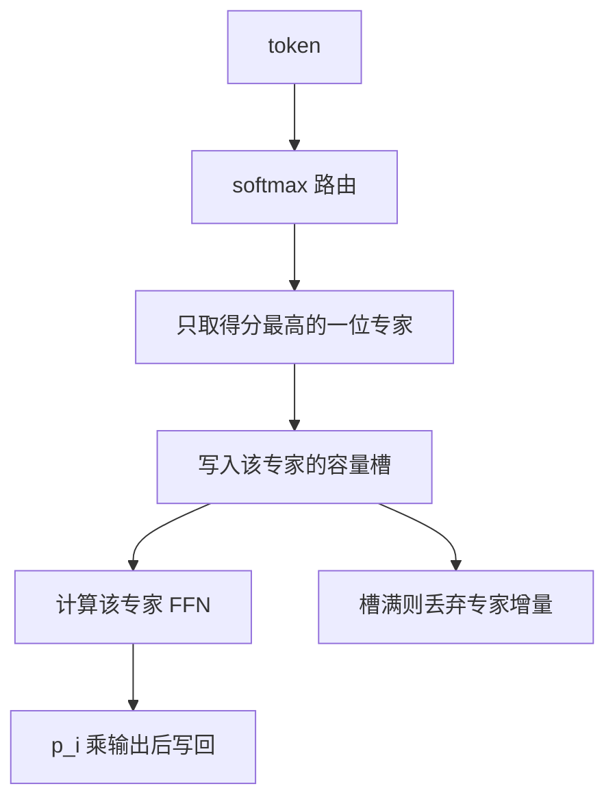

# Switch Transformer

每个 token 只进一个专家。路由变简单，容量仍可随专家数线性涨，训练却不再被 top-2 的实现细节绑住。

<footer>—— Fedus, Zoph, Shazeer, Switch Transformers, 2021</footer>

GShard 已经证明 Transformer 的 FFN 可以换成 MoE，但实现上每个 token 走两个专家（$k=2$），容量、通信、负载统计都更绕。Fedus、Zoph 与 Shazeer 在 2021 年的 Switch Transformer 把路由减到 **$k=1$**：softmax 后只把概率最高的那个专家算一遍。论文标题里的 switch 就是这个开关。简化之后，他们在 TPU 上把专家数加到上百，用和稠密模型同量级的 FLOPs 撑起远更大的参数量，并系统写了容量因子、辅助损失、专家 dropout 和稳定性技巧。本篇只讲 Switch 相对 GShard 改了什么，以及 $k=1$ 的代价。

## 问题

稀疏 MoE 的工程复杂度主要不在专家内部的 MLP，而在「一个 token 对应多个专家」时的调度：两份 All-to-All、两套容量桶、路由权重如何在两个专家之间归一化。$k=2$ 的质量通常略好，因为它允许 token 在两个专家上插值，但吞吐和代码路径更差。Fedus 等人问的是：若把 $k$ 降到 1，损失会糟多少？若糟得有限，能否用更多专家把容量补回来？

另一个问题是训练不稳定。早期 MoE 常出现专家崩溃、NaN、以及路由与层归一化耦合导致的尺度爆炸。Switch 把这些问题收成一套可复现的配方，而不是只报一个最大模型号。

### 为什么 $k=1$ 仍然是 MoE

$k=1$ 时输出不再是多个专家的凸组合，而是单个专家的硬选择，$y=E_{i^*}(x)$，路由概率有时仍乘在输出上（论文里讨论了是否把 $p_{i^*}$ 乘回去）。它仍是 MoE：不同 token 走不同参数，总容量随 $N$ 增长。它不是「退化成普通 FFN」——普通 FFN 对所有 token 共享同一套 $W$。Switch 的稀疏度是 $1/N$：32 个专家时每个 token 只算约 3% 的专家参数。对比 Mixtral 的 $2/8=25\%$，Switch 更稀疏，也更依赖路由一次选对。选错没有第二个专家兜底。

## 方法

路由 logits $h(x)=xW_r$，

$$
p_i(x)=\mathrm{softmax}(h(x))_i,\qquad i^*(x)=\arg\max_i p_i(x).
$$

前向只调用 $E_{i^*}$。论文默认把门值乘到专家输出上：$y=p_{i^*}\,E_{i^*}(x)$，使路由概率进入主损失的梯度。容量因子 $c$ 决定每个专家的槽位数 $C=\lceil c\cdot T/N\rceil$。超额 token 被 drop，其 FFN 输出视为 0，残差仍在，所以丢掉的是专家增量而不是整个 token。

### 辅助损失与专家 dropout

负载均衡损失取 Switch 论文中的形式 $\alpha N\sum_i f_i P_i$，其中 $f_i$ 是该专家分到的 token 比例，$P_i$ 是平均路由概率，$\alpha$ 很小（如 $10^{-2}$）。另有专家 dropout：训练时随机丢掉若干专家，迫使路由不要只依赖固定子集。这些与 $k=1$ 是一套组合：选择越硬，越需要显式均衡。

精度方面，Switch 强调在 MoE 层用更保守的初始化、把路由用 float32 计算、以及谨慎的学习率。这些看起来像训练琐事，却是 $k=1$ 能放大到万亿参数的条件。

## 机制

$k=1$ 的通信是一份 dispatch 加一份 combine，payload 大约是 $T\cdot d$ 量级，不随 $k$ 加倍。专家内部仍是标准 FFN（当时多为 GeLU MLP）。有效 FLOPs 约等于稠密 FFN 的 $1/N$ 再乘容量因子带来的浪费：若 $c>1$，空槽仍可能占位，实际利用率小于 100%。

### 质量与稀疏的交换

Fedus 等人的消融表明，$k=1$ 相对 $k=2$ 在同样专家数下略差，但把专家数加倍后可以补回，而计算仍按 $k=1$ 计。机制是：多出来的专家提供更细的分区，路由用硬开关把空间切开；每个分区里的 FFN 可以专门化。错误路由的代价是该 token 得到一个不太对口的变换，没有第二个专家平均掉错误。因此 Switch 对负载均衡更敏感——某个专家若既热又混杂，会伤害一整片 token。

乘上 $p_{i^*}$ 的作用是：即使选中的专家对，若路由不够自信，输出被缩小，残差占主导。这提供了一点软性，部分补偿硬选择。后来的 Mixtral 回到 $k=2$ 且不乘复杂的置信度技巧，说明 Switch 的 $k=1$ 是可扩展性选择，不是质量上限。DeepSeek 细粒度专家则用更大的 $N$ 和适中的 $k$，走第三条路。

## 边界

Switch 证明了「稀疏 FFN + 简单路由」可以上到极大参数，但它不是 2024 年开源 MoE 的默认形态。Mixtral、Qwen2-MoE、DeepSeek-V2 多用 $k\ge 2$ 或细粒度多专家，因为在几十到几百专家、现代 GPU 上，All-to-All 已经能负担 $k=2$，质量收益更明确。Switch 的历史位置是：把 MoE Transformer 简化到能大规模稳定训练，并写清容量与辅助损失。

$k=1$ 的边界还包括：专家数很少时（如 4）硬选择过粗；专家数极多时路由矩阵 $d\times N$ 变肥，且每个专家数据太少容易过拟合。容量因子过小会大量 drop，训练信号变少；过大则稀疏名存实亡。论文中的 TPU 网格、模型并行切分，迁移到 GPU Expert Parallelism 时要重写通信，不能照抄设备拓扑。

不要把 Switch 写成「发明了 MoE」。MoE 在 2017，GShard 在 2020。Switch 的贡献是 $k=1$ 的开关路由、配套稳定性，以及用同等 FLOPs 换参数量的清晰实验。

稳定性配方同样是边界的一部分。路由用 float32、专家用 BF16 或 FP16，是为了避免 softmax 在低精度下溢出；专家 dropout 只在训练开，推理必须全开全部专家候选。初始化若把 $W_r$ 放得太大，第一步就会塌到少数专家，后面的辅助损失很难拉回来。容量因子要和 batch 里的 token 数一起设：太小的 microbatch 会让 $C$ 变成个位数，drop 率失控，看起来像 MoE 不工作，其实是槽位不够。把 Switch 从 TPU mesh 迁到 GPU 时，专家并行的 All-to-All 替代了论文里的设备轴 permute，语义相同，实现完全不同，不能指望一份 JAX 分区规格在 NCCL 上直接跑通。$k=1$ 时没有「第二专家」可做备份，容量溢出就是硬丢失。日志里的 drop 率应和验证损失一起看：drop 高而损失仍降，往往是热专家过拟合；drop 高且损失不降，才是容量或均衡真的坏了。后续的稀疏上循环（把稠密 FFN 复制成专家再继续训）可以建在 Switch 式路由上，但那是训练日程，不是 2021 年论文的核心定义。写 Switch 时抓住 $k=1$、容量与辅助损失即可。

## 小结

- Switch Transformer 将 MoE 路由取 $k=1$，每个 token 只计算一个专家。
- 用容量因子限制每专家 token 数，超额丢弃专家增量；用 $\alpha N\sum f_i P_i$ 做负载均衡。
- $k=1$ 降低通信与实现复杂度，质量略逊于 $k=2$，可用更多专家补偿。
- 它是大规模稀疏 Transformer 的简化基线，不是当前开源 MoE 的唯一形态。
- 推理成本由激活专家数决定，仍是一份 FFN，不是 $N$ 份。
- 出处：Fedus, Zoph, Shazeer, *Switch Transformers: Scaling to Trillion Parameter Models with Simple and Efficient Sparsity*, 2021；对照 Lepikhin et al., *GShard*, 2020。
