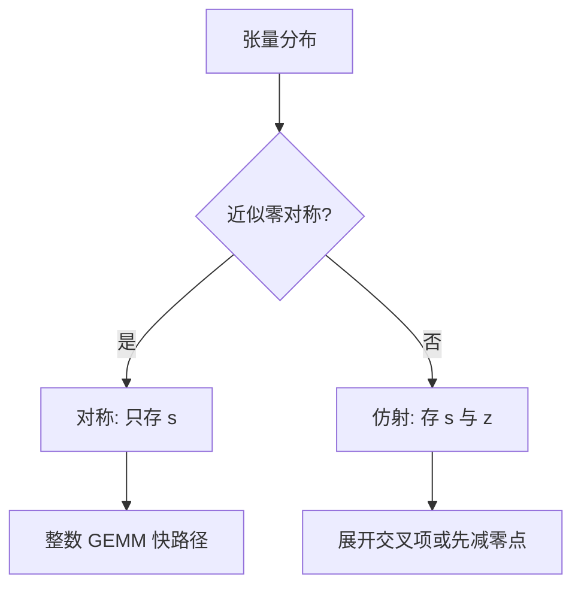

# 对称与非对称

对称格子强制零映射到零，只用一个尺度；非对称加一个零点，用同样的 bit 去覆盖偏移的动态范围。激活的 ReLU 后分布常常需要后者，权重的零均值常常只需要前者。

<footer>—— 对照仿射量化 $x \approx s(q-z)$ 与对称 $x \approx s q$；实现见各框架量化配置</footer>

[上一课](/llm/uniform-nonuniform-quant) 在均匀与非均匀之间做了选择。本课留在均匀格子内： **对称 vs 非对称（仿射）**。缺口是零点 $z$ 省的是哪一段范围、以及它如何破坏「整数 GEMM 不带偏置」的快路径。[GPTQ](/llm/gptq) 实现里对称/非对称是检查点契约；本课只讲几何，不重做 Hessian。

## 问题

对称：$q = \mathrm{clip}(\mathrm{round}(x/s))$，$q\in\{-2^{b-1},\ldots,2^{b-1}-1\}$，$x\approx s q$。零精确可表，乘法是整数乘再 scale。若 $x$ 的分布不关于零对称（ReLU 激活全非负，或某通道永远偏正），一半码字浪费在永远用不到的负半轴，有效 $b$ 少一 bit。

非对称：$x\approx s(q-z)$，$z$ 把格子滑到 $[\min,\max]$。同样 $b$ bit 覆盖实际动态范围。代价：$z$ 要存、要在反量化里减；GEMM 出现交叉项 $s(W_q-z_W)(X_q-z_X)$，展开后有额外的求和，核更肥，或必须把减 $z$ 融进打包。问题是 **准一点的格子 vs 能不能走对称 INT 核**。

有的实现用「无符号对称」对付 ReLU：只量化到 $[0,2^b-1]$ 再乘 $s$，零点固定为 0。这是非对称的退化，元数据更少。

## 方法

权重：常近零均值，对称 INT4/INT8 足够，[GPTQ](/llm/gptq) 默认对称或分组对称很常见。激活：W8A8 时非对称更常见，因为激活 min/max 不对称；SmoothQuant 迁移后仍可能不对称。KV cache 量化更要看正负是否对称，以及是否按头/按通道。

校准（后课）分别估 $s$ 和 $z$：对称只用 $\max|x|$ 或百分位；非对称用 $\min,\max$ 或百分位对。Clip 过猛会把 $z$ 估偏。

推理核：若只重量化、激活仍 FP16（W4A16），零点只出现在反量化权重的一乘加里，代价小，非对称更划算。若 W8A8 两端都是整数，零点成本高，有时宁可对称 + 稍微更差的 $s$，换核的吞吐。

## 机制

仿射的交叉项：$s_W s_X \sum (q_W q_X - q_W z_X - z_W q_X + z_W z_X)$。后三项可预计算或作向量加，但寄存器与带宽增加。对称 $z=0$，只留第一项，硬件友好。这是「非对称更准但更慢」的机制，不是感觉。

数值：零点本身通常 8 bit 或 32 bit 存。分组很细时，零点元数据吃回每参数比特，和 QLoRA 双重量化面对的尺度问题同类。后课粒度会限制你把 $z$ 存多细。

对称量化对「必须精确的零」（稀疏、ReLU 硬零、mask）更友好：量化后仍是零。非对称可能把真零映成非零，破坏稀疏核的跳过。

## 边界与工程取舍

不要在 W4A16 上因为「对称更简单」就浪费激活本不存在的负半轴——权重对称、激活另一套是正常的。不要混用带 $z$ 与不带 $z$ 的检查点。不要假设所有 INT8 Tensor Core 路径都接受逐通道零点。下一课粒度：同一 $s,z$ 共享的范围有多大。

## 小结

- 对称：零对齐、GEMM 简单；浪费不对称分布的半边码字。
- 非对称：格子对准 min/max，多存零点，整数 GEMM 有交叉项。
- 权重常对称；激活与 KV 常要仿射或无符号。
- W4A16 的零点便宜；W8A8 的零点可能卖掉吞吐。
- 出处：仿射量化标准形式；GPTQ / 框架里的对称开关。
