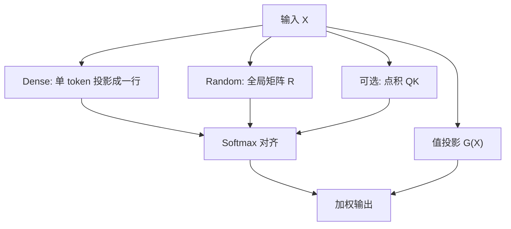

# Synthesizer

    
点积自注意力被当成 Transformer 不可缺少的内核，但随机对齐矩阵已经相当能打；合成权重不必来自查询与键的两两交互。

    <footer>—— Tay et al., Synthesizer: Rethinking Self-Attention for Transformer Models, ICML 2021</footer>

缩放点积注意力把「谁该看谁」写成 $QK^\top$，再 softmax 成行随机矩阵去乘值。Tay 等人 2021 年的问题更刺：这张对齐矩阵是否必须由 token–token 交互产生？他们用一组合成注意力（synthetic attention）替换点积，得到 Synthesizer：权重可以直接从单个 token 的表示投影出来，甚至可以是与输入无关的随机矩阵。实验上，简单的合成器在翻译、语言建模、GLUE/SuperGLUE 上与原 Transformer 接近；与点积拼在一起时往往更好；随机合成器相对动态卷积更快，困惑度也更低。本篇只写这篇论文的机制贡献，不把后续所有「去掉 $QK$」的工作算进 Synthesizer。

## 问题

标准自注意力的分数来自查询与键的相容性。这个设计有两层假设：第一，位置 $i$ 对位置 $j$ 的权重应当随当前内容改变；第二，改变的方式必须是一次双线性打分。第二层并不显然。若许多任务真正需要的只是「一种可学习的混合图案」，图案本身可以是全局的、与样本无关的，也可以只依赖单个位置的表示，而不依赖两两点积。

点积还有工程代价：$n\times n$ 的分数矩阵、额外的 $W_Q,W_K$ 投影、以及随长度二次的显存。当时已经有固定稀疏图案、Linformer、动态卷积等替代。Synthesizer 要检验的不是「注意力能不能稀疏」，而是「对齐矩阵的信息来源」：拿掉 token–token 交互之后，Transformer 还剩多少能力。若随机矩阵已经够用，说明点积贡献被高估了；若从单 token 合成的权重也够用，说明内容寻址不必走 $q^\top k$。「随机也能工作」不是说注意力无用，而是说：在当时的模型宽度与任务上，可学习的混合图案本身就带很强的归纳偏置。点积是图案的一种生成器，不是唯一生成器。

## 方法

### Dense Synthesizer：从单 token 合成一行权重

对长度为 $\ell$、宽度 $d$ 的输入 $X$，Dense 变体不再计算 $QK^\top$。每个位置 $i$ 的表示 $X_i$ 经过一个前馈 $F:\mathbb{R}^d\to\mathbb{R}^\ell$，直接产出对全部键位置的未归一化分数，再 softmax，去乘值投影 $G(X)$：

$$
Y=\mathrm{softmax}\bigl(F(X)\bigr)\,G(X).
$$

$F$ 通常是两层：先压到较小的隐维，再扩到 $\ell$。权重只依赖「我是谁」，不依赖「对方是谁」的键向量，因此没有 $Q$、$K$ 投影。参数量大约是 $d\times\ell$ 量级（加上值投影），相对点积省掉一对 $d\times d$ 矩阵，但多出与长度相关的投影，长序列会变沉。

### Random Synthesizer：与输入无关的对齐

更极端的 Random 变体令 $R\in\mathbb{R}^{\ell\times\ell}$ 为随机初始化矩阵，可训练或冻结：

$$
Y=\mathrm{softmax}(R)\,G(X).
$$

每一头加 $\ell^2$ 个参数。对齐完全不看当前 token，只学一套任务级的全局混合。这是对固定注意力图案（如 Raganato 等人的固定模式）的直接推广：图案可以学习，但仍然与样本无关。作者原先预期它会崩，结果在多项任务上出乎意料地能打，成为论文最刺的经验结论之一。

### 低秩分解与和点积的混合

$\ell$ 一大，$d\times\ell$ 或 $\ell\times\ell$ 都不可接受。Factorized Dense 把 $F(X_i)$ 拆成两路较短的投影，再外积或逐元乘还原成长度为 $\ell$ 的分数，参数从 $O(\ell)$ 降到接近 $O(\sqrt{\ell})$ 量级。Factorized Random 把 $R$ 写成 $R_1 R_2^\top$，其中 $R_1,R_2\in\mathbb{R}^{\ell\times k}$、$k\ll\ell$：

$$
Y=\mathrm{softmax}(R_1 R_2^\top)\,G(X).
$$

混合 Synthesizer 再把合成分数与标准点积分数相加或拼接，让模型同时使用「内容寻址」和「合成图案」。论文报告：单独的合成器已有竞争力；与点积组合后稳定超过原 Transformer。相对 Linformer 一类只编码的低秩注意力，分解后的合成器在编码任务上也可以更好，说明低秩不必来自对 $K,V$ 的随机投影，也可以来自对对齐矩阵本身的分解。分解针对的是参数，不是把二次计算变成线性。未分解的 Random 在推理时仍要物化 $\ell\times\ell$ 的 softmax；分解后是低秩分数，乘 $V$ 可以先乘小矩阵，这才有计算上的线性化空间。

## 机制

点积注意力的梯度同时流过查询和键，迫使表示空间学会一种相容性度量。Dense Synthesizer 的梯度只流过「当前 token → 整行权重」的映射：它学的是位置相关的混合系数，更接近「每个位置一套动态卷积核」，而不是检索。Random 则连这层条件都去掉，梯度只更新全局 $R$ 与值投影；网络把内容交互推到后面的前馈与残差里。

这解释了为何随机矩阵并不等于「没有注意力」。softmax$(R)V$ 仍是对值的凸组合，多层叠起来可以合成复杂的跨位置路由；缺的是随样本改变路由的能力。翻译和对齐敏感的任务更吃点积；分类、语言建模在当时规模下，一套好的全局图案已经能混到足够的上下文。把合成器与点积相加，等于给模型两条路由：一条内容寻址，一条任务先验。经验上后者不是噪声，而是正则。

长度外推是另一条裂缝。Dense 的 $F$ 输出维绑死在训练长度 $\ell$ 上，换更长序列要改投影或插值；Random 的 $R$ 同样是 $\ell\times\ell$ 的表。点积没有这张表，长度由 $QK^\top$ 的形状临时决定。合成注意力用参数换掉了内容交互，也把长度变成了架构常数。不要把「不需要 $QK$」读成「注意力权重可以随便初始化」。Random 能工作，靠的是 softmax 之后仍是合法的行随机矩阵，以及足够深的残差把混合多次叠加。换成未归一化的 $R$ 直接乘 $V$，尺度会漂。

## 边界与工程取舍

Synthesizer 是 2021 年对「点积是否必要」的消融，不是今日长上下文的默认层。长序列上 Dense/Random 的参数随 $\ell$ 涨，分解缓解参数但不自动给出 Flash 级别的核。需要精确拷贝、指代消解、针测时，丢掉 $q^\top k$ 通常会伤检索；这时应保留点积或只在部分层替换。

与动态卷积相比，Random 更快是因为对齐可以预计算，卷积核随输入变则不能。这不意味着合成器在所有硬件上都更快：现代 FlashAttention 把点积的二次常数压得很低，短序列上再上一个未融合的 $\ell\times\ell$ softmax 没有优势。论文给出的 60% 加速、相对 3.5% 的困惑度改进，绑定在当时的动态卷积基线上，迁移时要重测。

因子化合成器可以当作廉价的位置先验，塞进混合架构：局部仍用窗口 softmax，全局用低秩 $R_1 R_2^\top$。不要假设「随机注意力 = 无需训练」——可训练的 $R$ 才是主结果；完全冻结的 Fixed Random 是更弱的对照，用来说明图案本身有用，不是推荐配方。

## 小结

- Synthesizer 用合成对齐矩阵替换 $QK^\top$，检验 token–token 交互对 Transformer 是否必要。
- Dense 从单 token 投影出一行权重；Random 用与输入无关的 $\ell\times\ell$ 矩阵；二者都可以低秩分解。
- 随机对齐在多项任务上出乎意料地有竞争力，说明点积不是性能的唯一来源。
- 与点积混合通常优于纯 Transformer；相对动态卷积，Random 更快且困惑度更低。
- 长度绑在参数表上，外推与超长序列不是主场。
- 精确检索仍更依赖内容寻址；合成器更适合当作可学习的混合先验。
- 出处：Tay et al., *Synthesizer: Rethinking Self-Attention for Transformer Models*, ICML 2021。
