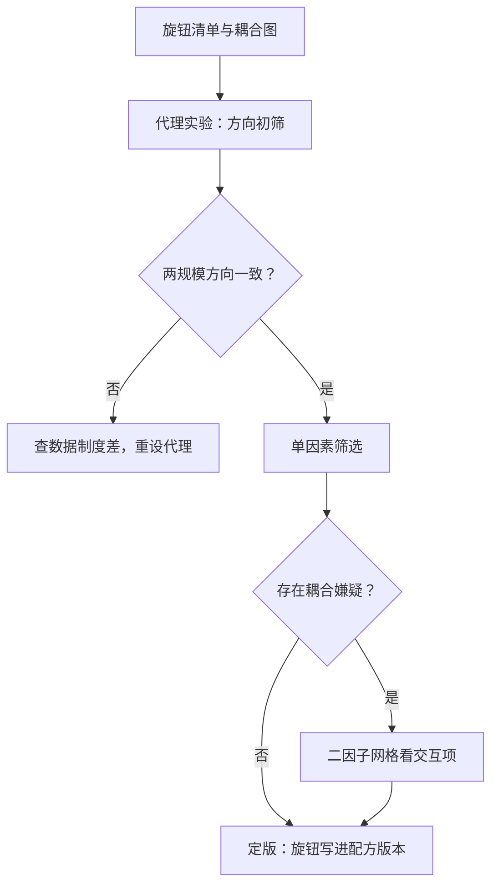
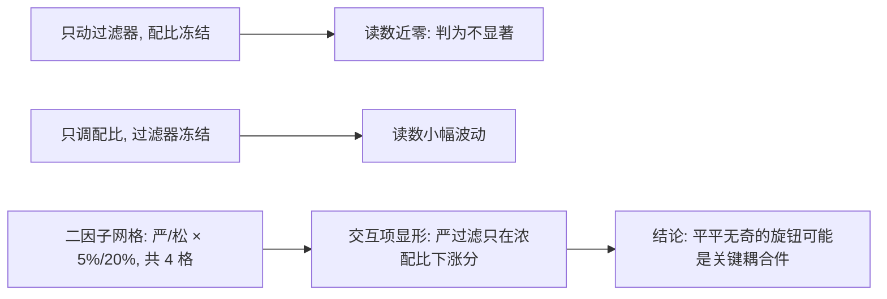

# 数据配方的消融设计

    
配方有几十个旋钮，直觉一个都不灵：数据工程的因果结论，只能从控制变量的实验里来，不能从复盘的感觉里来。

    <footer>—— 据 Xie 等 DoReMi；Chen 等 RegMix；本站小模型代理实验课整理</footer>

[上一课](/llm/synthetic-eval-sets)立了评测的纪律——有了可信的尺子，才谈得上归因。本课写归因本身：配方由过滤阈值、去重档位、配比、演化轮数、难度窗等几十个旋钮组成，哪个旋钮真正在起作用，唯一的来源是设计好的消融。[小模型代理实验](/llm/proxy-model-experiments)讲过代理的坑，[DoReMi](/llm/doremi)与 [RegMix](/llm/regmix)给过配比搜索的两种自动化。本课把它们收成一套对合成管线通用的实验协议。

## 问题

合成管线的消融比模型结构难，难在环节耦合：过滤器变了，配比的最优点就变；配比变了，难度窗的最优位置也变。单因素实验在这种耦合下会给出误导性的「不显著」——单独动过滤器看不出效果，是因为它的效果要靠配比配合才能显形。另一类错误是把「数据更多总没坏」当公理：合成数据的增量可能负迁移（风格污染、难度错位），「加不加」必须是实验问题。最贵的错误是直接在目标规模上做探索：一次全量训练的成本足以覆盖几十次代理实验，没有协议的团队会把预算烧在「试一下」上。术语翻译：「消融」（ablation）就是每次只拧动或摘掉配方的一个部件，看结果掉多少，从而判断这个部件贡献了什么——这个词借自生物学里切除器官研究功能的老办法。它回答的是「因果上谁在起作用」，不是「最终配方好不好」。

## 方法

协议四件。旋钮清单与耦合图：把配方的旋钮列全，标出已知耦合（过滤器-配比、配比-难度窗、演化轮数-去重阈值），消融设计从耦合对里取，不从清单里随机抽。代理先行：小模型加小数据跑方向；代理的失真有已知方向——太稳出假阴性，数据制度不同出假阳性，方向性结论至少在两个规模复验。单因素与因子网格并用：初筛用单因素，每轮只动一个旋钮、其余冻结在当前定版；耦合可疑的对子用二因子网格（两旋钮各取两档），看交互项是否存在。方差纪律：固定评测网格与训练种子集合，报告均值加区间，[评测的种子方差](/llm/eval-variance-seed)课的口径直接沿用；单点差异不进结论。

## 机制

为什么单因素会漏：管线是一串重加权的复合函数，每个旋钮的效果都以其余旋钮为条件——统计上这是交互项，工程上是「换了过滤器就得重新调配比」的日常经验。二因子网格不是全因子：全因子在十几个旋钮下不可行，按耦合图选对子才是可执行的折衷。代理外推的机制边界在代理实验课已立：合成数据的制度差通常表现为「代理学合成的效率高于目标模型」，方向反转的高发区是质量过滤档位——代理模型上「更严过滤更好」，目标规模上未必，因为小模型本来就容不下噪声。配比搜索的自动化（回归面拟合或 DRO）不取消消融，只改变它的对象：自动搜索给你最优点，消融回答「为什么是最优、换了教师还成不成立」。

配方要版本化三件套：数据版本、生成器版本、过滤器版本。少了任何一件，三个月后的你就无法解释「那次涨分」——数据实验的复现成本集中在环境重建，不在重训本身。

## 边界

消融结论的有效期绑定教师与基座版本：换代即作废，能继承的只有结构与方向。代理规模太小会整个脱离数据制度——比如目标规模的退火阶段在小代理上不存在——此时方向结论直接无效，不要硬推。评测网格要覆盖配方声称的能力域，用错网格的消融会系统性偏向某类旋钮：只测平均分会偏向通用旋钮、掩盖域内收益。最后，消融不能替代监控：定版之后，配方的每个旋钮仍要有读数（过滤率、桶占比、难度分布），漂移要从读数发现，不是从分数倒推。常见误区：初学者容易把一次实验里的单点分差当成结论，比如「+0.4 分，说明这个过滤器有效」。种子与评测噪声常就有半个点的抖动，正确做法是固定种子集合报均值加区间，落在区间内的差异一律不进结论。

## 小结

- 旋钮清单加耦合图先行，消融从耦合对取，不随机抽。
- 代理跑方向，两规模复验；制度差高发在过滤档位。
- 单因素初筛，耦合对二因子网格看交互项。
- 均值加区间进结论，单点差异不进。
- 配方版本化三件套：数据、生成器、过滤器版本。
- 出处：Xie 等 DoReMi 2023；Chen 等 RegMix 2024；本站代理实验与配比定律课。
