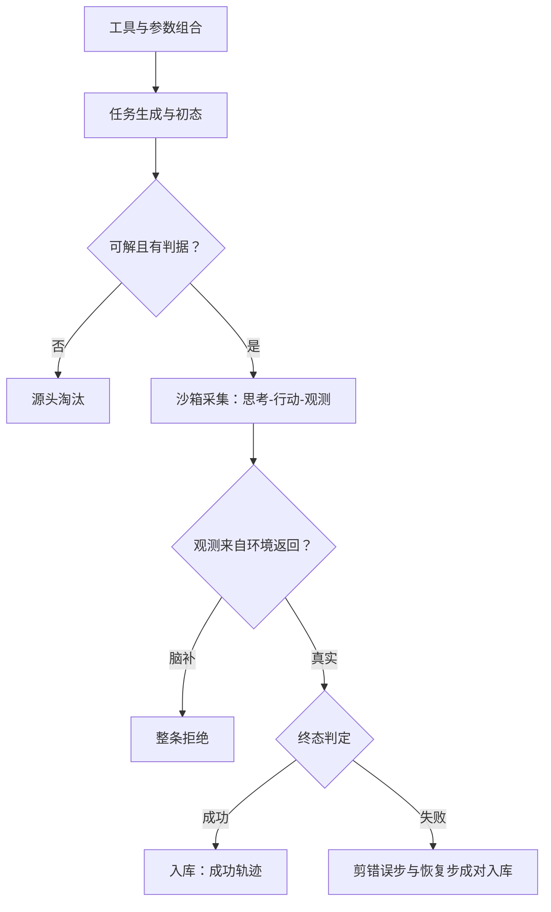

# Agent 轨迹合成

    
轨迹合成的铁律：观测必须来自环境返回，不能来自模型的想象——脑补出来的观测，会教出一个相信幻觉的策略。

    <footer>—— 据 Schick 等 Toolformer；Gulcehre 等 ReST；Zeng 等 AgentTuning 整理</footer>

[上一课](/llm/synthetic-multiturn)让用户模拟器第一次把「环境」引进了合成；本课把环境换成可执行系统：工具、沙箱、任务与结局。Agent 轨迹是一条「思考—行动—观测」序列，它的合成质量几乎完全由环境侧决定，模型侧反而自由。[工具沙箱](/llm/tool-sandbox)与 [function calling 训练](/llm/tool-call-sft)已立基建，本课写数据线：任务从哪来、轨迹怎么采、结局怎么判、什么该剪掉。

## 问题

轨迹合成的缺口在任务侧与观测侧。任务侧：工具组合空间指数大，从工具文档自动造任务（「用这三个 API 完成某事」）命中率低，多数生成任务要么不可解要么无判据——任务有效率是这条线的第一瓶颈。观测侧最大的陷阱是「脑补观测」：让教师模型一口气写完整条轨迹（包括工具返回），生成便宜且通顺，但观测是想象——模型从此学会在真实运行里也想象工具输出，错误在多步之后爆炸。结局侧：以任务成功过滤轨迹给了强真值，但纯成功过滤会把分布压向「易任务加保守策略」，失败信息全部丢弃。

## 方法

四段线。任务段：以环境能力为纲造任务——枚举工具与参数组合，按组合模板生成任务描述与初始状态，成功率试采定难度，不可解或无判据的任务在源头淘汰；[Toolformer](/llm/toolformer)式的自监督（用「插入调用是否降低未来损失」筛调用点）适合无明确任务的工具熟悉数据。采集段：策略在沙箱里真跑，观测取环境返回原文，超时与异常原样保留——它们本身就是训练信号；[RFT 数据循环](/llm/rft-data-loop)的「采样、过滤、回灌」是骨架。结局段：成功按可判定的终态判（文件存在、测试通过、答案核对），不靠模型自评；失败轨迹不整条丢弃，剪出「错误步加恢复步」的对子入库。整形段：剪冗余重试与循环步，保留「探索—失败—调整—成功」的结构——这正是多步能力的学习对象。

## 机制

结局过滤的机制价值与代码域一致——程序级拦截率撑起放量；它的新增代价是选择压力：只留成功轨迹时，训练分布向策略已会的区域收缩，探索行为被系统性淘汰。剪「失败加恢复」对子是直接的解法：保留失败的信息，去掉失败的噪声。环境与真实工具的差距是本课版本的 sim-to-real：沙箱里的 API 无限耐心、无并发、无限额，模型学到的调用习惯——不等结果、不重试、忽略限流——在真实环境里全部失灵；缓解不是造完美环境，而是在环境里显式注入这些「不配合」：限速、部分失败、格式漂移。任务有效率的瓶颈没有银弹：模板命中率随任务复杂度骤降，复杂任务的合成通常退回「真实种子加教师扩展」，纯自动造复杂任务仍是开放问题。

Toolformer 的筛选信号是「调用点插入后，未来 token 的损失是否下降」——不需要环境真值就能找到值得调工具的位置。有沙箱之后的成功率过滤更强，但两种信号覆盖不同：前者找「哪里该调」，后者判「最后成没成」。

## 边界

结局判据只覆盖可形式化的任务；「用户体验好」这类终态无法程序判定，轨迹质量退回裁判与人审。采集成本随步数与环境调用次数放大，复杂任务的轨迹单条成本可能超过一次训练迭代，配比时要算账。轨迹数据的时效性强：工具 API 改版后，旧轨迹教的是过时接口，任务库要带环境版本号，随环境升级重采。本课只写单 agent 单任务的合成，多 agent 协作与环境编排是相邻课程的议题。

## 小结

- 任务从工具组合造，源头淘汰不可解无判据；任务有效率是第一瓶颈。
- 观测必须取环境返回原文，脑补轨迹整条拒绝。
- 成功轨迹入库，失败剪成错误-恢复对；纯成功过滤收缩探索分布。
- 环境要主动注入不配合：限速、部分失败、格式漂移，防 sim-to-real 失灵。
- 任务库带环境版本号，API 改版重采。
- 出处：Schick 等 Toolformer 2023；Gulcehre 等 ReST 2023；Zeng 等 AgentTuning 2023。
