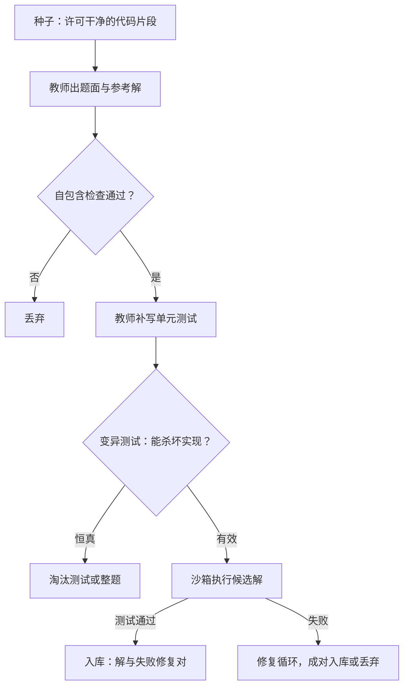

# 代码数据的合成

    
代码把「对」从文本判断换成执行判断：编译与测试是最诚实的裁判，也是最容易被人钻空子的裁判。

    <footer>—— 据 Gunasekar 等 Textbooks Are All You Need；Wei 等 Magicoder 整理</footer>

[上一课](/llm/synthetic-math-pipeline)的数学域用答案等价做真值，代码域把真值再往前推一步：不判输出对不对，直接跑。[代码验证器](/llm/code-verifier-unittests)课立过沙箱与隐藏测例的规矩，[教科书式合成](/llm/textbook-synthetic)讲过 phi-1 用合成教材补代码能力的路数。本课写题、解、测试三样都可合成时的完整生产线，以及执行反馈在放量的同时放进来什么新风险。

## 问题

代码合成的特殊性在于三样东西都能造：题目可以从开源片段反推（给一段真实代码让教师写出「这段代码回答的问题」），解法可以由教师生成，测试可以由教师补写。三样都能造意味着生产线可能自洽地空转：教师出的题配教师写的解配教师写的测试，全部通过，整体却是对教师分布的自食。工程事故集中在三处。测试太松：恒真断言放行一切实现。测试泄漏：测例进了题面，模型学会硬编码答案。环境漂移：依赖版本不钉死，同一段代码今天过明天不过，过滤器静默变成随机数。

## 方法

生产线四站。种子站：从许可干净的仓库取函数级片段作种子——这是有源改写，[The Stack v2](/llm/the-stack-v2)的文件级许可检测是原料闸；纯无源出题的覆盖更飘，默认不做。出题站：教师围绕种子写题面与参考解，题面过「自包含」检查——不依赖隐藏上下文与未给定义。执行站：参考解与候选解都进沙箱，[工具沙箱](/llm/tool-sandbox)的快照与资源预算照搬；测试合成物要先验「能杀掉坏实现」——用几组变异代码（改边界、删检查）验证测试的杀伤力，恒真测试直接淘汰。整形站：失败轨迹不是废料，修复对（错误版本加补丁）是更值钱的监督；冗余重试与循环步剪枝后入库。

## 机制

执行反馈的价值在把拦截率从「裁判可信」升级到「物理层可信」：编译错误、运行超时、断言失败都是不可辩驳的信号，于是代码域可以承受比开放域高一个量级的采样量。但执行判的是「满足这组测试」，不是「满足题意」——测试与题意之间的缝隙就是投机取巧的入口，测例泄漏只是缝隙中最粗的一条。变异测试堵的是测试质量这一环：让测试先证明自己能区分好坏实现，才配当裁判。自食风险的机制防线比数学域更依赖原料——数学还有教材与竞赛题当外部题源，代码的种子只能来自真实仓库，真实种子的占比是这条生产线免于空转的压舱石；教科书式合成之所以有效，是因为它把真实种子与教师生成的「教材化解释」按结构配比，而不是让教师从头写整个世界。

phi-1 的 1.3B 模型在 HumanEval 上过半，公开归因给「教科书级」合成数据——但其配方里真实仓库种子与执行过滤都在。把结论读成「纯合成即可」，会漏掉这条管线最贵的两个部件。

## 边界

执行验证只覆盖可执行代码：前端视觉、数据科学脚本、基础设施配置的「对」很难用断言钉死，这些域的过滤器退回裁判打分档，拦截率随之退化。测试杀伤力检查增加成本，且只保证测过的变异类，测不出「题意与测试同时偏」的情形。环境钉版本是运维纪律不是技术难题，失守的代价是过滤器静默变成噪声源——这类失败在日志里表现为通过率的日间漂移。最后，代码合成与工具调用共享沙箱基建但目标不同：前者造训练数据，后者造智能体轨迹，轨迹的观测真实性与多步结构是下一课的主题。

## 小结

- 三样都可合成：种子反推题面、教师写解、教师补测试；自洽空转是结构性风险。
- 测试先过变异测试证明杀伤力，恒真测试淘汰。
- 题面、测例、环境三隔离，防模型学会硬编码。
- 失败修复对是资产；执行拦截率撑起代码域的放量。
- 真实种子占比是免于自食的压舱石。
- 出处：Gunasekar 等 2023；Wei 等 Magicoder 2023；Chen 等 HumanEval 2021；BigCode 2024。
