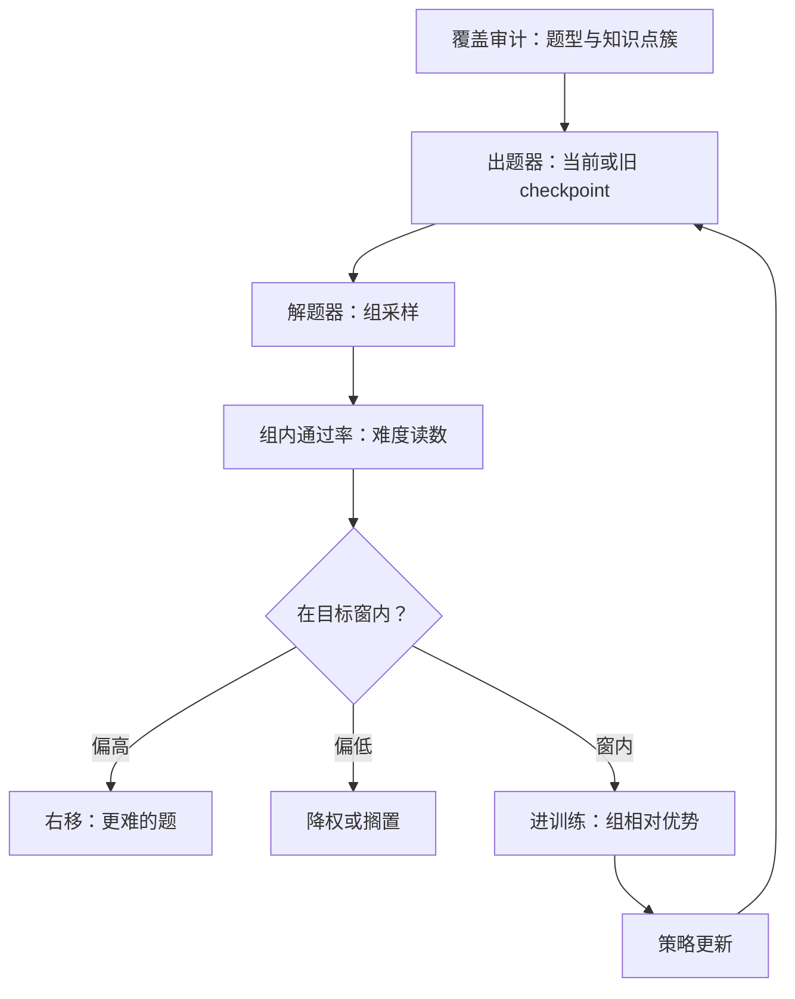

# 合成课程与自出题

让模型自己出题，是把课程表的编写权也交给被教的那位；可出题性会替难度做主——它偏爱自己快能会做的题。

<footer>—— 据 Zelikman 等 STaR；Xu 等 Evol-Instruct 整理</footer>

[上一课](/llm/rlvr-design-space)把 RLVR 的设计空间切成域、泄露、粒度三轴，其中「域里的题从哪来」留了口子：可验证题目可以人工维护，也可以合成。本课收束本单元：从[教科书式合成](/llm/textbook-synthetic)的教师写教材，走到自出题—自排课——出题、解答、排难度由模型闭环完成，并用[难度课程](/llm/rl-difficulty-curriculum)与[动态采样](/llm/dynamic-sampling-rl)的结论控制难度分布。本单元至此讲完回路的地基，但最危险的一站——没有程序真值时谁来判分——本课不回答：[自奖励语言模型](/llm/self-rewarding-lm)那种裁判与选手同一模型的循环依赖，留给下一单元。

## 问题

合成课程分两级。教师出题：教科书式合成是原型——大纲定技能轴，教师生成教材与习题，上限是教师分布与大纲覆盖；Evol-Instruct 加加深与换题算子，Meta-Math 式改写自举扩大题量，但都依赖外部大纲与教师。自出题：出题器是当前或旧 checkpoint 的自己，模型给自己出题、解答、再由验证器判分——题源不再受限，但引入一个新的选择环节：出什么题，由谁的目标决定。共同的工程问题是难度分布：组相对 RL 只在中间通过率有信号（全对全错组无梯度），难度课程课的结论是把通过率维持在中间带——合成课程第一次让这个带成为可直接控制的出题参数。

难度读数用当前策略的组内通过率，不用教师自评难度：同一道题对教师容易、对学生未必。R1 式配方按通过率过滤题目、丢弃全对全错组，就是这个口径。

## 方法

难度分布控制三步。测：每题用当前策略组采样估通过率，作为难度读数——它随训练移动，同一题会从难变中再变易。控：把出题分布校到目标窗（如通过率 $0.3$–$0.7$），窗外不丢而是降权或留给下一阶段；动态采样在组内无分叉时过采样补齐，是窗控制的在线版。移：随能力上升右移难度窗，形成课程——这与预训练的数据排序不同：RL 的出题分布本来就该随策略动，动的依据是上一轮通过率。覆盖审计与难度控制并行：按题型、长度、知识点簇检查出题分布，防止难度窗收窄时题型也跟着收窄。

## 机制

自出题的新风险是目标漂移：出题分布会漂向「可出且可解」的区域——模板题、短题、模型自家风格的题。漂移是选择压力的产物而非实现错误：过滤器按可解性留题，训练改变解题器，出题器若也被间接选择（经出题质量过滤，或「能产生梯度」的题才被用），整个环节优化的是可训练性而非价值。判据是[数据飞轮的停止条件](/llm/data-flywheel-stop)课的仪表：出题侧指标（题目量、通过率分布）还在涨，held-out 真实题的边际增量却在掉——训练分布与真实任务分布脱节了。治理三条：出题器与解题器分离（旧 checkpoint 或不同温度出题，防止题目与解法同源同漂）；真实题型锚（按真实基准的题型分布对出题分布重加权）；出题侧回混（真实题保留固定份额，与[模型坍缩的实证](/llm/model-collapse-empirics)课的真实数据回混同一逻辑）。

## 边界

本课的难度控制假设验证器可信——题的解答对不对仍由程序判；出题与判分都交给模型时，循环依赖进入下一单元的议题。难度窗数值随任务与组大小变，$0.3$–$0.7$ 是常用口径不是常数。出题器扩到开放域（无验证器的自由出题）超出本单元，那里的判分问题正是下一单元第一课的入口。

## 小结

- 合成课程两级：教师出题（上限是教师与大纲）、自出题（题源开放但引入选择环节）。
- 难度读数用组内通过率，目标窗控制并随训练右移；覆盖审计与难度控制并行。
- 目标漂移：可出可解区域吃掉训练分布；判据是 held-out 边际增量掉头。
- 治理：出题与解题分离、真实题型重加权、出题侧回混。
- 出处：Zelikman 等 STaR；Xu 等 Evol-Instruct；Yu 等 Meta-Math；DeepSeek-AI R1 的难度过滤；Muennighoff 等 s1 的选题口径。
