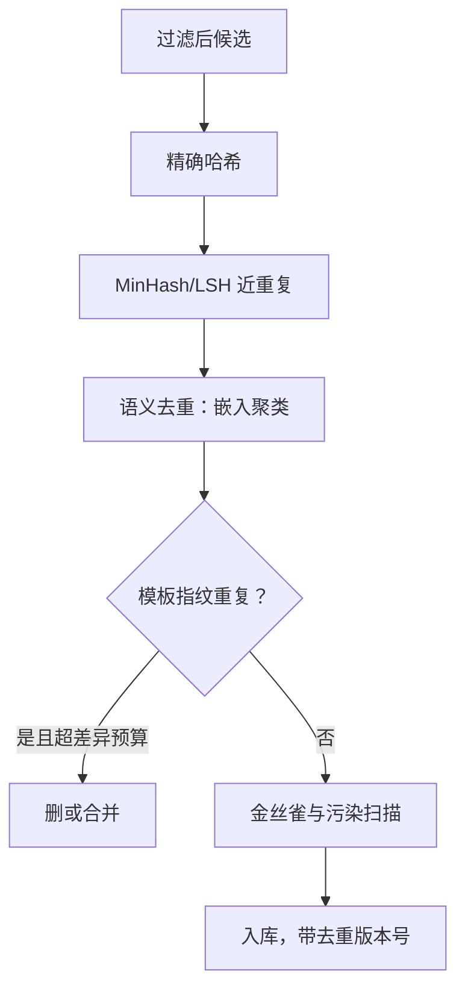

# 合成数据的去重与污染

    
合成管线里，去重不是清洗，是生成环内的一步：挡不住重复的生成器，会在几轮之内把题池唱成同一首歌。

    <footer>—— 据 Lee 等 2021 去重实证；Shumailov 等 2024 坍缩实证整理</footer>

[上一课](/llm/synthetic-quality-filter)的关卡拦的是「坏样本」，本课拦的是「重复与泄漏」。字面与近重复去重在 [MinHash / 精确去重](/llm/minhash-dedup)与[语义去重](/llm/semdedup)已讲，评测去污染的流水线在[去污染流水线](/llm/decontamination-pipeline)已立。本课写合成数据特有的三件事：模板共因让常规去重失效；污染入口从「爬到评测题」变成「教师会出评测题」；重复在闭环里是坍缩的燃料。

## 问题

合成的重复有一种常规管线看不见的形态：同一模板批量生成一千道题，表面字词全不同，模板层完全相同。n-gram 与 MinHash 在字面层工作，抓不住这种「换皮不换骨」；语义去重能抓一部分，但同时带来把「同题不同解」误删的风险。污染的入口则有两扇：教师预训练时见过基准题，生成时会不自觉地复刻其结构与数值；更糟的是操作性问题——为了让评测分好看，直接把基准题型喂给出题器。两扇门通向同一个结局：训练分与评测分双双上涨，泛化没动。

## 方法

去重四层，逐层收紧。精确哈希消灭字节级复制；MinHash 加 LSH 估计 Jaccard 抓近重复；嵌入空间语义去重抓释义级重复；再加一层模板指纹——抽取指令的骨架（句式结构、槽位类型、答案形态），在骨架层去重，专治模板共因。同一道数学题保留多条解法是资产不是重复，所以骨架比对要允许答案与解法字段带差异度预算，这是合成管线与网页管线在去重上最实质的分歧。

污染扫描三件套。与基准的字面与近字面重叠检测：n-gram 加嵌入近邻双通道。金丝雀：往训练池投放带标记的合成样本，评测时检查是否被背诵——它同时审计生成器与数据管理链路。生成器隔离审计：训练集与评测集的生成器、模板库、种子是否共享；共享即视为系统性污染嫌疑，不必逐条找证据。三件套的结论与[训练-评测污染检测](/llm/eval-contamination)的语料审计口径合并使用。

## 机制

重复不是中性填充。[模型坍缩的实证](/llm/model-collapse-empirics)的机制里，递归训练的损害正是从高频模式被反复强化开始的：模板共因若不去，等价于把训练分布往几个模板峰上压，坍缩的先兆——尾部丢失、熵收缩——会提前出现。重复还放大隐私面：语言模型对重复串的背诵概率显著更高，合成批次若夹带种子里的个人信息，重复会让它从「可提取」变成「必然吐出」。污染的机制则更隐蔽：它是过拟合到评测生成过程的学习——模型不需要学会任务，只需要学会「这类生成器会出什么」，模板正则性就是全部答案。这也是为什么去污染课强调语料审计是一等证据：成员推断只能补刀，不能洗白。

Lee 等 2021 的口径：对 C4 去重后训练效率提升，训练集中可被背诵的测试串大幅减少；Kandpal 等 2022 进一步把去重与隐私泄露率挂钩。合成管线照单全收这两条，只多加一条：模板层也要去。

## 边界

四层去重的阈值都是精度与覆盖的权衡：语义层阈值松了删资产（多解法、多表述），紧了留近重复。模板指纹的抽取本身可能过拟合到某种题式，把真正不同的任务误判为同模板——骨架层去重要抽样人审。污染扫描对释义级污染的召回有限，金丝雀只能证明被测链路干净，不能证明没投放过的路径干净。评测集若也来自合成（本课程后面有专课），隔离审计要升级到生成器级：n-gram 重叠合格不等于同源风险解除。

## 小结

- 去重四层：精确、MinHash、语义、模板指纹；合成特有的是模板共因。
- 同题多解是资产，骨架去重要带差异度预算。
- 污染两扇门：教师复刻基准与操作性出题；生成器隔离是结构性防线。
- 重复是坍缩与背诵的燃料，去重是生成环内步骤，不是事后清洗。
- 金丝雀与语料审计是一等证据，成员推断只补刀。
- 出处：Lee 等 2021；Kandpal 等 2022；Shumailov 等 2024。
