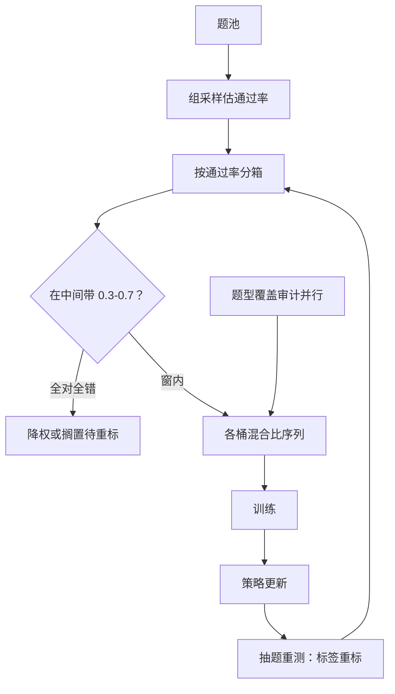
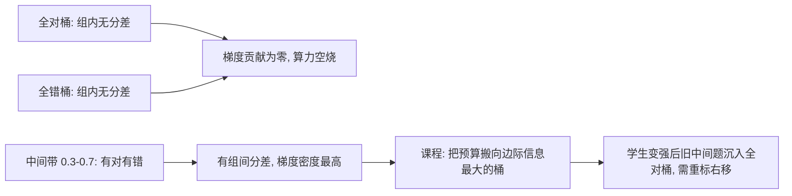

# 难度分级与课程合成

    
难度不是题的属性，是题与学生当前关系的一个读数：学生变了，同一道题会从「难」走到「中」再走到「废」。

    <footer>—— 据 Zelikman 等 STaR；Muennighoff 等 s1；DeepSeek-AI R1 的难度过滤整理</footer>

[上一课](/llm/synthetic-agent-traj)把域合成推进到轨迹与结局判定；本课回到所有域共享的一站：题池进训练前，每道题还欠一个「难度」标签。[难度课程](/llm/rl-difficulty-curriculum)与[合成课程与自出题](/llm/synthetic-curriculum-close)已在 RL 语境立了「中间通过率才有梯度」的规矩，[难度分层与课程](/llm/instruction-curriculum)讲了 SFT 侧的桶与混合比序列。本课把难度当作通用的数据工程原语收拢：标签从哪来、桶怎么分、课程怎么排、标签什么时候会过期。

## 问题

难度标签有三个来源，可靠性与成本此消彼长。当前策略的组通过率最可靠：它直接量「这题对现在的学生有没有梯度信号」。教师自评最便宜但校准最差：同一道题对教师容易、对学生未必，教师还倾向于把「步骤多」当成「难」。结构代理（步数、长度、知识点层级）介于两者之间，单用会犯系统性错误——把啰嗦当难、把套话当易。典型工程错误是：用教师自评难度排课程，训练前期学生全在过易题（无信号），后期突然面对全难题（无梯度），课程表形同虚设。常见误区：把「步骤多」当「难」。一道 10 步套模板的题，教师自评很难，学生通过率却有 0.6；一句看似简单的话可能藏着巧构造，通过率只有 0.05。教师度量的是题目外观，学生通过率度量的才是梯度信号——两者经常对不上。

## 方法

标签、分箱、排序、重标四步。标签：有程序真值的域一律用通过率——组采样 $k$ 条估通过率 $r$，落在 $0.3 \lt r \lt 0.7$ 中间带的题才有组间分差；无真值域退回结构代理加教师自评的加权组合，并注明置信度。分箱：按通过率分箱而不是按绝对题号，箱宽按训练批次的数据量定；两端箱（全对全错）默认降权或搁置而非删除——它们留给能力变化后的重标。排序：课程是各桶混合比随训练移动的序列，静态配比是它的特例；移动的依据是实测通过率的漂移，不是预设时间表。重标：策略每前进一段，抽题重测通过率，过期标签按新读数改写——星级不是永久的。

## 机制

难度之所以是数据维度而不是训练技巧，是因为它决定梯度密度：组相对或 0-1 损失下，全对全错样本贡献为零，算力花在这些样本上等于空烧；课程的本质是把预算持续搬向边际信息最大的桶。通过率读数把「难」从教师视角换到学生视角，这正是教师自评失准的根源——它度量的对象错了。重标的机制必要性来自读数的移动性：训练改变学生，标签的含义随之漂移，不重标的课程会越来越保守——学生已会的中等题仍占着中间带的预算，新增算力被静默浪费。覆盖审计与难度控制必须并行：把通过率窗收紧时，出题或选题分布会顺着「落在窗内」的压力漂向窄题型——难度达标而题型塌缩，是这门工程最常见的隐形失败，题型网格的占比要单独设阈值。

直觉类比：课程像健身的渐进负荷——天天举轻重量（过易题）不长肌肉，第一次就上极限重量（过难题）只受伤不进步。有效训练都在「勉强能完成」的区间，而且随着变强要不断加重——这就是重标右移。

s1 用人工精选的一千题起步，R1 式配方用通过率在线过滤——两端是同一原理：前者靠人事先把题卡在中间带，后者让读数随学生更新。差异在维护成本：人工卡难度是一次性的，读数更新是持续的。

## 边界

通过率读数需要采样预算：每题 $k$ 条的组采样在题池大时是显著算力，重标频率与预算要一起规划。难度不等于价值：过难的题即便偶尔通过，其信号也常被噪声淹没，中间带的追求是「有分差即可」，不是越难越好。无真值域的难度全靠代理，读数失真时课程会系统性错位，此时宁可静态配比也不要假装有课程。最后，难度分级只回答「梯度在哪」，不回答「覆盖够不够」——题型与能力网格的覆盖是下一课多样性的辖区。数字实例：组采样的预算账——题池 10 万题、每题采 8 条估通过率，就是 80 万条生成，相当于整条 SFT 数据再造一遍。所以重标要省着做：每前进一段抽 5%–10% 的题重测，好过全量重测。

## 小结

- 难度标签三来源：通过率最可靠，结构代理居中，教师自评最不可信。
- 中间通过率带是梯度存在带，全对全错降权搁置而非删除。
- 课程是桶混合比的移动序列，移动依据是实测漂移不是时间表。
- 星级会过期：策略每进一步，抽题重测重标。
- 难度窗收紧时题型会塌缩，覆盖审计必须并行。
- 出处：Zelikman 等 STaR 2022；Muennighoff 等 s1 2025；DeepSeek-AI R1 2025。
