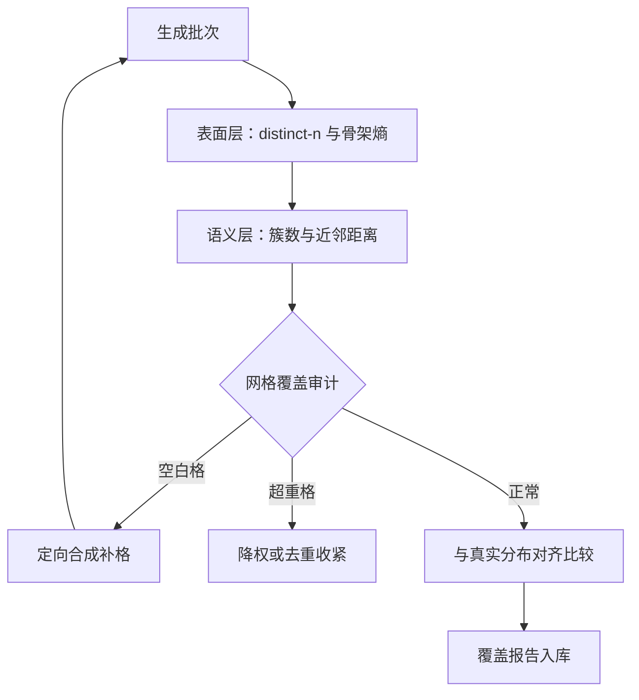
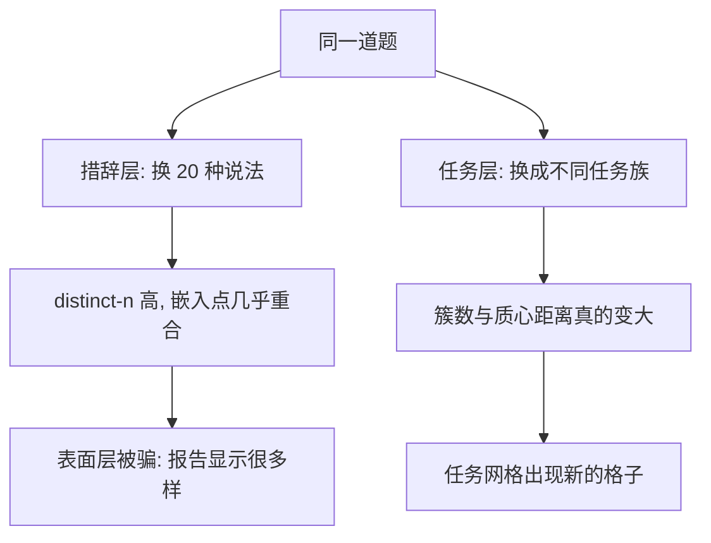

# 多样性的度量与覆盖

    
多样性从来不是「越大越好」的标量，是相对目标分布的覆盖率：没有真实锚点，连「多样」两个字都无从谈起。

    <footer>—— 据 Liu 等 DEITA；Zhou 等 LIMA；本站数据飞轮课整理</footer>

[上一课](/llm/synthetic-difficulty-curriculum)控制了「梯度在哪」，本课控制「覆盖多大」。多样性收缩是自训练回路的系统性损耗：[自改进回路的解剖](/llm/self-improvement-loop)把它列为损耗之首，[数据飞轮的停止条件](/llm/data-flywheel-stop)给了三个仪表。本课把「多样性」拆成可度量的层级，写每个层级能被怎样骗过、该配什么审计。

## 问题

多样性的度量难点在「表面多样、语义单一」的分离。让教师把同一道题换二十种措辞，distinct-n 仍然很高，嵌入空间里却是二十个几乎重合的点；反过来，语义去重的阈值设松了，会把真正不同的任务误判为同义。更深的缺口是覆盖没有定义域：说「数据更多样」必须回答「相对什么更多样」——相对真实用户查询、相对基准题型网格、还是相对能力清单。没有目标分布，多样性只是生成温度的函数；有了目标分布，它才是配比可以优化的对象。术语翻译：distinct-n 是统计「不同 n-gram（连续 n 个词的片段）占比」的指标，占比高说明字面用词丰富。但它完全不看意思——同一道题换个说法就能骗过它，所以它只配当报警器，不配当审计员。

## 方法

四层度量，逐层到语义。表面层：distinct-n、自重复率、模板骨架熵——便宜、每日可跑、最易被骗，只配做报警不做结论。语义层：样本过嵌入器，看簇数、簇间质心距离、k 近邻平均距离，与[语义去重](/llm/semdedup)的聚类直接复用；指令侧可用[指令嵌入](/llm/instruction-embeddings)的专用编码器。任务层：题型与能力网格的覆盖审计——把目标分布画成格子（任务族乘难度乘格式），统计每格占比，空白格与超重格点名。锚点层：抽样与真实查询分布对齐比较——覆盖真实分布的多少格、分布距离随批次移动的方向，这是唯一能回答「覆盖够不够」的一层。

生成侧的旋钮按层级对应：表面多样性调温度与去重阈值；语义多样性调种子池与提示变体；覆盖缺口靠定向合成补——对空白格定点出题，而不是全局升温。

## 机制

为什么表面层会被骗：措辞熵与任务熵是两个自由度，教师在措辞上均匀采样不费任何能力，而在任务上展开需要它真的会别的任务——所以坍缩最先发生在任务层，表面层最后才见底。这也是为什么熵与新颖占比是坍缩的先行指标：[模型坍缩的实证](/llm/model-collapse-empirics)的监测口径里，生成分布熵与尾部占比的掉头早于平均质量的掉头。定向补格之所以优于全局升温：升温同时抬高所有格的方差，已超重的格更超重；定点出题把生成预算对准空白格，让多样性成为可执行的生产计划而不是统计副作用。锚点层是防自欺的最后一道：池内网格再满，也可能整体偏离真实分布——覆盖报告必须同时给池内占比与对真实分布的相对位置。

数字实例：一批 1000 条数据，distinct-2 高达 0.98、表面层全绿；嵌入聚类后却只有 12 个簇、九成样本挤在 3 个簇里——语义层红灯。只看表面层会得出「数据很多样」的错误结论，审计必须逐层下钻。

distinct-n 对换皮完全不设防：同一模板改写二十遍，distinct-n 照样漂亮。多样性审计至少要到嵌入层，且嵌入器要定期换尺复核——教师亲生的嵌入器会把自家风格判为「多样」。

## 边界

嵌入器的偏置决定语义层的上限：簇结构反映嵌入器的归纳偏好，不全是数据的结构，换嵌入器复核是纪律不是优化。覆盖目标分布本身需要一份真实查询或任务的样本——冷启动域没有锚点，此时覆盖报告只能给池内相对值，结论要降级。定向补格有过拟合到网格定义的风险：格子怎么切，模型就朝怎么切的方向学，网格设计要留余量并定期修订。最后，多样性与质量在预算上互斥：两端都要时，先看难度与覆盖的报告再定过滤器松紧，不要凭手感调阈值。直觉类比：全局升温像把整间屋的灯一起调亮——原来刺眼的角落更刺眼，该亮的角落还是照不到；定向补格像拿手电筒去照空白格。生成预算就是电费，定点照明便宜且有效。

## 小结

- 四层度量：表面、语义、任务网格、真实分布锚点；表面层只配报警。
- 坍缩先发生在任务层：生成熵与新颖占比是先行指标。
- 覆盖缺口用定向合成补，不用全局升温。
- 嵌入器要换尺复核，防教师自家风格被判为多样。
- 没有真实锚点的域，覆盖结论降级为池内相对值。
- 出处：Liu 等 DEITA 2023；Zhou 等 LIMA 2023；Shumailov 等 2024 的监测口径。
