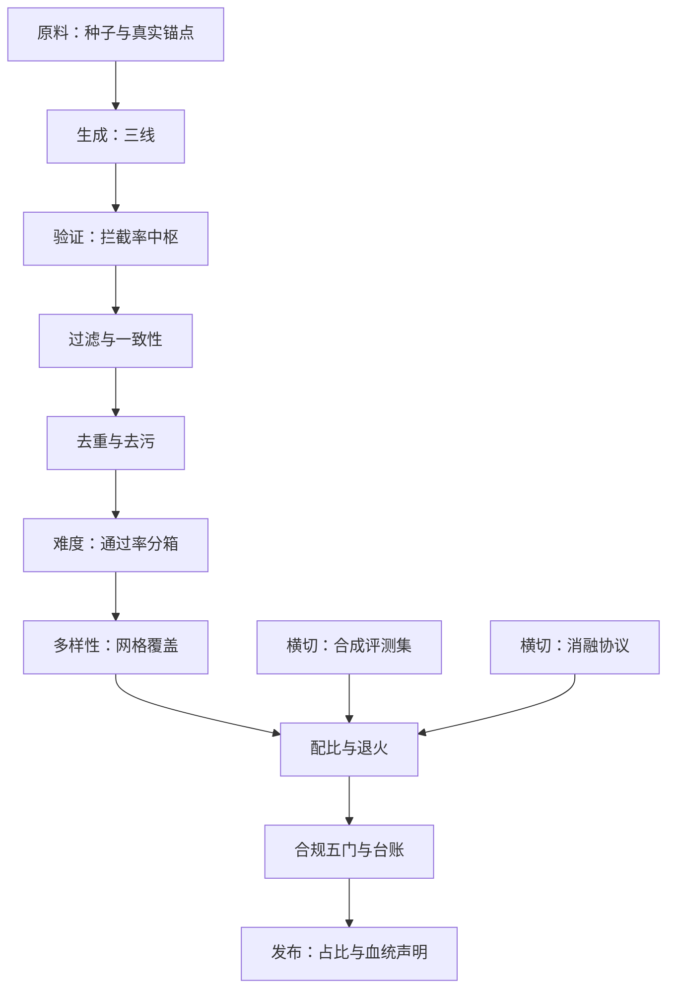

# 合成数据工程收束

    
生成越来越便宜，稀缺的从来不是数据：是验证、覆盖审计，和那一份不许被挤掉的真实锚点。

    <footer>—— 据本课程十五课整理，口径与各课出处一致</footer>

[上一课](/llm/synthetic-license-compliance)把合规做成管线的最后一道门。本课程到此收束：从[谱系分类](/llm/synthetic-taxonomy)起步，经质量控制、域合成、配方与验证，到缩放与合规——本课把十五课拼回一条完整生产线，给出每站的控制点、跨站共享的失败模式，以及这门工程与相邻课程的接口。

## 问题

十五课散开后容易丢掉整体：单站最优的组合未必是好的生产线——过滤器过严配合配比过松，等于用高成本买回原分布；难度窗收紧配合覆盖审计缺位，就是难度达标而题型塌缩；蒸馏数据与自合成混记一本账，两条上限互相掩盖。收束要回答的是：这条线的骨架是什么，站在哪里能看见哪类失败，新批次上线前最少要过几问。

## 方法

生产线的九站与控制点。原料站：种子与真实锚点，控血统与覆盖的上限。生成站：无源、有源、程序三线，控变异方向与放量的边际。验证站：程序真值、裁判、无验证三档，控拦截率——它是全线的汇率中枢。过滤站：启发式、分类器、打分器加一致性三查，控投影方向。去重去污站：四层去重加生成器隔离，控重复燃料与泄漏。难度站：通过率分箱与课程序列加重标，控梯度密度。多样性站：四层度量加网格覆盖，控坍缩的先行指标。配比站：域、阶段、教师三粒度加末段退火，控份额。合规站：四链五门加台账，控合法性。评测集与消融协议是横切的两个基建：一把可信的尺，一套归因的协议，两个都不属于任何单站。

## 机制

跨站共享的失败模式有三条主轴。选择压力轴：过滤器、fitness、成功率、难度窗全都在选择样本；选择叠加而不留通道，分布就系统性漂移——解药是有意回混：真实题、失败样本、窗外难题都要留份额。同源轴：生成器、打分器、用户模拟器、评测生成器若同源，偏置相互放大且不可见——解药是分离：生成与打分分离，训练与评测隔离，教师与学生分版本记账。反馈延迟轴：合成管线的错误大多不在当轮显形（日志更好看、分更高），而在下游或数代后显形——解药是把先行指标挂在前：held-out 真题边际增量、生成熵、新颖占比、回退率，任何一个掉头都先于质量崩塌。

新批次上线五问：来源可溯吗？验证器可信且与用途匹配吗？去重去污版本对齐吗？难度与多样性的读数在窗内吗？真实探针的边际增量为正吗？有否定，批次不进配比——这门工程的全部纪律，浓缩起来就是让这五问在每一批都真的被问过。

## 边界

本课程写的是数据侧工程；模型侧的对应物各有专课：蒸馏的机制与失真在[推理链蒸馏](/llm/cot-distill)与[推理蒸馏到小模型](/llm/reasoning-distill-small)，自训练回路的收益与损耗在[自改进回路的解剖](/llm/self-improvement-loop)与[数据飞轮的停止条件](/llm/data-flywheel-stop)，闭环的极限后果在[模型坍缩的实证](/llm/model-collapse-empirics)。方法的有效期绑定教师与基座版本：换代之后，能继承的是骨架——五元组、三轴、九站，不是参数。最后要承认这门学科的边界：验证器覆盖不到的地方——品味、安全、开放域价值——合成数据只有代理信号，那里的问题要交给偏好数据与对齐评测的工程，不是本课程的能力范围。

## 小结

- 生产线九站加两个横切基建；验证站是全线汇率中枢。
- 三条失败主轴：选择压力、同源偏置、反馈延迟；解药分别是回混、分离、先行指标。
- 新批次五问是最低验收线，否定即不进配比。
- 合成的稀缺资源是验证、覆盖审计与真实锚点，不是生成量。
- 本课程到此收束：骨架可继承，参数随版本作废。
- 出处：本课程总口径——Self-Instruct、Evol-Instruct、Textbooks、Meta-Math、RFT、Lightman PRM、Magicoder、CAMEL、UltraChat、Toolformer、ReST、s1、R1、Muennighoff 2024、Shumailov 2024、The Stack v2、LIMA、DEITA、Dynabench、LiveBench。
