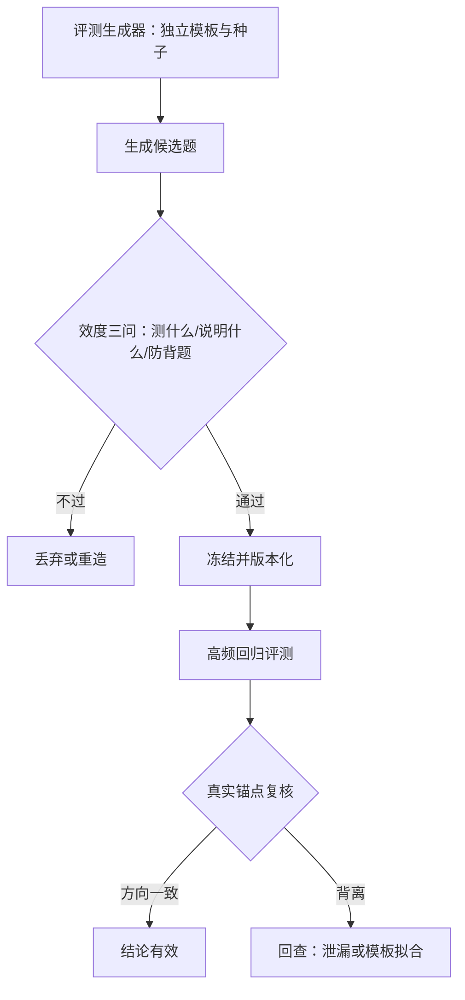
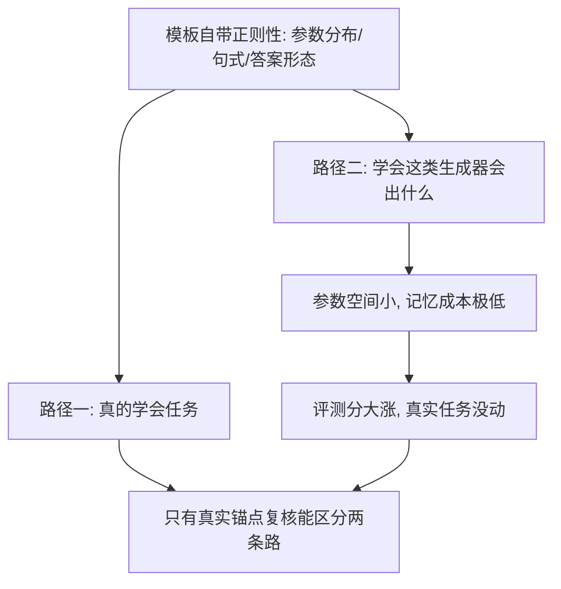

# 合成评测集的构造

    
用合成机器造评测，风险从「训练学坏」换成「评测自欺」：分数可以完全真实，结论可以完全错误。

    <footer>—— 据 Kiela 等 Dynabench；White 等 LiveBench 整理</footer>

[上一课](/llm/synthetic-small-model-mix)把训练配比定版；本课把同一套合成机器转向评测集。训练-评测污染的检测已有专课：[评测去污染流水线](/llm/decontamination-pipeline)与[训练-评测污染检测](/llm/eval-contamination)，LiveBench 类动态基准给过「月更新加客观评分」的口径（[LiveBench](/llm/livebench)）。本课写更上游的问题：当你决定自己合成一个评测集时，构造本身要守什么纪律。

## 问题

合成评测有三种做法，缺口各不相同。模板加参数采样：从程序模板生成题与标准答案，真值由生成器定义，最干净也最危险——它测的是「模板正则性」还是「能力」，取决于模板藏得多深。教师出题加程序验证：题源开放、真值可靠，但与训练集同源的风险最高——教师出的题天然长成它能解的样子，模型若在同类题上被密集训练，分数上涨与能力无关。真实种子改写：把真实题换数字换情境，效度最好，污染检测却更难——表面改了，解法结构没改。三类共同的死穴是自欺：评测的生产者与训练数据的生产者是同一个团队、同一批教师、有时是同一份模板库。直觉类比：让教师给自己出考卷，题目会天然长成它擅长的样子——就像老师偏爱出自己会讲的题型。再用同类题密集训练，等于考前把出题人的草稿纸刷了十遍：分数暴涨，「能力」没动。

## 方法

四条纪律。生成器隔离：训练与评测的模板库、种子、教师版本全部物理分开，隔离审计写进发布流程——这是「训练测试分离」在合成时代的重写，违反它的高分一律无效。效度三问：每道题入库前过「它测什么」（对应能力清单的哪一格）、「答对说明什么」（排除捷径路径）、「怎么防背题」（参数空间够不够大）。稳定性预算：题量与参数采样决定的置信区间要写进报告，单点分差小于区间不得下结论。真实锚定：合成评测集只做高频回归，方向性结论必须在一小片真实题上复核；换题周期要短于模板被拟合的速度。

## 机制

合成评测自欺的机制是优化压力对生成器捷径的利用：任何模板都有正则性——参数分布、句式骨架、答案形态——模型不需要学会任务，只需要学会「这类生成器会出什么」。参数空间放大与情境改写抬高的是记忆成本而不是学习成本，恰好是当前大模型最充裕的资源；所以防背题不能靠「题面变体够多」，要靠换题周期与生成器隔离把结构差立住。动态更新与静态冻结是一对张力：LiveBench 用月更新对抗污染，内部评测集的更新受制于版本管理与可比性——工程折衷是双轨：冻结集保证可比，滚动集保证新鲜，结论以两轨一致为准。合成评测集同样要过污染扫描与许可检查：它是数据，不是法外之地。

数字实例：模板「计算 $a\times b+c$」若三个参数各只取 10 个值，参数空间只有 1000 道题，把答案表背下来的成本极低；把每个参数扩到 500 个值、再套不同情境，同样的「题型」参数空间变成上亿——防背题靠的是这个，不是换措辞。

评测集与训练集共用同一教师与同一模板库时，可以出现「模型分涨了十点、真实题一分没涨」的完全虚假增益。把生成器隔离做成 CI 检查项：任何评测集构建脚本引用了训练侧模板或种子，构建直接失败。

## 边界

合成评测的效度上限是能力清单的完备性：清单里没有的能力，合成再精也测不到，清单本身要靠真实基准定期校。程序化模板适合有形式结构的域（数学、代码、受控抽取），开放域的「好回答」无法模板化，合成评测在这些域退化为裁判打分，回归质量受裁判漂移约束。换题周期短有成本：历史可比性断裂，趋势分析要靠锚题子集（跨版本固定的题）续接。最后，评测集的规模与方差纪律沿用评测方法课的口径：合成不豁免统计。常见误区：初学者容易把「换题周期越短越好」当绝对真理。频繁换题会打断历史可比性——这季度分和上季度分不再是同一把尺。工程折衷是留一小撮「锚题」跨版本固定，用它们续接趋势，其余题滚动更新。

## 小结

- 三种做法：模板采样最干净最险，教师出题防同源，真实改写效度最好。
- 生成器隔离是训练测试分离的重写：模板、种子、教师版本物理分开。
- 效度三问入库；题量置信区间写进报告。
- 双轨：冻结集可比，滚动集新鲜，结论以一致为准。
- 方向性结论必须过真实锚点复核。
- 出处：Kiela 等 Dynabench 2021；White 等 LiveBench 2025；本站去污染两课。
