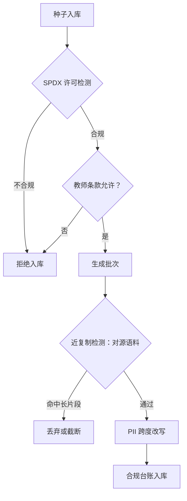
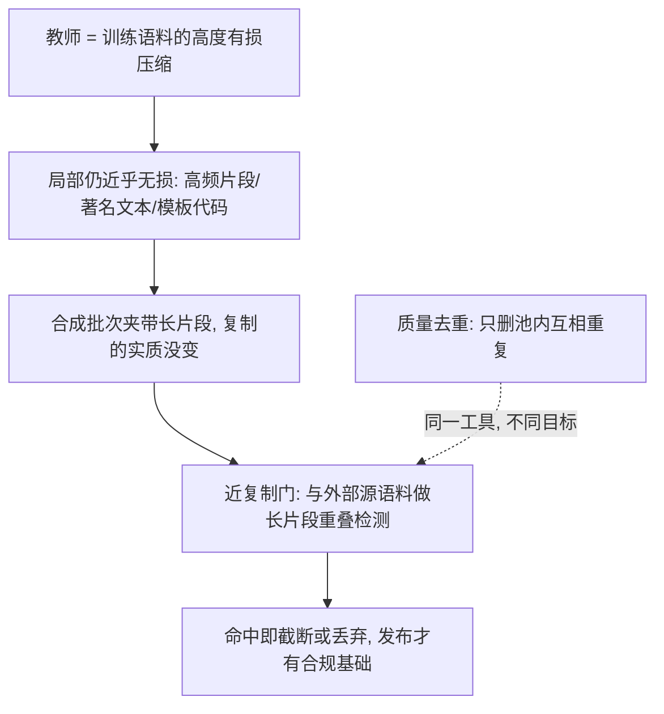

# 许可与合规

    
「数据是合成的，所以没有版权问题」是这门工程里最贵的一句错觉：合成只是换了一条传播链，没有换掉任何一环义务。

    <footer>—— 据 BigCode The Stack v2 的许可门；本站记忆化与版权课整理</footer>

[上一课](/llm/synthetic-scaling-laws)算清了配方的收益账；本课算另一本账：这条生产线能不能合法地存在、发布、商用。原料许可门在[代码许可与质量门](/llm/code-license-gate)与 [The Stack v2](/llm/the-stack-v2)已立，版权与记忆化的关系在[记忆化与版权](/llm/memorization-copyright)讲清：版权关心复制，事实正确不自动豁免。本课把四条链的合规义务串成一条流水线，并指出合成在哪几环重新打开了本来已经关上的门。

## 问题

合成数据有四条链，各自带义务。原料链：种子的许可（仓库、网页、教材）决定生成物的第一重血统——copyleft 与「仅限研究」的原料混进种子池，整批数据继承可疑地位。教师链：两层约束常被漏看——API 服务条款可能限制「用输出训练竞争模型」；开源权重许可的附加条款（命名、用途限制、分发条件）约束「用教师造数据训学生」这件事本身。输出链：教师可能近乎逐字地吐出训练语料，合成批次因此夹带受版权保护的长片段——「合成」的外衣不改变复制的实质。人格与隐私链：种子与真实锚点里的个人信息会在改写中被保留、组合甚至放大，合成不自动匿名。术语翻译：copyleft 是一类「传染性」开源许可（如 GPL）——要求衍生作品沿用同等许可继续开放。它混进种子池后，下游数据与模型的分发条款都可能被连带追问。很多数据集整体排除它，不是因为「坏」，而是因为它带来连带的开放义务。

## 方法

流水线五道门，随管线走。许可门：种子入库前过 SPDX 级检测，粒度从严，低置信度按从严处理并记录；许可口径写成策略而不是逐案判断。条款门：教师的选择本身是合规决策——用哪家教师的输出训模型，先读它的条款与权重许可，把约束写进数据台账。近复制门：对生成批次做与源语料的长片段重叠检测，命中即丢弃或截断——这是去重关卡在合规侧的第二身份，用的是同一套 [MinHash](/llm/minhash-dedup) 基建，但阈值与目的不同。隐私门：[PII 去除](/llm/pii-redact)的跨度改写跑在合成之后而非之前——改写可能把遮掉的实体重新带回来。台账门：每批数据记录来源、教师版本、过滤与检测记录，[数据谱系](/llm/instruction-data-lineage)的谱系表升级为合规台账；发布时模型卡声明合成占比与教师血统。

## 机制

为什么「合成即安全」是错觉：版权分析的对象是复制行为与实质性相似，不是数据的生产方式。教师是训练语料的高度有损压缩，压缩到局部仍可能近乎无损——高频片段、著名文本、模板化代码正是记忆化最强的地方，也恰好是合成生成最容易命中的地方。近复制检测因此不是可选审计而是结构性部件：它与质量去重共享工具但目标相反——质量去重要删「池内重复」，合规检测要删「与外部源语料的重叠」。教师链的机制地位更高：它决定整条线的合法性上限，条款不允许时，后面的门修得再好也无效，所以条款门排在最前。台账的机制价值在于把合规从一次性审查变成可追溯的状态：许可证检查可以在源库变更后重跑，作者退出请求可以按台账定位批次重处理。

直觉类比：教师像把一座图书馆压成一本摘要笔记——整体上丢了很多细节，但名句、常用代码模板这类高频内容会被近乎逐字记住。「我们没存原书，只用了笔记」在版权上站不住：笔记里可能整段就是原文。

The Stack v2 的口径：许可在文件级检测，纳入宽松与无许可、排除 copyleft 与商业许可，配合退出机制与稳定标识（SWHID）做问责——「能追溯」是合规的第一属性，比任何单一检测规则都基础。

## 边界

本课是工程口径不是法律意见：管辖区差异、合理使用的边界、条款的可执行性都要专业判断；工程的角色是把事实——来源、检测记录、版本——准备到可供专业判断的状态。近复制检测对改写级复制的召回有限，风格模仿的争议（声音、笔名、画风）大多不在检测器射程内，靠用途政策兜底。退出机制的时效滞后于采集，台账只能保证「可响应」，不保证「从未包含」。跨辖区商用还有输出合规（模型行为）与数据合规（训练过程）两层，本课只覆盖后者。为什么重要：某作者撤回对一段种子的授权时，有台账就能按谱系定位「哪些批次用过它」，重跑过滤甚至重训；没有台账，只能整批作废。合规台账买的不是「从未包含」，而是「出事时能响应」。

## 小结

- 四条链：原料许可、教师条款、输出近复制、隐私人格；合成不豁免任何一环。
- 条款门排最前：教师选择决定整条线的合法性上限。
- 近复制检测与去重同工具不同目的：删的是与外部源语料的重叠。
- PII 改写跑在合成之后；台账让合规成为可重跑的状态。
- 发布声明合成占比与教师血统；工程备事实，法律判断另请专业。
- 出处：Kocetkov 等 The Stack v2 2024；本站记忆化与版权、PII 去除两课。
